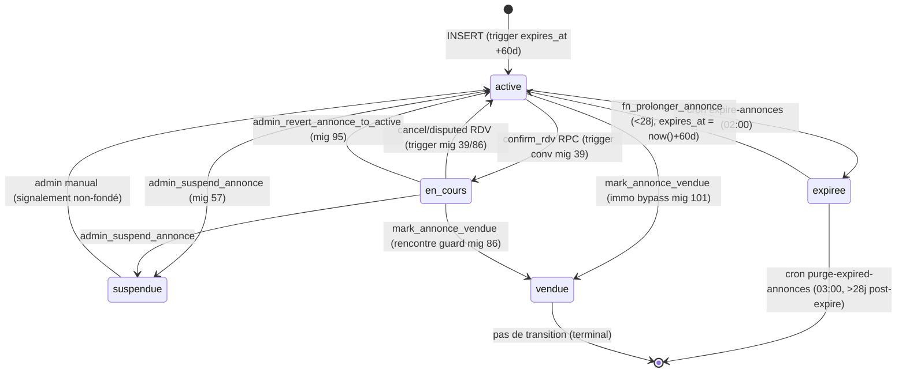

# Module Annonces — Backend

> Source de vérité backend du module **Annonces** (CDC v4.0 §3, F02).
> Couvre : table `public.annonces` (**25 colonnes**), **7 RLS policies**, 7 triggers, 4 RPCs publiques + 1 admin + 1 cron-only (+ `apply_boost` référencé `boost.md`), 2 crons annonces (expiration + purge), 1 storage bucket `annonces-photos`, mode dual normal/immo, content filter via `mots_interdits`, lifecycle 5 statuts.
>
> **Migrations concernées** : **15 (CREATE TABLE + 5 RLS + 2 triggers + plafonds prix initial)**, **16 (expiration 60j + cron purge 28j + RPC `fn_prolonger_annonce` + RPC `fn_increment_views` + rate limit 5/24h + RPC `get_user_public_profile`)**, **17 (trigger anti-doublon 24h)**, **18 (fix `expires_at` immuable côté client)**, **29 (content filter `mots_interdits` — table + trigger annonces)**, **30 (pivot v4.0 : DROP cap prix par pays + ajout Véhicules + reorder catégories)**, **32 (mode Immobilier — 5 colonnes nullable + enums + index)**, **33 (DROP `prix_negocie` — abandon escrow v3.14)**, **34 (`etat` nullable pour immo)**, **39 (lifecycle `en_cours` via trigger on RDV confirm + RPC `mark_annonce_vendue` + FK conversations.annonce_id SET NULL)**, **41 (RLS `annonces_buyer_select_via_conv` — acheteur lit en_cours/vendue via chat)**, **56-57 (RLS `annonces_admin_select` + RPC `admin_suspend_annonce` côté Signalements)**, **60 (boost — `is_boosted` + `boost_until` + index partiel)**, **86 (lifecycle rencontre mutuelle — guard `mark_annonce_vendue`)**, **89 (auto-confirm vendeur dans `mark_annonce_vendue`)**, **90 (`mark_vendue_reminders_sent` + `mark_vendue_reminder_last_at`)**, **94 (revoke public/anon/authenticated sur RPCs SECURITY DEFINER)**, **95 (RPC admin `admin_revert_annonce_to_active`)**, **100 (block `propose_rdv` si annonce immo)**, **101 (bypass rencontre dans `mark_annonce_vendue` si immo)**, **102 (lock `add_rencontre_photo` après décision admin)**, 103 (audit log admin sur revert/suspend), **105 (RLS deny-all sur `mots_interdits`)**, 109 (cron `expire-annonces` + `purge-expired-annonces` instrumentés event_log).
>
> **Tier RGPD** : 🟡 **P1** — annonce = donnée publique par design (browse-first), mais elle expose indirectement `vendeur_id → users` (joint en JS via `get_user_public_profile`, qui minimise les champs : prénom + initiale du nom, pas le téléphone clair). Purge cron 28j post-expiration → DELETE photos Storage via Edge Function `purge-annonces-photos` (HTTP REST). Pas de cascade Storage sur DELETE manuel utilisateur côté annonce (l'app mobile supprime les photos avant DELETE, défense en profondeur via le cron). Conformité ARTCI 2024-30 (CI), ANRTIC 2023-15 (CG), loi 2021-058 RW.

---

## 1. Vue d'ensemble

`annonces` est la **table pivot du marketplace** : c'est le produit. Tout user authentifié peut publier une annonce (max 5/24h), elle est immédiatement visible publiquement (RLS `annonces_read_active`) sans validation manuelle. Elle expire automatiquement à 60 jours (cron 02:00 UTC) et est purgée 28 jours après expiration (cron 03:00 UTC, suppression des photos Storage via Edge Function HTTP).

L'annonce a un **lifecycle à 5 statuts** :

```
active ─── confirm_rdv ───→ en_cours ─── mark_vendue ──→ vendue (terminal)
  │                              │
  │ cron 60j                     │ RDV disputed (rencontre split mig 86)
  ▼                              ▼
expiree ── prolonger 28j ────→ active
  │
  │ cron 28j
  ▼
DELETE (cascade Storage)

active/en_cours ── admin suspend ──→ suspendue ── admin revert ──→ active
```

**Invariants produit non-négociables :**

| Invariant | Enforcement |
|---|---|
| Pays immuable, hérité de `users.pays` | Trigger `inherit_annonces_pays` BEFORE INSERT (mig 15) — segmentation marketplace CI/CG |
| Expiration 60j non manipulable côté client | Trigger `set_annonces_expires_at_trigger` REPLACE mig 18 — force `expires_at = created_at + 60d` même si l'INSERT le fournit |
| Pas plus de 5 annonces / 24h / user | Trigger `enforce_annonces_rate_limit_trigger` BEFORE INSERT (mig 16) — raise `rate_limit_announces` (P0001) |
| Pas de doublon dans 24h | Trigger `enforce_annonce_no_duplicate` BEFORE INSERT (mig 17) — match exact `vendeur+titre+description+prix+ville` |
| ~~Plafonds prix par pays~~ | **DROPPED mig 30** — pivot v4.0 sans escrow Mobile Money → plus de limite |
| Pas de mot interdit dans titre/description | Trigger `tg_annonces_content_filter` BEFORE INSERT/UPDATE (mig 29) — raise `contenu_interdit`, scan via SECURITY DEFINER helper `fn_check_forbidden_words` |
| Browse-first : visible anon par défaut | RLS `annonces_read_active` SELECT WHERE `statut='active'` — aucun JWT requis |
| Acheteur lit `en_cours`/`vendue` SI il a une conversation | RLS `annonces_buyer_select_via_conv` (mig 41) — bypass `statut=active` only pour le chat |
| Owner update seulement `statut='active'` | RLS `annonces_owner_update` (mig 15) — pas d'edit en transaction/vendue/suspendue |
| Owner delete seulement `active`/`expiree`/`suspendue` | RLS `annonces_owner_delete` (mig 15) — préserve historique en_cours/vendue |
| Pas de RDV en mode Immobilier | RPC `propose_rdv` raise `IMMO_NO_RDV` si `annonce.type_offre IS NOT NULL` (mig 100) |
| Marquer vendue/louée immo sans rencontre | RPC `mark_annonce_vendue` bypass rencontre guard si immo (mig 101) |
| FK `conversations.annonce_id ON DELETE SET NULL` | Préserve historique chat/msg/avis après purge cron (mig 39) |
| Suppression cascade purge Storage | Edge Function `purge-annonces-photos` appelée par `fn_purge_expired_annonces` (mig 16) |

---

## 2. Tables consommées

### 2.1 `public.annonces` (mig 15 + extensions)

**Total 25 colonnes** (16 base + 5 immobilier + 2 boost + 2 mark_vendue_reminder). La colonne `prix_negocie` (mig 15) a été DROPPED en mig 33 (abandon escrow v3.14, plus reflétée dans le schéma actuel).

| Colonne | Type | Default | NOT NULL | FK / CHECK | Mig | Sémantique |
|---|---|---|---|---|---|---|
| `id` | uuid | `gen_random_uuid()` | ✅ | PK | 15 | |
| `vendeur_id` | uuid | — | ✅ | → users(id) ON DELETE CASCADE | 15 | Suppression user → cascade annonces |
| `categorie_id` | uuid | — | ✅ | → categories(id) | 15 | 11 catégories réelles (vs 6 CDC) — cf. §10 |
| `titre` | text | — | ✅ | 3-50 chars | 15 | |
| `description` | text | — | ✅ | 10-2000 chars | 15 | |
| `prix` | numeric(12,0) | — | ✅ | > 0 (cap par pays DROPPED mig 30) | 15→30 | Plus de plafond depuis v4.0 (escrow MM supprimé) |
| `photos` | text[] | `'{}'` | ✅ | 1-5 length | 15 | Paths Storage `annonces-photos` |
| `etat` | enum `etat_objet` | — | ✗ (mig 34) | neuf/tres_bon/bon/moyen | 15→34 | NULL pour immobilier (mig 34) |
| `statut` | enum `statut_annonce` | `'active'` | ✅ | active/en_cours/vendue/suspendue/expiree | 15 | Transitions via RPC + trigger lifecycle |
| `pays` | enum `pays_code` | — | ✅ | CI/CG (hérité user) | 15 | Trigger `inherit_annonces_pays` force = users.pays |
| `ville` | text | — | ✅ | 2-50 chars | 15 | |
| `quartier` | text | — | ✗ | 2-50 chars (if NOT NULL) | 15 | |
| `nb_vues` | int | 0 | ✅ | — | 15 | Increment via `fn_increment_views` (mig 16) |
| `expires_at` | timestamptz | — | ✅ | — | 15 | Forcé `created_at + 60d` par trigger mig 18 |
| `created_at` | timestamptz | `now()` | ✅ | — | 15 | |
| `updated_at` | timestamptz | `now()` | ✅ | — | 15 | Auto via `set_updated_at()` trigger |
| `type_bien` | enum `type_bien` | NULL | ✗ | studio/appartement/maison/terrain/bureau/magasin/chambre | 32 | NULL si pas immo |
| `type_offre` | enum `type_offre_immo` | NULL | ✗ | location/vente | 32 | **Discriminateur immo** : `IS NOT NULL` ⇔ annonce immobilière |
| `surface_m2` | int | NULL | ✗ | > 0 (if NOT NULL) | 32 | Optionnel immo |
| `nb_pieces` | int | NULL | ✗ | 1-20 (if NOT NULL) | 32 | Optionnel immo |
| `meuble` | bool | NULL | ✗ | — | 32 | true=meublé, false=vide, null=N/A |
| `is_boosted` | bool | `false` | ✅ | — | 60 | F09 Boost — true tant que `boost_until > now()` |
| `boost_until` | timestamptz | NULL | ✗ | — | 60 | Cf. `docs/backend/boost.md` |
| `mark_vendue_reminders_sent` | smallint | 0 | ✅ | — | 90 | Compteur push relances mark_vendue (0-3 max). Reset à 0 par trigger quand statut → active |
| `mark_vendue_reminder_last_at` | timestamptz | NULL | ✗ | — | 90 | Timestamp dernier push relance. Cron respecte intervalle min 7j |
| ~~`prix_negocie`~~ | ~~numeric(12,0)~~ | — | — | — | 15→33 | **DROPPED mig 33** — abandon escrow v3.14 (plus dans le schéma) |

**Indexes :**
- `idx_annonces_pays_statut (pays, statut)` — filtre browse Home/Search
- `idx_annonces_expires_at (expires_at)` — cron `expire-annonces`
- `idx_annonces_categorie_pays (categorie_id, pays)` — filtre catégorie
- `idx_annonces_localisation (pays, ville)` — filtre ville
- `idx_annonces_vendeur (vendeur_id)` — "mes annonces"
- `idx_annonces_purge_candidates (expires_at) WHERE statut='expiree'` — cron purge partiel
- `idx_annonces_boosted_active (boost_until DESC NULLS LAST, created_at DESC) WHERE is_boosted=true AND statut='active'` — tri prioritaire Home/Search (mig 60)
- `idx_annonces_immobilier (type_offre)`, `idx_annonces_surface (surface_m2)` — filtres immo (mig 32)

### 2.2 Tables dépendantes (lecture/écriture lifecycle)

| Table | Rôle | Mig |
|---|---|---|
| `public.users` | FK `vendeur_id` + `pays` hérité + `is_admin` pour RPCs admin | — |
| `public.categories` | FK `categorie_id` (11 catégories actives, mig 13+31+32) | 13 |
| `public.conversations` | FK `annonce_id` ON DELETE SET NULL (mig 39) — trigger `tg_annonce_statut_on_rdv_change` lit `rdv_confirme_at` et `rencontre_*` | 39, 86 |
| `public.mots_interdits` | Référentiel content filter (~70 mots) — lu par helper SECURITY DEFINER `fn_check_forbidden_words` | 29, 105 |
| `public.paiements_niqo` | Cf. `docs/backend/boost.md` — `target_id` = annonce_id pour les boosts | 43, 60 |
| `public.audit_log_admin` | Log via `_log_admin_action` helper (mig 103) sur `admin_revert_annonce_to_active` et `admin_suspend_annonce` | 103 |
| `public.niqo_event_log` | Crons `expire-annonces` + `purge-expired-annonces` instrumentés (mig 109) | 106-109 |

---

## 3. RLS

`alter table public.annonces enable row level security;` (mig 15).

| Policy | Action | Predicate | Mig | But |
|---|---|---|---|---|
| `annonces_read_active` | SELECT (anon+auth) | `statut = 'active'` | 15 | Browse-first — visible sans JWT |
| `annonces_owner_select_own` | SELECT (auth) | `vendeur_id = auth.uid()` (any statut) | 15 | "Mes annonces" — owner voit ses expirées, suspendues, vendues |
| `annonces_buyer_select_via_conv` | SELECT (auth) | `EXISTS (conv WHERE acheteur_id = auth.uid() AND annonce_id = annonces.id)` | 41 | Acheteur lit en_cours/vendue depuis le chat (sinon erreur d'affichage post-transition) |
| `annonces_owner_insert` | INSERT (auth) | `vendeur_id = auth.uid()` | 15 | Owner crée pour lui-même uniquement |
| `annonces_owner_update` | UPDATE (auth) | `vendeur_id = auth.uid() AND statut = 'active'` | 15 | Pas d'edit en_cours/vendue/suspendue/expiree (préserve transaction) |
| `annonces_owner_delete` | DELETE (auth) | `vendeur_id = auth.uid() AND statut IN ('active','expiree','suspendue')` | 15 | Préserve historique en_cours/vendue (acheteur a droit au chat post-transition) |
| `annonces_admin_select` | SELECT (auth) | `is_current_user_admin()` | 56 | Admin web read-only sur toutes annonces (modération + observability) |

**Notes :**
- Admin web utilise aussi `service_role` (Edge / Server Component) côté SSR ou les RPCs SECURITY DEFINER (`admin_revert_annonce_to_active`, etc.) pour les actions write.
- Pas de policy DELETE pour cron purge — `fn_purge_expired_annonces` est SECURITY DEFINER (bypass RLS).
- Stranger UPDATE/DELETE → silently 0 rows affected (PostgREST renvoie `[]` pas une 403).

---

## 4. RPCs

### 4.1 `fn_increment_views(p_annonce_id uuid) → void` (mig 16)

> SECURITY DEFINER · search_path = public · grant anon+authenticated

Increment `nb_vues +1` sur les annonces `statut='active'`. Fire-and-forget côté client (pas d'await). No-op si annonce introuvable/inactive.

```sql
update annonces set nb_vues = nb_vues + 1
 where id = p_annonce_id and statut = 'active';
```

### 4.2 `fn_prolonger_annonce(p_annonce_id uuid) → jsonb` (mig 16)

> SECURITY DEFINER · search_path = public · grant authenticated

Réactive une annonce expirée dans les 28j post-expiration. Owner-only.

| Code retour | Condition |
|---|---|
| `{success: true, new_expires_at: <ts>}` | OK, set `statut='active'`, `expires_at = now()+60d` (full new lifecycle, pas +28d comme initialement spec) |
| `{success: false, error: 'not_found'}` | Annonce introuvable |
| `{success: false, error: 'not_owner'}` | `vendeur_id <> auth.uid()` |
| `{success: false, error: 'not_expired'}` | Statut ≠ expiree |
| `{success: false, error: 'window_closed', deadline: <ts>}` | Window 28j post-expire dépassée (annonce déjà purgée ou en cours de purge) |

**Note** : pas de raise — retourne jsonb. Pattern différent des RPCs RDV/Boost. Code mobile doit checker `success` field.

### 4.3 `get_user_public_profile(p_user_id uuid) → jsonb` (mig 16)

> SECURITY DEFINER · search_path = public · grant anon+authenticated

Retourne le profil public minimum d'un vendeur (browse anon → tap "Voir vendeur"). Champs : `id, prenom, nom_initial, avatar_url, pays, ville, note_vendeur, nb_ventes, created_at`. **Pas le téléphone ni l'email** (RGPD minimisation).

Retourne `null` si user suspendu (`is_active = false`).

### 4.4 `mark_annonce_vendue(p_annonce_id uuid) → jsonb` (mig 39 → 89 → 101)

> SECURITY DEFINER · search_path = public · grant authenticated

Owner marque son annonce comme vendue (terminal). Comportement v3 (mig 101) :

| Cas | Condition | Effet |
|---|---|---|
| **Annonce immo** (`type_offre IS NOT NULL`) | Owner only | active/en_cours → vendue. **Bypass rencontre guard.** Pas de besoin de RDV/rencontre. |
| **Annonce normale** | Owner + ≥1 conversation où `rencontre_acheteur=true` AND `rencontre_vendeur≠false` (auto-confirme `rencontre_vendeur=true` si NULL) | active/en_cours → vendue. Guard mig 86 (rencontre mutuelle). |

**Codes erreur** (vérifiés mig 101) :
- `{success: false, error: 'not_authenticated'}` — JWT absent
- `{success: false, error: 'annonce_not_found'}` — UUID introuvable
- `{success: false, error: 'not_owner'}` — caller ≠ vendeur
- `{success: false, error: 'invalid_state'}` — statut ∉ {active, en_cours}
- `{success: false, error: 'no_meeting_confirmed'}` — annonce normale sans rencontre confirmée (mig 86 — guard)
- `{success: true}` — transition OK (immo bypass mig 101 OR rencontre validée)

### 4.5 `apply_boost(p_paiement_id, p_annonce_id, p_duration_days)` (mig 60 → 62 → 63)

Cf. `docs/backend/boost.md` §4 — RPC boost complète (8 gates + atomic claim + rollback).

### 4.6 `admin_revert_annonce_to_active(p_annonce_id uuid) → jsonb` (mig 95)

> SECURITY DEFINER · search_path = public · admin-gated · grant authenticated

Admin uniquement. Revert `en_cours → active` après décision admin sur signalement non-fraude (libère le vendeur après un RDV bloqué). Log via `_log_admin_action` mig 103.

| Cas | Effet |
|---|---|
| Pas authentifié | `{success: false, error: 'AUTH_REQUIRED'}` |
| Caller pas admin | `{success: false, error: 'ADMIN_REQUIRED'}` |
| Annonce introuvable | `{success: false, error: 'ANNONCE_NOT_FOUND'}` |
| Statut ≠ en_cours | `{success: false, error: 'INVALID_STATE', current_statut: '<statut>'}` (pas idempotent : retourne erreur sur active aussi) |
| Statut en_cours | UPDATE → active, push notification vendeur, log `annonce_reverted_active` |

### 4.7 `fn_purge_expired_annonces() → int` (mig 16)

> SECURITY DEFINER · search_path = public · revoke public/anon/authenticated (mig 94)

Cron-only. Sélectionne annonces `statut='expiree' AND expires_at < now() - 28 days`, POST les paths photos vers Edge Function `purge-annonces-photos` (DELETE Storage HTTP), puis DELETE rows. Returns nb purgées. Instrumenté event_log (mig 109).

---

## 5. Triggers

| Trigger | Fonction | Type | Mig | Effet |
|---|---|---|---|---|
| `set_annonces_updated_at` | `set_updated_at()` | BEFORE UPDATE | 15 | `updated_at = now()` |
| `set_annonces_expires_at_trigger` | `set_annonces_expires_at()` | BEFORE INSERT | 15→18 | Force `expires_at = (created_at OR now()) + 60 days` — **client ne contrôle pas** (mig 18 fix) |
| `inherit_annonces_pays` | `inherit_annonces_pays_from_user()` | BEFORE INSERT | 15 | Force `pays = (SELECT users.pays WHERE id=vendeur_id)`. Raise si users.pays NULL |
| `enforce_annonce_no_duplicate` | `fn_enforce_annonce_no_duplicate()` | BEFORE INSERT | 17 | Reject doublon exact `(vendeur_id, titre, description, prix, ville)` dans 24h → raise `annonces_duplicate_check` |
| `tg_annonces_content_filter` | `fn_annonces_content_filter()` | BEFORE INSERT/UPDATE | 29 | Scan titre + description via `fn_check_forbidden_words` → raise `contenu_interdit` (errcode `22023`) |
| `enforce_annonces_rate_limit_trigger` | `enforce_annonces_rate_limit()` | BEFORE INSERT | 16 | Count annonces du user dans 24h, raise `rate_limit_announces` (P0001) si ≥ 5 |
| `tg_annonce_statut_on_rdv_change` (sur **conversations**) | `fn_annonce_statut_on_rdv_change()` | AFTER UPDATE OF `rdv_confirme_at` | 39 | Si ≥1 conv avec `rdv_confirme_at` non-null sur annonce → active → en_cours. Sinon en_cours → active (annulation RDV). Mig 86 : revert en_cours → active si rencontre disputed. |

**Note** : pas de trigger sur DELETE — purge cascade gérée par cron + Edge Function HTTP (Storage REST).

---

## 6. Cron jobs (pg_cron)

| Job | Schedule (UTC) | Fonction | Mig | Effet |
|---|---|---|---|---|
| `expire-annonces` | `0 2 * * *` (02:00) | SQL inline + instrumenté (mig 109) | 16 | `UPDATE annonces SET statut='expiree' WHERE statut='active' AND expires_at < now()` |
| `purge-expired-annonces` | `0 3 * * *` (03:00) | `fn_purge_expired_annonces()` instrumenté | 16, 109 | Photos Storage HTTP DELETE + DELETE rows (28j post-expire) |
| `purge-expired-boosts` | `*/15 * * * *` (toutes 15 min) | `purge_expired_boosts()` | 60, 62 | Flip `is_boosted=false` (cf. `boost.md`) |

**Instrumentation** : les 3 crons écrivent dans `niqo_event_log` (`surface='cron'`, `event='cron.<name>.completed'`, payload `{count, duration_ms}`). Cf. `docs/backend/observability.md`.

---

## 7. Storage bucket `annonces-photos` (mig 14)

| Aspect | Valeur |
|---|---|
| Visibilité | **Public** (`public = true`) — lecture HTTP sans JWT |
| Path pattern | `{vendeur_id}/{annonce_id}/{uuid}.{ext}` |
| Limites | Max 5 photos/annonce, max 5 MB/photo, formats JPEG/PNG/WebP |
| RLS SELECT | Public (bucket public) |
| RLS INSERT | `auth.uid()::text = (storage.foldername(name))[1]` — owner only |
| RLS DELETE | Idem INSERT (owner) |
| Purge cascade | Edge Function `purge-annonces-photos` (Storage REST `DELETE /object/...`) appelée par `fn_purge_expired_annonces` (mig 16) |
| Purge sur DELETE user | Cascade via mig 110 (`trg_purge_cni_storage` analogue pour KYC + extension annonces) |

**Note Edge Function** : passe par `net.http_post` car SQL DELETE direct sur `storage.objects` est bloqué par `storage.protect_objects_delete` Supabase (cf. mig 110 pour le même fix sur CNI).

---

## 8. Lifecycle — diagramme Mermaid



---

## 9. Mode Immobilier (Discriminateur `type_offre IS NOT NULL`)

Le mode immobilier est **dérivé** : pas de colonne `mode`, c'est `type_offre IS NOT NULL` qui discrimine. Conséquences :

| Aspect | Annonce normale | Annonce immobilière | Mig |
|---|---|---|---|
| `etat` (neuf/tres_bon/bon/moyen) | Required | NULL (N/A) | 34 |
| `type_offre` (location/vente) | NULL | Required | 32 |
| `type_bien` (studio/appartement/...) | NULL | Required pour immo | 32 |
| `surface_m2`, `nb_pieces`, `meuble` | NULL | Optionnel | 32 |
| RDV (propose_rdv / confirm_rdv) | Permis | **Bloqué** — raise `IMMO_NO_RDV` | 100 |
| Notation (`submit_avis`) | Permis post-rencontre | **Impossible** (pas de rencontre) | — |
| `mark_annonce_vendue` | Requires rencontre confirmée | **Bypass rencontre** — owner peut marquer vendue/louée seul | 101 |
| Boost (`apply_boost`) | Permis | Permis | 60 |
| Expiration 60j + prolongation | Identique | Identique | 16 |
| Lifecycle `en_cours` | Set via trigger sur rdv_confirme | Jamais (pas de RDV) — reste `active` → `vendue` direct | 39, 100 |

**Edge cases produit :**
- Un vendeur 100% immo ne pourra **jamais** devenir "Vendeur Fiable" (`nb_ventes ≥ 5 AND note_vendeur ≥ 4.0`) — pas de note possible sans rencontre. Décision produit acceptée.
- Le badge `is_boosted` reste identique pour immo (même tri Home/Search).

---

## 10. Catégories (référentiel)

11 catégories **toutes actives** (`is_active = true`) au 2026-05-12. Origin : seed mig 13 (9 base) + mig 30 (Véhicules + reorder v4.0) + mig 31 (Beauté) + mig 32 (Immobilier insertion position 5).

| # | Catégorie | Icone Lucide | Mig | Notes |
|---|---|---|---|---|
| 1 | Téléphones & Accessoires | smartphone | 13 | |
| 2 | Électronique | monitor | 13 | Reorder mig 30 (était #2 → reste #2) |
| 3 | Mode & Vêtements | shirt | 13 | Reorder mig 30 (était #2 → #3) |
| 4 | Maison & Électroménager | home | 13 | |
| 5 | Immobilier | building-2 | 32 | Mode immo (cf. §9) — reorder mig 32 (intercalée) |
| 6 | Véhicules | car | 30 | Ajoutée pivot v4.0 (escrow MM supprimé → plus de cap), `is_active=true` |
| 7 | Beauté & Cosmétiques | sparkles | 31 | |
| 8 | Sports & Loisirs | dumbbell | 13 | |
| 9 | Enfants & Bébé | baby | 13 | |
| 10 | Livres & Formation | book-open | 13 | |
| 11 | Autres | package | 13 | |

`annonces.categorie_id` est FK obligatoire (`NOT NULL`). Le front mobile filtre `categories.is_active=true` avant affichage du picker (`app/sell/create.tsx`).

---

## 11. Content filter (mig 29 + 105)

| Aspect | Détail |
|---|---|
| Table | `public.mots_interdits` — `id serial PK, mot text UNIQUE, categorie text, created_at` |
| Seed | **63 entrées** (armes, drogues, contrefaçons, adulte, arnaques, animaux, insultes, argot Nouchi CI) |
| Helper | `fn_check_forbidden_words(p_text text) → bool` SECURITY DEFINER — case-insensitive substring match via `position()` |
| Trigger annonces | `tg_annonces_content_filter` BEFORE INSERT/UPDATE — scan `titre || ' ' || description`, raise `contenu_interdit` (errcode `22023`) |
| Trigger messages | `tg_messages_content_filter` (cf. doc Conversations à venir) — analogue mais bypass pour `NEW.type = 'systeme'` (RDV system messages) |
| RLS `mots_interdits` | `enable row level security` + **deny-all** (no policies) — anon/auth ne peuvent SELECT. Helper SECURITY DEFINER bypass RLS (mig 105) |

**Pourquoi RLS deny-all** : empêche un user d'énumérer la blacklist via `select mot from mots_interdits` puis de contourner. La liste n'est lisible que par le helper SECURITY DEFINER.

---

## 12. Écarts CDC v4.0 & findings

| Écart / Finding | CDC | Implémentation | Statut |
|---|---|---|---|
| Mode Immobilier | Mentionné §3.2 mais sans détail spec | Discriminateur dérivé `type_offre IS NOT NULL` + 4 colonnes nullable + 2 RPCs guards | ✅ mig 32-34, 100, 101 |
| 11 catégories | 6 listées | 11 actives (5 ajoutées : Maison, Immo, Beauté, Sport, Livres, Enfants, Autres — Véhicules désactivée) | ✅ mig 13, 31, 32 |
| Lifecycle `en_cours` | Pas spécifié | Statut intermédiaire entre confirm_rdv et mark_vendue + trigger réversible | ✅ mig 39 — protège contre achat parallèle |
| Rate limit 5/24h | Non mentionné | Trigger BEFORE INSERT | ✅ mig 16 — anti-spam |
| Anti-doublon 24h | Non mentionné | Trigger match exact dans 24h | ✅ mig 17 |
| Content filter | Mentionné §6 (modération) | Trigger DB + table seed | ✅ mig 29 |
| Prolongation 28j post-expiration | Non spécifié | `fn_prolonger_annonce` + window 28j | ✅ mig 16 |
| ~~Plafonds prix par pays~~ | Non spécifié | DROPPED mig 30 | ✅ pivot v4.0 — sans escrow MM, pas de raison de capper |
| Browse-first anon | §2 (parcours) | RLS `annonces_read_active` (SELECT sans JWT) | ✅ mig 15 |
| **RLS `annonces_owner_update` requires `statut='active'`** | — | Bloque toute correction post-RDV (typo, photo manquante) | 🟡 **Finding** — UX gap, l'owner ne peut PAS éditer une annonce en_cours pour corriger une typo. Workaround : annuler le RDV (revient active) puis reproposer. Pas prioritaire MVP. |
| **`fn_prolonger_annonce` retourne jsonb au lieu de raise** | — | Pattern inconsistant vs RPCs RDV/Boost qui raise | 🟢 **Finding cosmétique** — mobile gère les 2 patterns via mapping erreurs. À harmoniser Phase 2 si refactor d'API mobile. |
| **Pas de purge déterministe sur cancel RDV** | — | Annonce reste en_cours → active mais conversation reste avec rdv_confirme_at orphelin si trigger mis à jour | 🟢 **Audit** — trigger `tg_annonce_statut_on_rdv_change` revert OK (testé), mais à valider que la conv n'a pas d'état stale. Couvert par tests mig 86 (rencontre). |
| **Pas d'audit log INSERT/DELETE annonces** | — | `audit_log_admin` couvre seulement `admin_revert_annonce_to_active` et `admin_suspend_annonce` | 🟢 **Finding** — un INSERT annonce n'est pas auditable (sauf logs PostgreSQL infra). Pas critique MVP — Phase 2 si besoin compliance. |
| **Drift `is_boosted` vs `boost_until`** | — | Flag `is_boosted=true` reste tant que cron `purge-expired-boosts` (15min) n'est pas passé — annonce expirée peut afficher badge "Sponsorisé" 15 min après expiration | 🟢 Documenté `boost.md` §5 — accepté |

---

## 13. Tests

### pgTAP — `tests/sql/annonces.test.sql`

Couvre :

- **A. Triggers BEFORE INSERT** (5 triggers) :
  - `set_annonces_expires_at_trigger` : force `expires_at` à `created_at + 60d` même si client fournit une autre valeur
  - `inherit_annonces_pays` : force `pays = users.pays` même si client envoie CG sur user CI
  - `enforce_annonces_rate_limit_trigger` : 6e INSERT dans 24h raise `P0001`
  - `enforce_annonce_no_duplicate` : doublon exact `(titre+desc+prix+ville)` dans 24h raise
  - `tg_annonces_content_filter` : mot interdit dans titre raise `22023`
- **B. CHECK constraints** : prix > 0, titre/desc length (cap par pays DROPPED mig 30, non testé)
- **C. RLS** :
  - Anon SELECT active OK, non-active KO (`expiree`, `vendue`, `suspendue`, `en_cours`)
  - Owner SELECT own (tous statuts) OK
  - Stranger SELECT non-active KO
  - Buyer via conv SELECT en_cours/vendue OK (mig 41)
  - Owner UPDATE active OK, UPDATE en_cours/vendue/suspendue KO (0 rows)
  - Owner DELETE active/expiree/suspendue OK, DELETE en_cours/vendue KO
  - Stranger UPDATE/DELETE KO
- **D. RPCs core** :
  - `fn_increment_views` : +1 sur active, no-op sur non-active
  - `fn_prolonger_annonce` : 4 cas (success / not_owner / not_expired / `window_closed`)
  - `get_user_public_profile` : champs minimisés (pas de téléphone), null si suspended
  - `mark_annonce_vendue` (immo) : bypass rencontre, OK
  - `mark_annonce_vendue` (normale) : retourne `no_meeting_confirmed` si pas de RDV+rencontre
  - `admin_revert_annonce_to_active` : `ADMIN_REQUIRED` si non-admin, succès + audit log si admin sur en_cours
- **E. Trigger lifecycle** :
  - `tg_annonce_statut_on_rdv_change` : confirm RDV → active → en_cours
  - Cancel RDV (set `rdv_confirme_at = null`) → en_cours → active
- **F. Mode Immobilier** :
  - `propose_rdv` sur annonce immo raise `IMMO_NO_RDV` (mig 100)
  - INSERT immo valide (type_offre + type_bien + etat NULL)
- **G. Cron-side** :
  - `expire-annonces` SQL : active dont `expires_at < now()` → expiree
  - `fn_purge_expired_annonces` : ne supprime pas si < 28j post-expire

### Vitest — `tests/integration/annonces.test.ts`

Couvre end-to-end via PostgREST (RLS gateway) :

- Create annonce (RLS INSERT owner)
- Anon ne voit que statut=active
- Owner voit tous ses statuts
- Buyer via conv voit en_cours/vendue de l'annonce qu'il a contactée
- `fn_increment_views` anon + auth + no-op sur non-active
- `fn_prolonger_annonce` happy path + not_owner
- `mark_annonce_vendue` immo bypass
- `mark_annonce_vendue` normale (rencontre requise)
- Rate limit 5/24h
- Doublon 24h
- Content filter (mot interdit)
- Pays inheritance (force CI sur user CI même si client envoie CG)

---

## 14. Références

- **Migrations** : 15 (core), 16 (expiration+RPCs), 17 (anti-doublon), 18 (fix expires_at), 29 (content filter), 32-34 (immo), 39 (lifecycle), 41 (RLS buyer via conv), 60 (boost cols), 86 (rencontre mutuelle), 89 (auto-confirm vendeur), 94 (revoke), 95 (admin revert), 100 (block RDV immo), 101 (mark vendue immo bypass), 102 (lock photos), 103 (audit), 105 (RLS mots_interdits), 109 (cron instrumentation)
- **Tests** : `tests/sql/annonces.test.sql`, `tests/integration/annonces.test.ts`
- **Code mobile** : `lib/annonces.ts`, `lib/annonces/errors.ts`, `app/announce/[id].tsx`, `app/announce/[id]/edit.tsx`, `app/sell/create.tsx`, `app/(home)/index.tsx`, `app/search/index.tsx`, `app/profile/announces.tsx`
- **Code web admin** : `landing/src/app/a/[id]/` (page publique annonce SSR)
- **Edge Functions** : `supabase/functions/purge-annonces-photos/index.ts` (Storage REST DELETE)
- **Doc cross-référencée** : `docs/backend/boost.md` (paiements + `apply_boost`), `docs/backend/rdv.md` (lifecycle en_cours), `docs/backend/observability.md` (cron event_log), `docs/migrations/INDEX.md`
