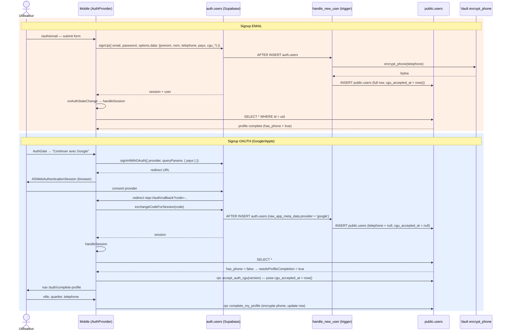
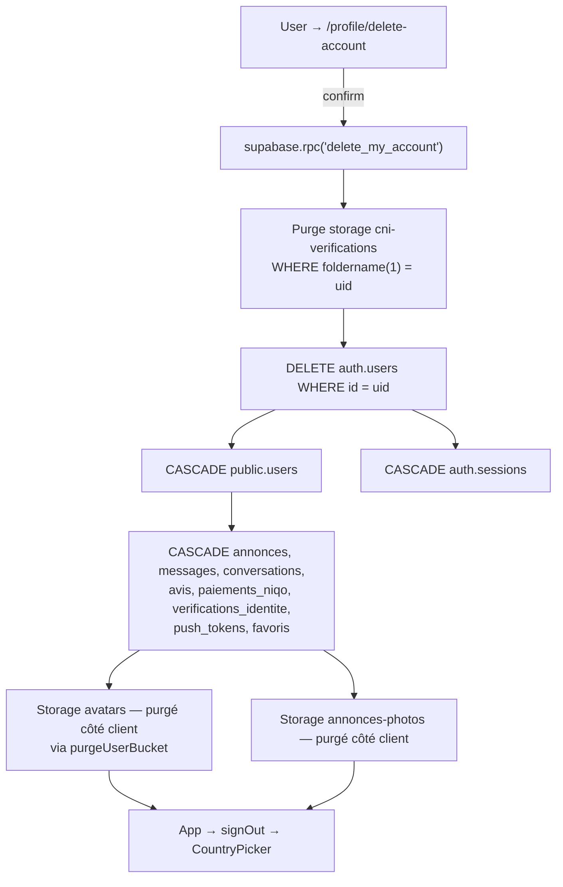

# Module Auth — Backend

> Source de vérité backend du module **Authentification + profil utilisateur**.
> Couvre : `auth.users` (Supabase built-in), `public.users`, encryption téléphone via Vault, triggers, RPCs, RLS, cron de purge, droit à l'oubli, et les écrans/lib mobiles qui consomment.
>
> **Migrations concernées** : 01, 02, 03, 04, 05, 06, 07, 08, 09, 10, 11, 12, 20, 21, 28, 44, 52, 53, 74, 77, 81, 82, 83, 84.
> **Tier RGPD** : 🔴 P0 — manipule des données personnelles sensibles (email, téléphone chiffré, consentement légal).

---

## 1. Vue d'ensemble

Niqo utilise **Supabase Auth** (table `auth.users` built-in) avec 3 providers :

| Provider | Flow | Source `auth_provider` |
|---|---|---|
| **Email + password** | écran `/auth/email`, push `prenom/nom/telephone/pays/ville/cgu_*` dans `options.data` au signUp | `raw_user_meta_data->>'auth_provider'` = `'email'` |
| **Google** | `signInWithOAuth({ provider: 'google' })` → ASWebAuthenticationSession (iOS) / Custom Tabs (Android) → callback PKCE | `raw_app_meta_data->>'provider'` = `'google'` (écrit par Supabase) |
| **Apple** | idem Google avec `provider: 'apple'` | `raw_app_meta_data->>'provider'` = `'apple'` |

**Browse-first** : l'app fonctionne sans compte (Home, Search, AnnonceDetail). L'auth est gatée par `requireAuth(reason)` dans `AuthProvider` quand l'user tape une action authentifiée (sell/messages/profile/favorite/contact/notifications).

**Profil unifié** : `public.users` étend `auth.users` avec les données métier (prenom, nom, telephone chiffré, pays, ville, notes, score abus). FK `id` avec `ON DELETE CASCADE` → suppression atomique des deux lignes via `delete_my_account()`.

**Particularité OAuth** : Supabase ne copie PAS `cgu_accepted_at` dans `raw_user_meta_data` (les claims provider écrasent), donc le timestamp de consentement est posé en deuxième temps par `AuthProvider.handleSession` via la RPC `accept_auth_cgu(version)` au premier login.

---

## 2. Tables consommées

### 2.1 `auth.users` (Supabase built-in)

Colonnes lues par notre code :

| Colonne | Usage |
|---|---|
| `id uuid` (PK) | Référencé par `public.users.id` (FK CASCADE) |
| `email text` | Source de vérité — propagée à `public.users.email` via trigger `handle_email_update` |
| `raw_user_meta_data jsonb` | Champs poussés par le client : `prenom`, `nom`, `telephone`, `pays`, `ville`, `quartier`, `auth_provider`, `cgu_accepted_at`, `cgu_version` |
| `raw_app_meta_data jsonb` | Écrit par Supabase Auth — contient `provider` (`google`/`apple`/`email`) et `providers[]` |
| `encrypted_password text` | Géré par Supabase, jamais lu directement |
| `email_confirmed_at timestamptz` | Pour les flows email-only (passwordless). Notre signup email exige email + password (pas de magic link MVP). |

**Pas de RLS appliquée** — `auth.*` est gérée par Supabase. On y accède UNIQUEMENT via les RPCs `SECURITY DEFINER` (`handle_new_user`, `delete_my_account`, `repair_my_profile`).

### 2.2 `public.users` (notre table métier)

Mig 01 + add-columns successifs (02, 08, 09, 11, 20, 25, 37, 43, 44).

| Colonne | Type | Source mig | Usage |
|---|---|---|---|
| `id` | `uuid` PK FK→auth.users CASCADE | 01 | Atomicité auth ↔ profil |
| `email` | `varchar(254)` UNIQUE | 01 + 11 | Sync auth.users.email via trigger |
| `prenom`, `nom` | `varchar(60)` NOT NULL | 01 + 11 | UI affichage + handle_new_user |
| `telephone` | `bytea` chiffré Vault | 02 | RGPD — jamais en clair via REST |
| `telephone_hash` | `bytea` HMAC-SHA256 keyed | 84 | UNIQUE partiel — anti-fraude multi-comptes (clé Vault `phone_encryption_key`) |
| `pays` | `pays_code enum` (`CI`/`CG`) NOT NULL | 01 | Filtre annonces côté serveur |
| `ville` | `varchar(80)` NOT NULL | 01 + 11 | Capital fallback (Abidjan/Brazzaville) |
| `quartier` | `varchar(80)` nullable | 01 + 11 | Optionnel UX |
| `auth_provider` | `auth_provider enum` (`google`/`apple`/`email`) | 01 + 05 (fix OAuth) | Affichage provider sur profil |
| `note_vendeur`, `note_acheteur` | `numeric(3,2)` 0-5 | 01 | Calculée par triggers F06 (mig 37+) |
| `nb_ventes`, `nb_achats` | `int` default 0 | 01 + 37 | Compteurs avis |
| `score_abus` | `int` default 0 | 01 + 25 | Auto-suspend ≥3 (mig 28) |
| `nb_signalements` | `int` default 0 | 25 | Compteur (info, pas un gate) |
| `avatar_url` | `text` nullable | 01 | URL publique bucket `avatars` |
| `is_active` | `boolean` default true | 01 | `false` = suspendu (purge J+30) |
| `is_verified`, `verification_paid_at` | `bool`/`tz` | 45 | F07 KYC |
| `is_admin` | `boolean` default false | 44 | Back-office Dominique |
| `is_boosted`, `boost_until` | (sur annonces) | 60 | — pas users — |
| `cgu_accepted_at`, `cgu_version` | `tz`/`text` | 08 + 21 | Consentement CGU auth (timestamp **serveur**) |
| `cgu_sell_accepted_at` | `tz` | 20 | Consentement CGU vente (1er post) |
| `created_at`, `updated_at` | `tz` default now() | 01 + 10 | `updated_at` bumpé via trigger BEFORE UPDATE |

**Index** : PK `id`, UNIQUE `email`, partiel `idx_users_is_admin where is_admin = true` (mig 44), partiel UNIQUE `users_telephone_hash_unique where telephone_hash is not null` (mig 84 — anti-fraude).

**Contraintes critiques** : `note_vendeur/note_acheteur between 0 and 5` (mig 01).

### 2.3 Enums

| Enum | Valeurs | Mig |
|---|---|---|
| `pays_code` | `CI`, `CG` | 01 |
| `auth_provider` | `google`, `apple`, `email` | 01 |

---

## 3. Vault — chiffrement téléphone (RGPD)

### Setup (mig 02)

```
extension supabase_vault → schema vault
vault.secrets[name='phone_encryption_key']  -- AES-256, 32 bytes base64
```

### Helpers privés (`SECURITY DEFINER`, revoke from public)

| Function | Signature | Usage |
|---|---|---|
| `encrypt_phone(plaintext text)` | → `bytea` | `pgp_sym_encrypt` avec clé Vault. **Non-déterministe** (chaque appel donne un ciphertext différent — sécurité). Retourne `null` si input null/vide. |
| `decrypt_phone(ciphertext bytea)` | → `text` | `pgp_sym_decrypt`. Retourne `null` si ciphertext null. |
| `hash_phone(plaintext text)` (mig 84) | → `bytea` | HMAC-SHA256(plaintext, clé Vault). **Déterministe** → permet UNIQUE INDEX (anti-fraude multi-comptes). HMAC keyed bloque le brute-force par dictionnaire (10⁹ numéros possibles). |

Ces helpers sont **non-grantables** aux `authenticated` — ils sont appelés uniquement par les autres functions `SECURITY DEFINER` de ce module (`handle_new_user`, `repair_my_profile`, `complete_my_profile`, `update_my_phone`, `update_my_profile`).

> ⚠ **Pourquoi 2 helpers (encrypt + hash)** : `encrypt_phone` est non-déterministe (sécurité chiffrement) → pas indexable pour UNIQUE. `hash_phone` est déterministe (même plaintext → même hash) → indexable mais reversible-hostile. Les call sites posent les deux ensemble. Les RPCs `update_my_phone`, `complete_my_profile`, `update_my_profile` catch `unique_violation` sur l'index → raise `'PHONE_ALREADY_USED'` (errcode P0020). Le trigger `handle_new_user` laisse remonter l'erreur native — le client mappe sur `users_telephone_hash_unique` dans le message (cf. `lib/auth/errors.ts`).

### RPC publique : `get_my_phone()`

Le **seul moyen** pour un user de récupérer son téléphone décrypté.

```sql
get_my_phone() returns text
  -- gate auth.uid() implicite : SELECT ... where id = auth.uid()
```

Granted to `authenticated`. La colonne `telephone bytea` est lisible via PostgREST (RLS `users_own_profile` permet le SELECT *) mais retourne du `bytea` inutilisable sans la clé Vault.

---

## 4. Triggers

### 4.1 `on_auth_user_created` → `handle_new_user()` (mig 01, modif 02/05/08/21)

**Quand** : `AFTER INSERT ON auth.users` (= signup email ou OAuth premier login).
**Effet** : crée la row `public.users` correspondante avec les données extraites de `raw_user_meta_data` + `raw_app_meta_data`.

**Logique de coalesce des champs critiques** :

| Champ | Source 1 | Source 2 | Fallback |
|---|---|---|---|
| `prenom` | `raw_user_meta_data->>'prenom'` (email) | `raw_user_meta_data->>'given_name'` (Google) | `'Utilisateur'` |
| `nom` | `raw_user_meta_data->>'nom'` | `raw_user_meta_data->>'family_name'` | `'—'` |
| `pays` | `raw_user_meta_data->>'pays'::pays_code` | — | `'CI'` |
| `ville` | `raw_user_meta_data->>'ville'` | — | `case pays when 'CG' then 'Brazzaville' else 'Abidjan'` |
| `auth_provider` | `raw_user_meta_data->>'auth_provider'::auth_provider` (email push manuel) | `raw_app_meta_data->>'provider'::auth_provider` (Supabase OAuth) | `'email'` |
| `telephone` | `encrypt_phone(raw_user_meta_data->>'telephone')` | — | `null` (cas OAuth) |
| `cgu_accepted_at` | `now()` (serveur, mig 21) si meta non-null | — | `null` |
| `cgu_version` | `raw_user_meta_data->>'cgu_version'` | — | `null` |

**Pourquoi `SECURITY DEFINER`** : la policy `users_own_profile` (`auth.uid() = id`) bloquerait l'INSERT — au moment du trigger, `auth.uid()` est null (côté `auth` schema). On bypass la RLS et on garantit l'atomicité.

**Bug historique fixé en mig 05** : OAuth Google/Apple finissaient avec `auth_provider = 'email'` car `raw_user_meta_data->>'auth_provider'` était absent → ajout de `raw_app_meta_data->>'provider'` comme deuxième source.

**Bug historique fixé en mig 21** : `cgu_accepted_at` posé avec timestamp client (falsifiable) → maintenant `now()` côté DB.

### 4.2 `on_auth_user_email_updated` → `handle_email_update()` (mig 09)

**Quand** : `AFTER UPDATE OF email ON auth.users` (= user clique le magic link de confirmation envoyé par `supabase.auth.updateUser({ email })`).
**Effet** : propage `auth.users.email` → `public.users.email` (+ bump `updated_at`).

### 4.3 `set_users_updated_at` → `set_updated_at()` (mig 10)

**Quand** : `BEFORE UPDATE ON public.users`.
**Effet** : `NEW.updated_at := now()`. Source de vérité unique — le `DEFAULT now()` de mig 01 ne s'appliquait qu'à l'INSERT, donc REST `update` ne bumpait pas.

La fonction `public.set_updated_at()` est aussi réutilisée par d'autres modules (`paiements_niqo`, `verifications_identite`, etc.).

### 4.4 `tg_check_score_abus` → `fn_check_score_abus()` (mig 28, étendu mig 77)

**Quand** : `BEFORE UPDATE OF score_abus, is_active ON public.users`.
**Effet** : si `NEW.score_abus >= 3 AND NEW.is_active = true` → force `NEW.is_active := false`.

**Pourquoi étendu à `is_active`** (mig 77) : edge case admin qui réactive manuellement un compte avec `score_abus >= 3` toujours ≥ 3 → sans le trigger, le compte restait actif malgré le seuil.

---

## 5. RPCs (toutes `SECURITY DEFINER`, granted to `authenticated`)

### 5.1 `repair_my_profile()` (mig 07, modif 08)

```sql
repair_my_profile() returns json
```

**Fallback côté client si `handle_new_user` a raté** (réseau coupé pendant le trigger, ou backfill de comptes pré-existants). Idempotent — si la row `public.users` existe déjà, retourne juste `row_to_json(u)`.

Sinon : reproduit la logique exacte de `handle_new_user()` en lisant `raw_user_meta_data` depuis `auth.users` (accès via `SECURITY DEFINER`).

Appelée par `AuthProvider.handleSession` après 3 retries de `fetchProfile` épuisés.

### 5.2 `complete_my_profile(p_ville, p_quartier, p_telephone, p_pays?, p_prenom?, p_nom?)` (mig 06, étendue mig 82, 83)

```sql
complete_my_profile(
  p_ville     text,
  p_quartier  text,
  p_telephone text,
  p_pays      pays_code default null,
  p_prenom    text      default null,
  p_nom       text      default null
) returns void
```

Appelée après signup OAuth (l'écran `/auth/complete-profile`). Encrypte le téléphone via `encrypt_phone()` et update jusqu'à 6 champs sur `auth.uid()`.

**Validation serveur** : `p_ville` non-vide, `p_telephone` non-vide, `p_prenom`/`p_nom` non-vides après trim si présents. Tous les autres params sont nullables (rétrocompat clients pré-mig 82/83). Garde-fou (pas de remplacement de la validation client).

**Pourquoi `p_pays` (mig 82)** : Supabase `signInWithOAuth` ne propage PAS les `queryParams` custom dans `raw_user_meta_data` — limitation Supabase. Conséquence : pour tout user OAuth qui a choisi 🇨🇬 CG dans le CountryPicker, le trigger `handle_new_user` reçoit `raw_user_meta_data->>'pays' = null` → fallback `'CI'`. Le client mobile lit `AsyncStorage('niqo_country')` (qui persiste avant/après le browser flow) au mount du `complete-profile.tsx` et pousse le bon pays via cette RPC. Si `p_pays` est null, le pays existant n'est pas écrasé.

**Pourquoi `p_prenom` + `p_nom` (mig 83)** : Apple Sign In ne renvoie le nom **qu'au PREMIER auth** (et l'user peut choisir de le masquer via "Hide My Email"). Pour Google, `given_name`/`family_name` arrivent normalement via `raw_user_meta_data` mais peuvent manquer si scope mal configuré. Dans tous les cas, `complete-profile.tsx` affiche désormais 2 champs `Prénom` + `Nom` éditables (préremplis depuis `profile`) — UX cohérente quel que soit le provider, et permet à l'user de corriger `'Utilisateur'` / `'—'` quand le trigger a fallback.

### 5.3 `update_my_profile(patch jsonb) returns public.users` (mig 12, refactor de 10)

Patch partiel JSONB — seules les clés présentes sont updatées. Couvre les 6 champs profil : `prenom`, `nom`, `ville`, `pays`, `quartier`, `telephone`.

**Validation** : `prenom`/`nom`/`ville` ne peuvent être vides s'ils sont présents dans le patch.
**Encryption** : `telephone` re-chiffré via `encrypt_phone()`.

Retourne la row complète après UPDATE — économise un round-trip (vs `void` + `SELECT *` séparé). Sensible sur 4G CI/CG.

### 5.4 `update_my_phone(new_phone text) returns void` (mig 09)

Helper bas niveau — encrypte + update juste le téléphone. Conservé pour rétrocompat ; le client préfère désormais `update_my_profile({ telephone })`.

### 5.5 `get_my_phone() returns text` (mig 02)

Décrypte + retourne le téléphone du caller. Voir §3 Vault.

### 5.6 `accept_auth_cgu(p_version text) returns void` (mig 21)

Pose `cgu_accepted_at = now()` (serveur) + `cgu_version = p_version` pour `auth.uid()`.

**Idempotent** : `where cgu_accepted_at is null` → ne re-écrase pas un consentement existant (la première version acceptée fait foi).

Appelée par `AuthProvider.handleSession` au premier login OAuth (le trigger ne peut pas le faire — Supabase écrase `raw_user_meta_data` avec les claims provider).

### 5.7 `accept_sell_cgu() returns void` (mig 20)

Pose `cgu_sell_accepted_at = now()` après le premier `createAnnonce` réussi. Idempotent (where `cgu_sell_accepted_at is null`).

### 5.8 `delete_my_account() returns void` (mig 03, étendue mig 53)

Droit à l'oubli RGPD. Pipeline :

1. **Purge Storage `cni-verifications`** (mig 53) : `DELETE FROM storage.objects WHERE bucket_id = 'cni-verifications' AND (storage.foldername(name))[1] = uid::text`. Nécessaire car la RLS Storage CNI bloque DELETE aux non-admin (mig 46) — la purge côté client échouerait.
2. **`DELETE FROM auth.users WHERE id = uid`** → cascade `public.users` (FK on delete cascade) → cascade tout ce qui référence `users.id` (annonces CASCADE, messages CASCADE, conversations CASCADE/SET NULL, avis SET NULL/CASCADE selon mig 70, paiements_niqo CASCADE, verifications_identite CASCADE, push_tokens CASCADE).

**Buckets `avatars` et `annonces-photos`** : purgés côté client via `purgeUserBucket()` dans `lib/supabase.ts` (RLS DELETE owner permise sur ces deux buckets).

### 5.9 `is_current_user_admin() returns boolean` (mig 52)

Helper `SECURITY DEFINER STABLE` — évite les loops RLS sur `public.users` (la policy `users_admin_select` ne peut pas faire un SELECT sur `public.users` dans son `qual` sans helper).

### 5.10 `is_my_account_active() returns boolean` (mig 74)

Helper `SECURITY DEFINER STABLE` — utilisé par les policies INSERT critiques (`annonces`, `messages`, `signalements`, `favoris`) pour bloquer les writes des comptes suspendus.

---

## 6. RLS

### 6.1 `public.users`

| Policy | For | Using | Mig |
|---|---|---|---|
| `users_own_profile` | ALL | `auth.uid() = id` | 01 |
| `users_admin_select` | SELECT | `is_current_user_admin()` | 52 |

**Note** : Postgres combine les policies en OR. Un user voit son propre profil OU s'il est admin, tous les profils.

**Convention vues publiques** : pour qu'un user voie le profil d'un vendeur (sur card annonce, profil public `/u/[id]`), on passe par la RPC `get_user_public_profile(p_user_id)` (déclarée dans le module Annonces, mig 16/51). Cette RPC `SECURITY DEFINER` retourne uniquement les champs publics (prenom, nom, ville, note_vendeur, nb_ventes, is_verified, avatar_url) — jamais email/telephone/cgu/score_abus.

### 6.2 Helper `users_conversation_read` (mig 23)

```sql
-- (déclarée dans le module Conversations)
-- Permet à un participant à une conversation de voir le prenom/nom de l'autre
-- via JOIN. Cf. docs/backend/conversations.md.
```

### 6.3 Verrouillage UPDATE (mig 74 — review #2)

`conversations` et `messages` ont eu leur grant UPDATE révoqué column-level pour éviter les écritures REST sauvages. **Pour `users`** : aucune policy UPDATE séparée — `users_own_profile FOR ALL` couvre déjà le cas, donc tout `UPDATE public.users` côté client passe par le SDK PostgREST avec `where id = auth.uid()` (RLS gate).

⚠ **Attention** : un client malveillant pourrait `UPDATE public.users SET note_vendeur = 5 WHERE id = auth.uid()` via REST direct. À ce stade pas de policy column-level qui limite — TODO à durcir si Phase 2 ou en cas d'incident. Pour le MVP, `note_vendeur/nb_ventes/score_abus` sont mises à jour uniquement par triggers (F06 avis, F08 signalements) — un client qui écrase ses notes les verra écrasées au prochain trigger.

---

## 7. Cron jobs

### 7.1 `niqo-purge-suspended-users` (mig 04)

```
schedule : "0 3 * * *"  (3am UTC = 4am Abidjan, 4am Brazzaville)
command  : DELETE FROM auth.users
            WHERE id IN (SELECT id FROM public.users
                          WHERE is_active = false
                            AND updated_at < now() - interval '30 days')
```

Suppression définitive des comptes suspendus (`is_active = false`) depuis ≥ 30 jours. Cascade tout via `delete_my_account()`-like (FK CASCADE sur `auth.users.id`).

**Audit cron** :
```sql
select jobid, schedule, command, jobname, active
from cron.job where jobname = 'niqo-purge-suspended-users';
select * from cron.job_run_details
where jobid = (select jobid from cron.job where jobname = 'niqo-purge-suspended-users')
order by start_time desc limit 10;
```

---

## 8. Storage

### 8.1 Bucket `avatars` (mig 09)

| Aspect | Valeur |
|---|---|
| Visibilité | `public` (read sans auth) |
| Path pattern | `{auth.uid()}/avatar.{ext}` |
| RLS SELECT | `bucket_id = 'avatars'` (libre) |
| RLS INSERT/UPDATE/DELETE | `(storage.foldername(name))[1] = auth.uid()::text` (owner-only) |

**Pourquoi public read** : les autres users doivent voir l'avatar (cards annonces, profil vendeur).

**Purge au delete account** : `purgeUserBucket('avatars')` côté client via `lib/supabase.ts` (RLS owner DELETE permise).

---

## 9. Code mobile qui consomme

### 9.1 `lib/auth/AuthProvider.tsx`

Context React global, mounted dans `app/_layout.tsx`. Expose :

```ts
useAuth() returns {
  session: Session | null
  profile: PublicUser | null
  isAuthenticated: boolean
  isLoading: boolean                  // true pendant cold-start hydration
  needsProfileCompletion: boolean     // OAuth signup sans téléphone
  gateReason: AuthGateReason | null
  authError: string | null
  requireAuth(reason): boolean        // ouvre le gate modal si non auth
  closeGate()
  clearAuthError()
  signIn(provider): Promise<void>     // OAuth uniquement (email → /auth/email)
  signOut(): Promise<void>
  refreshProfile(prefetched?): Promise<void>
}
```

**Cycle de vie** :
1. Mount → `getSession()` initial puis `await handleSession`.
2. `onAuthStateChange` → re-fetch profile + check is_active + auto-CGU OAuth + push token registration.
3. `AppState 'active'` + interval 30s → check `is_active` (suspension live).
4. Si `is_active = false` → `signOut()` + `setAuthError('compte suspendu')`.

**Gestion `handle_new_user` raté** : 3 retries `fetchProfile` avec backoff 600/1200ms → fallback `repair_my_profile` RPC → fallback `signOut` + erreur visible.

### 9.2 Écrans `app/auth/*`

| Écran | Rôle |
|---|---|
| `email.tsx` | Signup/signin email + password. Push `prenom/nom/telephone/pays/ville/cgu_*` dans `options.data`. |
| `callback.tsx` | OAuth callback — handle deep link `niqo://auth/callback?code=...`. |
| `complete-profile.tsx` | Post-OAuth : collecte `ville/quartier/telephone` → RPC `complete_my_profile`. |
| `forgot-password.tsx` | Demande `auth.resetPasswordForEmail(email)`. |
| `reset-password.tsx` | Définit nouveau password depuis le magic link. |

### 9.3 `<AuthGate />` (composant global)

Mount dans `app/_layout.tsx`. Quand `gateReason !== null`, affiche un modal :
- Hero text contextualisé selon `reason` (sell/messages/profile/favorite/contact/notifications)
- 3 boutons : `Continuer avec Google`, `Continuer avec Apple`, `Continuer avec email` (route `/auth/email`)
- Lien CGU/Confidentialité

### 9.4 `lib/supabase.ts`

| Helper | Usage |
|---|---|
| `supabase` | Client singleton |
| `withTimeout(promise, ms, label)` | Wrap réseau avec timeout — défaut `AUTH_TIMEOUT_MS = 15000` |
| `purgeUserBucket(bucketId)` | Liste + delete des objets dans `{auth.uid()}/*` du bucket donné |
| `deleteMyAccount()` | Wrapper RPC `delete_my_account` + sign out |

### 9.5 Route `/legal/*`

`cgu.tsx` + `confidentialite.tsx` rendent les CGU v1.1 + politique de confidentialité v4.0. La constante `LEGAL_LAST_UPDATED` (`lib/legal.ts`) est poussée comme `cgu_version` au signup et passée à `accept_auth_cgu()`.

---

## 10. RGPD — récap par feature

| Aspect | Implémentation |
|---|---|
| **Minimisation** (1) | On collecte 5 champs au signup : email, prenom, nom, telephone, pays. Ville fallback capital. Quartier optionnel. |
| **Chiffrement au repos** (2) | Téléphone `bytea` AES-256 via Vault. Email reste en clair (besoin métier login). |
| **Consentement** (3) | `cgu_accepted_at` + `cgu_version` à l'auth signup, `cgu_sell_accepted_at` à la 1ère vente. Timestamp **serveur** (RPC `SECURITY DEFINER`), pas client. Backfill mig 21 pour comptes pré-fix. |
| **Droit à l'oubli** (4) | `delete_my_account()` cascade auth + storage CNI + tous modules dépendants via FK. Purge avatars/annonces-photos côté client. |
| **Limitation conservation** (5) | Cron `niqo-purge-suspended-users` purge les `is_active=false` à J+30. KYC purge à J+60 si pending (mig 75, hors scope Auth). |
| **Tiers** (6) | Aucun export d'auth/profil vers tiers. PawaPay (paiements) reçoit user_id mais aucun PII auth. |
| **Logs admin** (7) | `users_admin_select` policy = lecture admin tracée dans Supabase Logs (Database → Logs). |
| **Sortie de données** (8) | À ajouter Phase 2 (export JSON via RPC `export_my_data`). MVP : pas obligatoire selon les 3 régulateurs (CI/CG/RW). |

Cf. `docs/references/rgpd-audit.md` entrée #1 pour le détail.

---

## 11. Diagramme — Signup flow



---

## 12. Diagramme — Droit à l'oubli



---

## 13. Diagramme — Cas d'utilisation

Vue UML simplifiée des acteurs du module Auth et des opérations qu'ils peuvent déclencher. Chaque use case correspond à un appel RPC, un trigger DB, ou un cron — référence détaillée dans les sections §4 (triggers), §5 (RPCs) et §7 (crons).

```mermaid
flowchart LR
    %% ── Acteurs ──
    Visitor(["👤 Visiteur<br/>anonyme"])
    User(["👤 Utilisateur<br/>authentifié"])
    Suspended(["⛔ Compte<br/>suspendu"])
    Admin(["👑 Admin<br/>Dominique"])
    System(["⚙ Système<br/>triggers + cron"])

    %% ── Use cases — Inscription ──
    subgraph S1[" Inscription "]
        UC_signup_email((Signup<br/>email + mdp))
        UC_signup_oauth((Signup OAuth<br/>Google / Apple))
        UC_complete_profile((Compléter<br/>profil post-OAuth))
        UC_repair((Réparer profil<br/>si trigger raté))
    end

    %% ── Use cases — Authentification ──
    subgraph S2[" Authentification "]
        UC_signin((Se connecter))
        UC_signout((Se déconnecter))
        UC_reset((Reset password<br/>par email))
        UC_change_email((Changer email<br/>magic link))
    end

    %% ── Use cases — Profil & téléphone ──
    subgraph S3[" Profil & téléphone "]
        UC_view_own((Lire son<br/>profil))
        UC_edit((Modifier prenom,<br/>nom, ville, quartier))
        UC_get_phone((Lire son téléphone<br/>en clair Vault))
        UC_update_phone((Mettre à jour<br/>son téléphone))
        UC_view_public((Voir profil public<br/>d'un vendeur))
    end

    %% ── Use cases — CGU & consentement ──
    subgraph S4[" CGU & consentement "]
        UC_cgu_auth((Accepter CGU<br/>auth signup))
        UC_cgu_sell((Accepter CGU<br/>1ère vente))
    end

    %% ── Use cases — RGPD & cycle de vie ──
    subgraph S5[" RGPD & cycle de vie "]
        UC_delete((Supprimer mon<br/>compte droit oubli))
        UC_check_active((Vérifier<br/>is_active))
        UC_check_admin((Vérifier<br/>is_admin))
    end

    %% ── Use cases — Modération admin ──
    subgraph S6[" Modération admin "]
        UC_view_any((Lire n'importe<br/>quel profil))
        UC_promote_admin((Promouvoir<br/>un admin SQL))
        UC_force_suspend((Forcer suspension<br/>is_active = false))
    end

    %% ── Use cases — Système automatique ──
    subgraph S7[" Système automatique "]
        UC_trig_create((Créer profil<br/>au signup trigger))
        UC_trig_email_sync((Synchroniser<br/>email auth↔public))
        UC_trig_updated((Bumper<br/>updated_at))
        UC_trig_score((Auto-suspend<br/>si score≥3))
        UC_cron_purge((Purger comptes<br/>suspendus J+30))
    end

    %% ── Liens Visiteur ──
    Visitor --> UC_signup_email
    Visitor --> UC_signup_oauth
    Visitor --> UC_signin
    Visitor --> UC_reset
    Visitor --> UC_view_public

    %% ── Liens Utilisateur ──
    User --> UC_signout
    User --> UC_complete_profile
    User --> UC_repair
    User --> UC_change_email
    User --> UC_view_own
    User --> UC_edit
    User --> UC_get_phone
    User --> UC_update_phone
    User --> UC_view_public
    User --> UC_cgu_auth
    User --> UC_cgu_sell
    User --> UC_delete
    User --> UC_check_active

    %% ── Liens Suspendu (réduits) ──
    Suspended --> UC_view_own
    Suspended --> UC_delete
    Suspended -.bloqué par<br/>is_my_account_active.-> UC_edit

    %% ── Liens Admin (hérite Utilisateur + privilèges) ──
    Admin --> UC_view_any
    Admin --> UC_force_suspend
    Admin --> UC_check_admin
    Admin -.SQL direct<br/>Studio.-> UC_promote_admin

    %% ── Liens Système (déclenchés par events) ──
    System --> UC_trig_create
    System --> UC_trig_email_sync
    System --> UC_trig_updated
    System --> UC_trig_score
    System --> UC_cron_purge

    %% ── Styles ──
    classDef actor fill:#FAECE7,stroke:#D85A30,stroke-width:2px,color:#1A1A1A
    classDef sysActor fill:#E8E8E8,stroke:#666,stroke-width:2px,color:#1A1A1A
    classDef suspended fill:#FFE5E5,stroke:#E24B4A,stroke-width:2px,color:#1A1A1A
    class Visitor,User,Admin actor
    class Suspended suspended
    class System sysActor
```



### Mapping use case → backend

| Use case (UI) | RPC / Trigger / Cron | Mig |
|---|---|---|
| Signup email + mdp | `supabase.auth.signUp` → trigger `handle_new_user` | 01, 81 |
| Signup OAuth Google/Apple | `signInWithOAuth` → trigger `handle_new_user` (raw_app_meta_data) | 01, 05, 81 |
| Compléter profil post-OAuth | RPC `complete_my_profile(ville, quartier, telephone, pays?)` | 06, 82 |
| Réparer profil si trigger raté | RPC `repair_my_profile()` | 07, 08 |
| Se connecter | `supabase.auth.signInWithPassword` / `signInWithOAuth` | — (Supabase built-in) |
| Se déconnecter | `supabase.auth.signOut` (+ unregister push token) | — |
| Reset password | `supabase.auth.resetPasswordForEmail` | — |
| Changer email | `supabase.auth.updateUser({email})` → trigger `handle_email_update` | 09 |
| Lire son profil | SELECT `public.users` (RLS `users_own_profile`) | 01 |
| Modifier prenom/nom/ville/quartier | RPC `update_my_profile(patch jsonb)` returns row | 10, 12 |
| Lire son téléphone en clair | RPC `get_my_phone()` (Vault decrypt) | 02 |
| Mettre à jour son téléphone | RPC `update_my_phone(text)` ou patch via `update_my_profile` | 09, 12 |
| Voir profil public d'un vendeur | RPC `get_user_public_profile(p_user_id)` (déclarée dans Annonces) | 16, 51 |
| Accepter CGU auth | RPC `accept_auth_cgu(p_version)` (idempotent, timestamp serveur) | 21 |
| Accepter CGU vente | RPC `accept_sell_cgu()` (idempotent) | 20 |
| Supprimer mon compte | RPC `delete_my_account()` (cascade + purge Storage CNI) | 03, 53 |
| Vérifier is_active | RPC `is_my_account_active()` (helper RLS) | 74 |
| Vérifier is_admin | RPC `is_current_user_admin()` (helper RLS) | 52 |
| Admin lit n'importe quel profil | Policy RLS `users_admin_select` | 52 |
| Forcer suspension | UPDATE `public.users SET is_active=false` (Studio admin) | — |
| Promouvoir un admin | UPDATE `public.users SET is_admin=true` (Studio admin, manuel) | 44 |
| Créer profil au signup | Trigger `on_auth_user_created` → `handle_new_user()` | 01, 02, 05, 08, 21, 81 |
| Sync email auth↔public | Trigger `on_auth_user_email_updated` → `handle_email_update()` | 09 |
| Bumper updated_at | Trigger `set_users_updated_at` → `set_updated_at()` | 10 |
| Auto-suspend score≥3 | Trigger `tg_check_score_abus` → `fn_check_score_abus()` | 28, 77 |
| Purger comptes suspendus J+30 | Cron `niqo-purge-suspended-users` (3am UTC daily) | 04 |

### Notes sur les acteurs

- **Visiteur anonyme** = JWT `anon` (browse-first). Ne peut PAS lire `public.users` (RLS bloque), seulement les profils publics via `get_user_public_profile()`.
- **Utilisateur authentifié** = JWT `authenticated` avec compte `is_active = true`. Toutes les RPCs `granted to authenticated` lui sont ouvertes.
- **Compte suspendu** = `is_active = false`. La policy RLS `users_own_profile` lui permet encore de lire son propre profil et de `delete_my_account`, mais le helper `is_my_account_active()` (mig 74) bloque tous les INSERT critiques (annonces, messages, signalements, favoris). Le compte est hard-deleté automatiquement à J+30 par le cron.
- **Admin** = `is_admin = true` (toggle manuel via SQL). Hérite de tous les use cases User + privilèges modération.
- **Système** = pas un acteur humain, déclenché par events DB (triggers AFTER INSERT/UPDATE) ou pg_cron schedule.

---

## 14. Edge cases & gotchas

| Cas | Comportement attendu |
|---|---|
| Trigger `handle_new_user` rate (réseau) | `fetchProfile` retry x3 → `repair_my_profile` RPC → si toujours KO, `signOut` + erreur visible. |
| OAuth signup sans `cgu_accepted_at` | `AuthProvider.handleSession` détecte `!fetched.cgu_accepted_at` → `accept_auth_cgu(version)` au premier login. |
| OAuth signup avec mauvais `pays` (CG → CI) | Limitation Supabase `signInWithOAuth` : `queryParams` custom **non propagés** à `raw_user_meta_data`. Trigger fallback `'CI'`. Fix mig 82 : `complete-profile.tsx` lit `AsyncStorage('niqo_country')` au mount et pousse `p_pays` via `complete_my_profile`. Côté UX : la ville aussi est corrigée (capital fallback du mauvais pays → capital correct). |
| Compte suspendu en cours d'usage | Check `is_active` à chaque `AppState 'active'` + interval 30s → `signOut` automatique avec message support. |
| Compte suspendu > 30j | Cron `niqo-purge-suspended-users` à 3am UTC → `DELETE auth.users` cascade. Irréversible. |
| User tente UPDATE direct `note_vendeur` via REST | Passe la RLS (own row) mais sera écrasée au prochain trigger F06 avis. **TODO Phase 2** : column-level grant. |
| Email update | `updateUser({email})` → magic link → `handle_email_update` propage `auth.users.email` → `public.users.email`. |
| Téléphone non collecté (OAuth) | `has_phone = false` → `needsProfileCompletion = true` → écran `/auth/complete-profile` forcé. |
| `auth.uid()` dans une RPC `SECURITY DEFINER` | Renvoie l'UID de l'**appelant** (lu depuis le JWT), pas le owner de la fonction. Garder ce mental model. |
| `vault.secrets.phone_encryption_key` perdu | `encrypt_phone()` raise exception `phone_encryption_key absente du Vault`. **Catastrophique** : tous les téléphones existants sont perdus (chiffrement irréversible). À sauvegarder hors-bande après mig 02. |
| Tentative de signup avec téléphone déjà utilisé (mig 84) | Trigger `handle_new_user` → INSERT public.users → `unique_violation` natif sur `users_telephone_hash_unique` → `auth.users` rollback aussi (transaction) → Supabase Auth remonte une erreur 500 avec le message Postgres. Client mappe via `lib/auth/errors.ts` (pattern matching `users_telephone_hash_unique` ou `PHONE_ALREADY_USED`) → "Ce numéro est déjà associé à un autre compte." |
| Collision phone via `update_my_phone` / `complete_my_profile` (mig 84) | RPC catch `unique_violation` → `raise PHONE_ALREADY_USED using errcode = 'P0020'`. Client mappe pareil. Cas typique : Apple Sign In second compte qui resaisit un téléphone d'un compte Google précédent → bloqué. |

---

## 15. Tests

- **Tests pgTAP** : `tests/sql/auth.test.sql` — **46 assertions**, run < 1s. Couvre les 4 triggers, les 11 RPCs, les 2 RLS users (own + admin), avec 4 fixtures users (Alice email + Bob OAuth + Claire suspendue + Dom admin). Premier vrai bénéfice : 2 régressions trouvées en mig 81 (telephone perdu, fallback OAuth perdu). Mig 84 ajoute 4 assertions sur `telephone_hash` UNIQUE (backfill non-null, collision via `update_my_phone` + `complete_my_profile` + signup direct).
- **Tests intégration Vitest** : `tests/integration/auth.test.ts` — **9 tests**, run ≈ 2.5s. Signup email e2e, get_my_phone via PostgREST (auth + anon), RLS users isolation entre 2 sessions, complete_my_profile encryption serveur, accept_auth_cgu idempotent, delete_my_account cascade, **+ 2 tests mig 84** (signup duplicate phone rejeté, complete_my_profile collision raise PHONE_ALREADY_USED).
- **Tests manuels** : `docs/features/auth-tests.md` — flows OAuth Google/Apple multi-device (Vitest ne couvre pas le browser flow).
