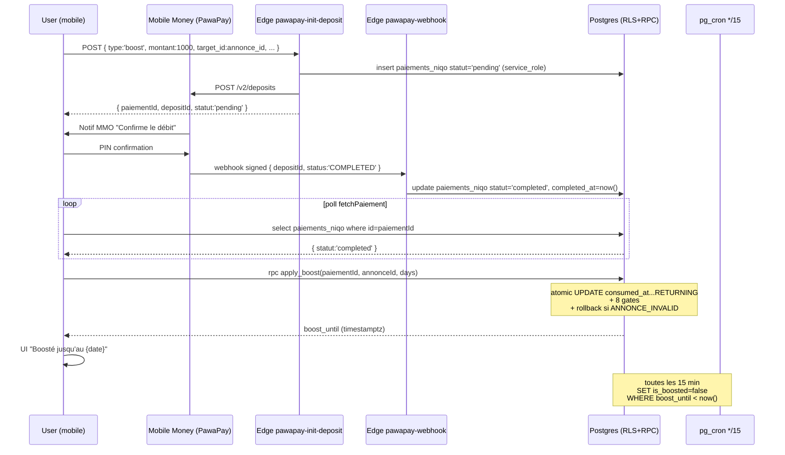

# Module Boost — Boost annonce — Backend

> Source de vérité backend du module **Boost annonce** (CDC v4.0 §5.2, F09).
> Couvre : table `paiements_niqo` (générique tous encaissements Niqo) + colonnes `annonces.is_boosted` / `boost_until`, RPC `apply_boost`, function `purge_expired_boosts` + cron, trigger RGPD scrub PawaPay, Edge Function `pawapay-init-deposit` (branche boost), Edge Function `pawapay-webhook` (statut → completed), lib mobile `boost.ts`, écran mobile, tri prioritaire Home/Search.
>
> **Migrations concernées** : **43 (paiements_niqo — table + enums + RLS générique)**, 44 (users.is_admin pour RLS admin paiements), **60 (core boost — cols annonces.is_boosted/boost_until + paiements_niqo.consumed_at + RPC apply_boost v1 + function purge_expired_boosts + cron 4h)**, 61 (`get_my_dashboard_stats.annonces.boosted` breakdown), **62 (audit fixes : cron 4h → */15 + RPC ajoute gate `PAIEMENT_TARGET_MISMATCH`)**, **63 (security hardening : race atomique `UPDATE...RETURNING` + gate `PAIEMENT_TARGET_MISSING` + gate `INVALID_PRICE` + rollback `consumed_at` si annonce inactive)**, 77 §D (trigger `fn_scrub_pawapay_metadata` — RGPD scrub `phoneNumber` dans `pawapay_metadata`), 94 (security advisor — revoke from public/anon/authenticated sur `purge_expired_boosts` + `apply_boost`), 106-109 (observability — `niqo_event_log` + cron `purge-expired-boosts` instrumenté).
>
> **Tier RGPD** : 🟡 **P1** — pas de PII sensible côté boost (CNI, etc.) mais `paiements_niqo.pawapay_metadata` contient initialement le `phoneNumber` MMO du payeur. Scrub via trigger `fn_scrub_pawapay_metadata` (mig 77). Conformité ARTCI 2024-30 (CI), ANRTIC 2023-15 (CG), loi 2021-058 RW.

---

## 1. Vue d'ensemble

Le **boost** est l'une des 6 sources de revenus de la plateforme Niqo (cf. CDC §5). Un vendeur paie 1 000 FCFA (7 jours) ou 3 000 FCFA (30 jours) via PawaPay pour que son annonce soit remontée en haut des résultats Home + Search, avec un badge "Sponsorisé". Marge ~95% (PawaPay facture ~5% sur petits montants).

**Invariants produit non-négociables :**

| Invariant | Enforcement |
|---|---|
| Boost gated par un paiement `completed` (montant whitelisté) | RPC `apply_boost` join sur `paiements_niqo.user_id = auth.uid()` + `type='boost'` + `statut='completed'` |
| 1 paiement consommé par AU PLUS 1 application boost (anti-double-spend) | **Atomic claim** : `UPDATE paiements_niqo SET consumed_at = now() WHERE consumed_at IS NULL RETURNING *` (mig 63) — single statement, pas de race SELECT-then-UPDATE |
| 1 paiement boost = 1 annonce ciblée (`target_id` non-null + cohérent) | Gates `PAIEMENT_TARGET_MISSING` + `PAIEMENT_TARGET_MISMATCH` (mig 62+63) |
| Montant payé doit matcher le tarif officiel (1000 → 7j / 3000 → 30j) | Gate `INVALID_PRICE` côté RPC (mig 63) + whitelist côté Edge Function (defense en profondeur) |
| L'annonce doit appartenir au caller + être `statut='active'` | Gate `ANNONCE_INVALID` (vendue/expirée/suspendue refusées) |
| Si l'annonce est invalide après débit, le paiement est libéré (`consumed_at = null`) | Rollback manuel dans la RPC mig 63 (sinon l'user perd son argent) |
| Cumul de boosts permis | `boost_until := greatest(coalesce(boost_until, now()), now()) + N days` — booster +7j sur un boost +7j actif = +14j au total |
| Expiration auto sans intervention user | Cron `purge-expired-boosts` toutes les 15 min — set `is_boosted = false` quand `boost_until < now()`. Drift max : 15 min entre expiration réelle et flag flippé (mig 62 — était 24h en mig 60) |
| Browse-first : tri prioritaire visible par tous (y compris anonymes) | RLS `annonces_public_read` permet `select` sur `statut='active'` sans JWT ; le tri client ORDER BY `is_boosted desc, boost_until desc nulls last, created_at desc` |
| Pas d'auto-publication : `is_boosted` ne devient `true` que sur retour de `apply_boost(...)` | RPC unique point d'entrée — pas de policy UPDATE permettant à un user de set directement `is_boosted = true` |

**Promesses UX implémentées :**

- Confirmation instantanée : RPC retourne le nouveau `boost_until` → l'écran affiche "Boosté jusqu'au {date}" sans re-fetch
- Badge "Sponsorisé" affiché côté client via `isBoostActive({ is_boosted, boost_until })` (filtre `boost_until > now()` — gère le décalage cron 0-15min)
- Compteur "X jours restants" via `formatBoostRemaining(boost_until)` (helper mobile `lib/boost.ts`)
- Dashboard vendeur : KPI annonces actives + sous-compteur "✨ X boostée(s)" via `get_my_dashboard_stats.annonces.boosted` (mig 61)

**Browse-first** : les boosts sont **publics par design** — un visiteur anonyme voit les annonces boostées en haut. Le tri se fait via PostgREST `order=is_boosted.desc,boost_until.desc.nullslast,created_at.desc`, et la RLS `annonces_public_read` autorise le `select` sans JWT sur `statut='active'`.

---

## 2. Tables consommées

### 2.1 `public.paiements_niqo` (mig 43)

Table générique pour **tous** les encaissements Niqo (verification + boost + Phase 2 pro/vedette/unsuspend). Le boost en consomme un sous-ensemble.

| Colonne | Type | Usage boost |
|---|---|---|
| `id` | uuid PK | Référencé par `apply_boost(p_paiement_id)` |
| `user_id` | uuid → users.id | Gate `INVALID_PAIEMENT` si `<> auth.uid()` |
| `type` | enum `type_paiement` | Doit être `'boost'` |
| `target_id` | uuid nullable | **Obligatoire pour boost** (mig 63) — `= annonce_id`. Gate `PAIEMENT_TARGET_MISSING` si null, `PAIEMENT_TARGET_MISMATCH` si `<> p_annonce_id` |
| `montant_fcfa` | int CHECK 0 < x ≤ 100000 | Doit matcher le tarif officiel (1000 ou 3000). Gate `INVALID_PRICE` |
| `pawapay_deposit_id` | text UNIQUE | UUID v4 généré par Edge Function, utilisé pour matcher le webhook PawaPay |
| `pawapay_metadata` | jsonb | Payload PawaPay brut — **scrubé par trigger mig 77** (phoneNumber → `[redacted]`) |
| `statut` | enum `statut_paiement` | Doit être `'completed'` pour `apply_boost` |
| `consumed_at` | timestamptz nullable | **Anti-double-spend** (mig 60). Set par `apply_boost`, null = encore disponible |
| `created_at` / `updated_at` / `completed_at` | timestamptz | Audit trail |

**Index utiles boost :**
- `idx_paiements_user (user_id, type, statut)` — lookup rapide "mes paiements boost completed"
- `idx_paiements_pawapay (pawapay_deposit_id) where pawapay_deposit_id is not null` — webhook lookup

### 2.2 `public.annonces` — colonnes ajoutées par mig 60

| Colonne | Type | Sémantique |
|---|---|---|
| `is_boosted` | boolean NOT NULL default false | Flag rapide pour le tri/badge. Reset à false par le cron quand `boost_until < now()` |
| `boost_until` | timestamptz nullable | Date de fin du boost actif. Cumul = `greatest(boost_until, now()) + N days` |

**Index dédié :**
```sql
create index idx_annonces_boosted_active
  on public.annonces (boost_until desc nulls last, created_at desc)
  where is_boosted = true and statut = 'active';
```
Partial index pour le tri Home/Search — ne contient que les rows pertinentes pour le sort prioritaire.

---

## 3. RLS

### 3.1 `paiements_niqo` (mig 43 + 44)

| Policy | Action | Predicate | Note |
|---|---|---|---|
| `paiements_select_own` | SELECT | `auth.uid() = user_id` | Historique facturation user |
| `paiements_select_admin` | SELECT | `public.is_admin(auth.uid())` | Back-office (mig 44) — KPIs `/admin/observability` |

**Pas de policy INSERT/UPDATE/DELETE côté client.** Toutes les écritures passent par les Edge Functions en `service_role` (bypass RLS) :
- `pawapay-init-deposit` → insert pending (ou completed en mode mock)
- `pawapay-webhook` → update statut `pending → completed/failed`
- `apply_boost` RPC SECURITY DEFINER → update `consumed_at`

### 3.2 `annonces` (RLS définie ailleurs — voir `docs/backend/annonces.md` à venir)

Pas de policy spécifique au boost. Les colonnes `is_boosted` / `boost_until` héritent des policies générales :
- SELECT public (browse-first) sur `statut='active'`
- UPDATE owner pour les autres colonnes — mais `apply_boost` est SECURITY DEFINER, donc bypass et set autoritaire de `is_boosted` + `boost_until`.

---

## 4. RPC `apply_boost(p_paiement_id, p_annonce_id, p_duration_days)`

> SECURITY DEFINER · search_path = public · returns `timestamptz` (nouveau `boost_until`)
> Migrations : 60 (v1) → 62 (+target_mismatch) → **63 (current — atomic claim + 8 gates)**

### Signature

```sql
apply_boost(
  p_paiement_id   uuid,
  p_annonce_id    uuid,
  p_duration_days int   -- whitelist : 7 ou 30
) returns timestamptz
```

### Gates (mig 63)

| # | Code | Errcode | Raison |
|---|---|---|---|
| 1 | `AUTH_REQUIRED` | P0001 | `auth.uid()` null (JWT absent) |
| 2 | `INVALID_DURATION` | P0002 | `p_duration_days not in (7, 30)` |
| 3 | `INVALID_PAIEMENT` | P0003 | Paiement introuvable OU appartient à un autre user OU type ≠ boost OU statut ≠ completed |
| 4 | `PAIEMENT_ALREADY_USED` | P0004 | `consumed_at` non-null (atomic claim a échoué) |
| 5 | `PAIEMENT_TARGET_MISSING` | P0007 | `target_id` null sur un paiement boost (Edge Function fuite, defense en profondeur) |
| 6 | `PAIEMENT_TARGET_MISMATCH` | P0006 | `target_id` ≠ `p_annonce_id` (user tente de booster une autre annonce) |
| 7 | `INVALID_PRICE` | P0008 | `montant_fcfa` ≠ tarif officiel pour la durée (1000/7j ou 3000/30j) |
| 8 | `ANNONCE_INVALID` | P0005 | Annonce introuvable OU pas owner OU `statut ≠ 'active'` → **rollback `consumed_at = null`** |

### Architecture critique : atomic claim (mig 63)

Avant mig 63 (v1) :
```sql
select * from paiements_niqo where consumed_at is null;  -- check
update paiements_niqo set consumed_at = now();           -- commit
```
→ Race : 2 devices peuvent passer le check en parallèle + 2 updates réussissent → boost double avec 1 paiement.

Après mig 63 :
```sql
update paiements_niqo
   set consumed_at = now()
 where id = p_paiement_id and user_id = v_uid and type = 'boost'
   and statut = 'completed' and consumed_at is null
 returning * into v_paiement;
if not found then ... raise PAIEMENT_ALREADY_USED ... end if;
```
Single statement → atomic. Seulement 1 device gagne, l'autre se prend le `PAIEMENT_ALREADY_USED`.

### Cumul boost

```sql
v_new_until := greatest(coalesce(v_annonce.boost_until, now()), now())
               + (p_duration_days || ' days')::interval;
```

- Annonce jamais boostée → `now() + N days`
- Boost actif (`boost_until > now()`) → prolongation : `boost_until + N days`
- Boost expiré flag toujours `true` (cron pas encore passé) → `now() + N days`

### Rollback paiement si annonce KO

Si l'annonce devient invalide entre l'init du paiement et l'application (vendue, suspendue, expirée), la RPC libère le paiement :
```sql
update paiements_niqo set consumed_at = null where id = p_paiement_id;
raise exception 'ANNONCE_INVALID';
```

→ L'user peut retry sur une autre annonce active sans perdre 1000-3000 FCFA. Cas d'usage rare mais réel (vente conclue pendant que le paiement Mobile Money tourne).

### Permissions

- `revoke all from public, anon` (mig 94)
- `grant execute to authenticated` (mig 60)

---

## 5. Function `purge_expired_boosts()` + cron

> SECURITY DEFINER · search_path = public · returns `int` (nb boosts purgés)
> Migrations : 60 (création, cron 4h) → **62 (cron passé en `*/15 * * * *` — drift max 15 min)** → 94 (revoke public/anon/authenticated) → 109 (cron instrumenté event_log)

```sql
update annonces
   set is_boosted = false, updated_at = now()
 where is_boosted = true
   and (boost_until is null or boost_until < now());
```

**Cron `purge-expired-boosts`** : toutes les 15 min (`*/15 * * * *` UTC). Schedule via `pg_cron.schedule`. Si `pg_cron` désactivé, la mig log un notice et continue (idempotente).

**Pourquoi 15 min et pas 1 min** :
- Le badge "Sponsorisé" côté client filtre `boost_until > now()` directement (mobile `isBoostActive()`) — le drift ne crée pas de faux badge
- Le tri Home/Search remonte les `is_boosted=true` même expirés → entre `boost_until` et le passage du cron (≤15 min), l'annonce reste en haut mais SANS badge. Compromis cost/UX acceptable.

**Instrumentation** (mig 109) : le cron loggue dans `niqo_event_log` avec `surface='cron'`, `event='purge.boosts.completed'`, `severity='info'`, payload `{ count }`.

---

## 6. Trigger RGPD `fn_scrub_pawapay_metadata` (mig 77 §D)

`BEFORE INSERT OR UPDATE OF pawapay_metadata` sur `paiements_niqo`. Redacte :
- `pawapay_metadata #> '{payer,accountDetails,phoneNumber}'` → `"[redacted]"`
- `pawapay_metadata #> '{payee,accountDetails,phoneNumber}'` → `"[redacted]"`
- Tout élément de l'array `metadata` dont `fieldName` matche `/phone|telephone|msisdn/i` → `fieldValue: "[redacted]"`

→ Le `phoneNumber` du payeur Mobile Money ne fuite jamais dans la table (audit RGPD-compliant). Backfill effectué sur les rows existantes par la même migration.

---

## 7. Edge Functions

### 7.1 `pawapay-init-deposit` (mig F07, branche boost)

POST `{ type: 'boost', montant_fcfa: 1000|3000, phone_number, mmo_provider, target_id: annonce_id }`.

**Validations boost-specific :**
- `type = 'boost'` → `target_id` obligatoire → `TARGET_ID_REQUIRED 400`
- Whitelist montant : `[1000, 3000]` pour boost → `INVALID_PRICE_FOR_TYPE 400`
- Whitelist provider par pays du user (anti-spoofing CI/CG) → `INVALID_PROVIDER_FOR_COUNTRY 400`
- Phone E.164 strict (`/^\+[0-9]{8,15}$/`) → `INVALID_PHONE_FORMAT 400`

**Mode mock** (`PAWAPAY_MOCK=true` en DEV) :
- Insert direct avec `statut='completed'` + `completed_at=now()` → skip pending + webhook
- L'app peut appeler `apply_boost` immédiatement

**Mode réel** :
- Insert pending → POST PawaPay `/v2/deposits` (currency XOF en CI, XAF en CG) → l'user reçoit notif MMO → confirme sur son téléphone → webhook PawaPay update statut

### 7.2 `pawapay-webhook` (mig F07)

Endpoint authentifié par signature PawaPay. Update `paiements_niqo.statut` `pending → completed/failed` selon le webhook reçu. Pas de logique boost-specific : c'est l'app mobile qui détecte `statut='completed'` (poll `fetchPaiement(paiementId)`) puis appelle `apply_boost(...)`.

---

## 8. Code mobile

### 8.1 `lib/boost.ts`

| Export | Rôle |
|---|---|
| `BOOST_OPTIONS` | Source de vérité tarifs côté client (1000/7j, 3000/30j). **Mirror de mig 63 RPC** + Edge Function `ALLOWED_PRICES` — fix les 3 si tarif change |
| `getBoostOption(days)` | Lookup option par durée |
| `initBoostPayment(...)` | Wrap `supabase.functions.invoke('pawapay-init-deposit', { type: 'boost', ... })` |
| `applyBoost({ paiementId, annonceId, days })` | Wrap `supabase.rpc('apply_boost', ...)` → retourne le nouveau `boost_until` ISO |
| `mapApplyBoostError(rawMessage)` | Mapping FR de tous les 8 codes d'erreur de la RPC mig 63 |
| `isBoostActive({ is_boosted, boost_until })` | Filtre frontend safety (`is_boosted=true` ET `boost_until > now()`) — gère le drift cron 0-15min |
| `formatBoostRemaining(boost_until)` | "5 jours restants" / "1 jour restant" / "expiré" |

### 8.2 Écran `app/profile/boost/[annonceId].tsx`

Wizard 4 steps :
1. Sélection durée (7j 1000 FCFA / 30j 3000 FCFA — labels et savings depuis `BOOST_OPTIONS`)
2. Sélection MMO provider (Orange / MTN CI ou Airtel / MTN CG, filtré par `user.pays`)
3. Numéro téléphone E.164 (préfix auto +225 / +242)
4. `initBoostPayment` → poll `fetchPaiement` jusqu'à `statut='completed'` → `applyBoost` → confirmation "Boosté jusqu'au {date}"

---

## 9. Flow end-to-end (Mermaid)



---

## 10. Écarts CDC v4.0

| Écart | CDC | Implémentation | Décision |
|---|---|---|---|
| Cron quotidien (CDC §5.2 "purge nuit") | 1×/jour | `*/15 * * * *` | ✅ mig 62 — drift 24h → 15min, meilleur UX |
| Cumul boost | non mentionné | Permis (`greatest + N days`) | ✅ mig 60 — pas de blocage produit, l'user peut prolonger son boost actif |
| Rollback paiement si annonce KO | non mentionné | `consumed_at = null` puis raise | ✅ mig 63 — garde-fou money-safe |
| Whitelist montant côté RPC | non mentionné | `INVALID_PRICE` gate | ✅ mig 63 — defense en profondeur (Edge Function bug ou bypass) |
| Audit log admin pour boost | non mentionné | **Absent** | 🟡 Finding (cf. §11) — pas critique pour MVP (pas d'action admin sur boosts), mais à considérer si Phase 2 ajoute des refunds / décisions admin |

---

## 11. Historique findings & fixes

| Date | Finding | Resolution |
|---|---|---|
| mig 62 (post-merge mig 60) | Cron 1×/jour → drift 24h badge ↔ tri | Cron `*/15 * * * *` |
| mig 62 (post-merge mig 60) | RPC ne vérifie pas `target_id` cohérent → user peut payer pour annonce X, booster annonce Y (même owner, mais incohérence comptable / PawaPay metadata) | Gate `PAIEMENT_TARGET_MISMATCH` |
| mig 63 (review #2) | **Race double-spend** : SELECT-then-UPDATE non atomique | `UPDATE...RETURNING` single statement |
| mig 63 (review #2) | `target_id` nullable bypassable | Gate `PAIEMENT_TARGET_MISSING` |
| mig 63 (review #2) | Pas de whitelist montant côté DB → 50 FCFA peuvent acheter 30j de boost si Edge Function buguée | Gate `INVALID_PRICE` + rollback |
| mig 77 §D (RGPD) | `pawapay_metadata.payer.accountDetails.phoneNumber` exposé en clair → fuite PII Mobile Money | Trigger `fn_scrub_pawapay_metadata` + backfill |
| mig 94 (security advisor Supabase) | `purge_expired_boosts` et `apply_boost` `EXECUTE` à public/anon/authenticated par défaut → grants over-permissives | `revoke all from public, anon` ; `apply_boost` reste granted à `authenticated` |
| Backfill 2026-05-11 (ce module) | **Pas d'audit log admin pour les boosts** — l'admin web n'a pas d'action sur les boosts aujourd'hui (pas de refund, pas de force-expire). Si Phase 2 ajoute ces actions, prévoir actions `boost_refunded` / `boost_force_expired` dans `_log_admin_action` (mig 103 pattern) | 🟡 Non-bloquant MVP — backlog Phase 2 |

---

## 12. Tests

### pgTAP — `tests/sql/boost.test.sql`

Couvre :
- `apply_boost` 8 gates (AUTH, INVALID_DURATION, INVALID_PAIEMENT user-mismatch / type-mismatch / status-mismatch, PAIEMENT_ALREADY_USED, PAIEMENT_TARGET_MISSING, PAIEMENT_TARGET_MISMATCH, INVALID_PRICE, ANNONCE_INVALID + rollback consumed_at)
- Happy path 7j et 30j + cumul (boost +7j sur boost +7j actif)
- Atomic claim : tentative double application séquentielle → 2e raise `PAIEMENT_ALREADY_USED`
- `purge_expired_boosts` : flippe `is_boosted=false` sur les annonces dont `boost_until < now()`
- `get_my_dashboard_stats.annonces.boosted` breakdown (mig 61)
- RLS `paiements_select_own` (Bob ne voit pas le paiement d'Alice)
- Trigger `fn_scrub_pawapay_metadata` (mig 77) : phoneNumber redacté à l'insert

### Vitest — `tests/integration/boost.test.ts`

Couvre :
- Happy path 7j (Alice paie, applique, dashboard.boosted = 1)
- Cumul (Alice applique 7j puis 7j → `boost_until ≈ now + 14j`)
- Anti-double-spend (2e applyBoost avec le même paiementId → `PAIEMENT_ALREADY_USED`)
- Anti-fraude target (Bob a un paiement boost avec `target_id = annonceBob`, applique sur `annonceAlice` → `PAIEMENT_TARGET_MISMATCH`)
- Anti-fraude price (paiement boost avec `montant=500` → `INVALID_PRICE`)
- Cross-user (Bob essaie d'utiliser le paiement d'Alice → `INVALID_PAIEMENT`)
- Annonce non-active (Alice marque son annonce `vendue`, apply → `ANNONCE_INVALID` + paiement libéré `consumed_at=null`)
- RLS : Bob ne lit pas les paiements d'Alice via PostgREST

---

## 13. Références

- **Migrations** : 43 (paiements_niqo), 60 (core), 61 (dashboard breakdown), 62 (audit), 63 (hardening), 77 §D (RGPD scrub), 94 (security advisor), 106-109 (observability)
- **Tests** : `tests/sql/boost.test.sql`, `tests/integration/boost.test.ts`
- **Code mobile** : `lib/boost.ts`, `app/profile/boost/[annonceId].tsx`
- **Edge Functions** : `supabase/functions/pawapay-init-deposit/index.ts`, `supabase/functions/pawapay-webhook/index.ts`
- **Doc cross-référencée** : `docs/backend/kyc.md` (paiements_niqo partagés), `docs/backend/observability.md` (event_log cron purge-expired-boosts), `docs/migrations/INDEX.md` (historique complet)
