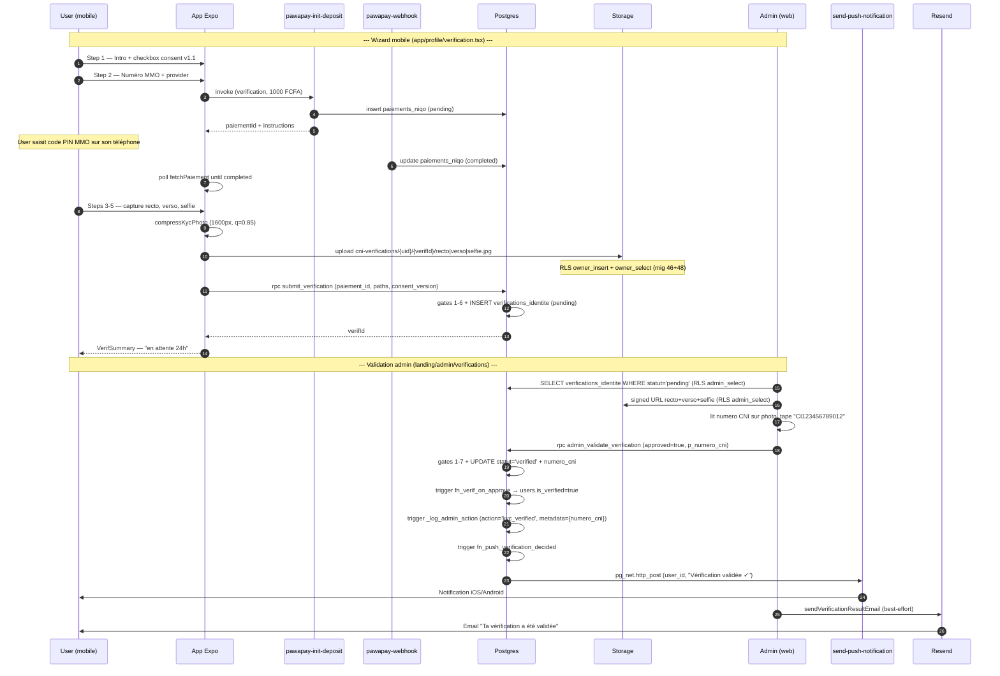

# Module KYC — Vérification d'identité — Backend

> Source de vérité backend du module **Vérification d'identité** (CDC v4.0 §2.6 Pilier 1, F07).
> Couvre : table `verifications_identite` + dépendance `paiements_niqo`, bucket Storage privé `cni-verifications`, RPCs `submit_verification` + `admin_validate_verification`, triggers (badge, purge Storage, push notif), cron purge RGPD, RLS, écrans mobile + admin web, audit log admin.
>
> **Migrations concernées** : 43 (paiements_niqo), 44 (users.is_admin), **45 (core — table + RPCs + trigger badge)**, 46 (bucket + RLS storage), 47 (RGPD consent v1.0 + ajout `rgpd_consent_at/version`), 48 (RLS storage SELECT/UPDATE own — fix bug upsert Supabase), 50 (cast enum statut), 52 (policy SELECT admin sur `users`), 53 (purge CNI au delete account — version mig 53), 54 (cron purge J+30/J+180 + trigger purge Storage on delete), 55 (bump consent v1.0 → v1.1), 65 (push notif `trg_push_verification_decided`), 72 (relax CHECK `verif_reviewed_needs_admin`), 73 (policy DELETE owner + simplification `delete_my_account` — Storage purge passe côté client), 75 (étend cron aux `pending > 60j`), **85 (anti-fraude : colonne + UNIQUE numero_cni + signature RPC 4 params)**, 94 (security advisor — revoke from public/anon), 78-80 (admin KPIs — consomme `paiements_niqo type='verification'` + `verifications_identite`), 103 (audit log : `kyc_verified` / `kyc_rejected`), 104 (backfill audit pour KYC historique pré-mig 103).
> **Tier RGPD** : 🔴 **P0** — pièces d'identité (CNI recto/verso) + selfie = PII sensible. Conservation strictement bornée (30j refus / 6 mois validé / 60j si pending abandonné). Conformité ARTCI 2024-30 (CI), ANRTIC 2023-15 (CG), loi 2021-058 RW.

---

## 1. Vue d'ensemble

La **vérification d'identité** est l'un des 4 piliers du système de confiance de Niqo (cf. CDC §2.6). Un utilisateur paie 1 000 FCFA via PawaPay, upload CNI recto + verso + selfie, et l'admin valide manuellement sous 24h. Si validé → badge "Vendeur Vérifié" affiché sur le profil + cap d'annonces levé (>3 annonces autorisées).

**Invariants produit non-négociables :**

| Invariant | Enforcement |
|---|---|
| Vérif gated par un paiement `completed` (1 000 FCFA, non remboursable) | RPC `submit_verification` join sur `paiements_niqo.statut = 'completed'` + `type='verification'` + `user_id=auth.uid()` |
| 1 paiement consommé par AU PLUS 1 verification | Gate `PAIEMENT_ALREADY_USED` (mig 45) — pas de UNIQUE index, c'est le SELECT EXISTS dans la RPC qui enforce |
| 1 user ne peut soumettre une 2e vérif tant qu'une `pending` existe | Gate `VERIFICATION_ALREADY_PENDING` (mig 45) |
| Path photos commence par `{auth.uid()}/` — pas de spoofing | Gate `INVALID_PATH_OWNERSHIP` (mig 45) + RLS Storage `(storage.foldername(name))[1] = auth.uid()::text` (mig 46/48) |
| Consent RGPD horodaté + versionné | `rgpd_consent_at` default `now()` (mig 47) + `rgpd_consent_version` whitelisté côté RPC (v1.0 et v1.1 acceptés, mig 47+55) |
| Bucket privé, pas d'URL publique exposable | `storage.buckets.public = false` (mig 46) — lecture admin via URL signée server-side |
| **Validation admin atomique** : statut + reviewed_by + reviewed_at + numero_cni + trigger badge users + audit log + push notif | RPC `admin_validate_verification` SECURITY DEFINER (mig 45→50→85→103) ; trigger `fn_verif_on_approve` + `fn_push_verification_decided` |
| Refus = motif obligatoire (5-500 chars) | CHECK `verif_rejected_needs_reason` (mig 45) + gate `REJECT_REASON_REQUIRED` côté RPC |
| **1 CNI = 1 compte vérifié** (anti-fraude multi-comptes) | UNIQUE INDEX partiel `verifications_numero_cni_verified_unique WHERE statut='verified'` (mig 85) — détection au moment du `UPDATE → 'verified'`, mapping `unique_violation` → `CNI_ALREADY_USED` |
| Conservation RGPD bornée : 30j refus, 6 mois validé, 60j pending abandonné | Cron `purge-expired-kyc-verifications` daily 3h UTC (mig 54+75) ; trigger `trg_purge_cni_storage` BEFORE DELETE garantit Storage et DB synchrones |
| Droit à l'effacement : delete compte purge toutes les CNI de l'user | Mig 73 — purge Storage côté client (`purgeUserBucket("cni-verifications", uid)`) AVANT `delete_my_account()` RPC ; mig 73 a aussi ajouté policy `cni_verif_owner_delete` pour permettre la purge user-side |
| Toute décision admin est tracée | Audit log via `_log_admin_action` (mig 103) — action `kyc_verified` ou `kyc_rejected` + metadata (`numero_cni` ou `reject_reason`) |

**Promesses UX implémentées :**

- 24h SLA (constant `VERIFICATION_SLA_HOURS=24` dans `lib/verification.ts`, affiché dans `<VerifPendingBanner>`)
- 3 annonces sans vérif (constant `UNVERIFIED_ANNONCES_CAP=3`, gate sur la création d'annonces — détails dans `docs/backend/annonces.md` à venir)
- Push notif "Vérification validée ✓" / "Vérification refusée: {motif}" (mig 65)
- Email post-validation Resend (admin web, best-effort — l'erreur n'échoue pas l'action — voir `landing/src/lib/email/verification-result.ts`)

**Browse-first** : un visiteur anonyme voit le badge "Vendeur Vérifié" sur le profil public via `users.is_verified` (RLS public SELECT sur `users`, profil exposé via `get_user_public_profile`).

---

## 2. Tables consommées

### 2.1 `public.paiements_niqo` (mig 43)

> Table générique pour tous les encaissements Niqo (KYC + Boost + Pro Phase 2 + Vedette Phase 2 + Unsuspend). Détail complet dans `docs/backend/boost.md` à venir. Ici on liste seulement ce que KYC consomme.

| Colonne | Type | Usage KYC |
|---|---|---|
| `id` | `uuid` PK | référencée par `verifications_identite.paiement_id` |
| `user_id` | `uuid` NOT NULL FK→users CASCADE | filtre RPC `submit_verification` |
| `type` | `type_paiement` enum NOT NULL | filtre `'verification'` |
| `target_id` | `uuid` nullable | toujours `null` pour `type='verification'` (la liaison se fait inverse via `verifications_identite.paiement_id`) |
| `montant_fcfa` | `int` NOT NULL CHECK (>0, ≤100000) | `1000` pour KYC |
| `pawapay_deposit_id` | `text` UNIQUE | matching webhook PawaPay |
| `statut` | `statut_paiement` enum NOT NULL default `'pending'` | filtre RPC : doit être `'completed'` pour soumettre |
| `completed_at` | `timestamptz` nullable | posé par webhook PawaPay |

**Indexes** :
- `idx_paiements_user (user_id, type, statut)` — query principale pour lister "mes paiements verif"
- `idx_paiements_pending (statut, created_at) WHERE statut='pending'` — pour le cron de relance/expiration (à venir Phase 2)

**RLS** : user voit ses propres rows. Admin voit tout via policy `paiements_select_admin` (créée mig 44, pas mig 43 — la colonne `is_admin` n'existait pas encore).

### 2.2 `public.verifications_identite` (mig 45, étendue 47, 85)

| Colonne | Type | Source mig | Usage |
|---|---|---|---|
| `id` | `uuid` PK default `uuid_generate_v4()` | 45 | identifiant interne |
| `user_id` | `uuid` NOT NULL FK→users CASCADE | 45 | cascade : delete user → delete verif (PII droit à l'oubli) |
| `paiement_id` | `uuid` NOT NULL FK→paiements_niqo **ON DELETE RESTRICT** | 45 | RESTRICT (pas CASCADE) : on ne veut PAS perdre l'historique paiement parce qu'une verif a été purgée. Un user qui supprime son compte purge la verif (cascade users) mais ses paiements restent en archive comptable jusqu'à purge dédiée. |
| `cni_recto_path` | `text` NOT NULL | 45 | path Storage `{uid}/{verification_id}/recto.jpg` |
| `cni_verso_path` | `text` NOT NULL | 45 | idem `/verso.jpg` |
| `selfie_path` | `text` NOT NULL | 45 | idem `/selfie.jpg` |
| `statut` | `statut_verification` enum NOT NULL default `'pending'` | 45 | machine d'état : `pending` → `verified` ou `rejected`, jamais d'aller-retour |
| `reviewed_by` | `uuid` nullable FK→users **ON DELETE SET NULL** | 45 | admin reviewer ; SET NULL si admin supprimé (mig 72 relax la CHECK pour supporter ce cas) |
| `reviewed_at` | `timestamptz` nullable | 45 | timestamp décision admin |
| `reject_reason` | `text` nullable CHECK (5-500 chars) | 45 | obligatoire si rejected (CHECK `verif_rejected_needs_reason`) |
| `rgpd_consent_at` | `timestamptz` NOT NULL default `now()` | 47 | timestamp consent — audit trail régulateur |
| `rgpd_consent_version` | `text` NOT NULL default `'v1.0'` CHECK (1-16 chars) | 47 | version texte légal acceptée ; whitelist serveur `('v1.0','v1.1')` (mig 47+55) |
| `numero_cni` | `text` nullable, CHECK `'^[A-Z0-9 \-]{4,20}$'` | **85** | tapé par admin lors de la validation, persisté pour anti-fraude |
| `created_at` | `timestamptz` NOT NULL default `now()` | 45 | tri historique |
| `updated_at` | `timestamptz` NOT NULL default `now()` | 45 | maintenu par `tg_verif_updated_at` |

**Constraints** :
- `verif_rejected_needs_reason` CHECK (mig 45) : si `statut='rejected'` → `reject_reason IS NOT NULL`
- `verif_reviewed_needs_admin` CHECK (mig 45 → relaxée mig 72) : si `statut <> 'pending'` → `reviewed_at IS NOT NULL`. **`reviewed_by` peut être NULL** post-mig 72 (cas admin supprimé via FK SET NULL).
- `verif_numero_cni_format` CHECK (mig 85) : si non-null, matche `^[A-Z0-9 \-]{4,20}$`

**Indexes** :
- `idx_verif_user (user_id, statut, created_at desc)` — query "mes vérifs" + détection pending existante
- `idx_verif_pending (created_at) WHERE statut='pending'` — file admin (back-office "à valider")
- `idx_verif_paiement (paiement_id)` — gate `PAIEMENT_ALREADY_USED`
- `verifications_numero_cni_verified_unique (numero_cni) WHERE statut='verified' AND numero_cni IS NOT NULL` UNIQUE PARTIEL — anti-fraude (mig 85)

### 2.3 Side-effect sur `public.users`

L'`UPDATE statut → 'verified'` propage 2 colonnes via le trigger `fn_verif_on_approve` :

| Colonne `users` | Mig | Usage produit |
|---|---|---|
| `is_verified` | 45 (ajoutée si absente) | Badge "Vendeur Vérifié" sur profil mobile + page web `/a/[id]` + cap d'annonces levé |
| `verification_paid_at` | 45 | Date de validation effective ; affichée dans le détail admin |

**Pas de reverse-on-reject** : si l'admin rejette une vérif, `users.is_verified` reste à sa valeur d'avant (default `false` pour un new user qui se fait rejeter, ou `true` pour un user déjà vérifié qui resoumet — cas rare). Décision conscious : `is_verified` est une qualité du compte, pas un mirror du dernier statut. Si on veut révoquer un badge → c'est une opération admin manuelle.

---

## 3. RLS

### 3.1 `public.paiements_niqo`

| Action | Policy | Effet |
|---|---|---|
| SELECT (user) | `paiements_select_own` `using (auth.uid() = user_id)` | User voit ses paiements |
| SELECT (admin) | `paiements_select_admin` `using (is_admin)` | Admin voit tout (créée mig 44 — dépend de `users.is_admin` colonne) |
| INSERT/UPDATE/DELETE | **aucune policy** | Bloqué côté client. Edge Functions `pawapay-init-deposit` (insert pending) + `pawapay-webhook` (update completed/failed) écrivent en service_role. |

### 3.2 `public.verifications_identite`

| Action | Policy | Effet |
|---|---|---|
| SELECT (user) | `verif_select_own` `using (auth.uid() = user_id)` | User voit ses soumissions (banner pending, historique) |
| SELECT (admin) | `verif_select_admin` via `is_admin = true` | Admin voit tout |
| INSERT/UPDATE/DELETE | **aucune policy** | Bloqué côté client. Tout passe par `submit_verification` (insert) + `admin_validate_verification` (update). DELETE via cron (super-user) ou cascade `users` (FK cascade). |

### 3.3 Storage `cni-verifications` (mig 46/48/73)

Bucket **privé** (`public = false`). 6 policies au final :

| Action | Policy | Mig | Effet |
|---|---|---|---|
| INSERT | `cni_verif_owner_insert` | 46 | User authentifié peut écrire dans son propre folder (`storage.foldername(name)[1] = auth.uid()::text`) |
| SELECT (user) | `cni_verif_owner_select` | 48 | User peut relire ses propres uploads. **Pragmatique** : `supabase.storage.upload()` exécute un SELECT post-INSERT pour retourner les metadata ; sans cette policy, l'upload entier fail (RLS violation). Mig 46 voulait privacy-by-default mais c'était techniquement impossible. |
| SELECT (admin) | `cni_verif_admin_select` | 46 | Admin lit toutes les CNI pour validation |
| UPDATE | `cni_verif_owner_update` | 48 | User peut réuploader (recapture client via `upsert: true`). Bloqué admin (pas de besoin produit). |
| DELETE (user) | `cni_verif_owner_delete` | 73 | User peut purger ses propres CNI (droit à l'effacement RGPD). Ajoutée mig 73 car le flow `delete_my_account()` ne pouvait plus passer par SQL direct (Supabase a ajouté `storage.protect_delete()` qui interdit `DELETE FROM storage.objects` en SQL). Le client appelle maintenant `purgeUserBucket()` via HTTP avant la RPC. |
| DELETE (admin) | `cni_verif_admin_delete` | 46 | Cron purge J+30/J+180/J+60 + admin manuel via SQL Editor |

**Pas de policy UPDATE admin** : décision = les CNI sont immutables côté admin. Si correction nécessaire, on DELETE puis on demande nouveau upload à l'user.

### 3.4 `public.users` (extension RLS pour KYC admin)

Mig 52 a ajouté la policy `users_admin_select` via une fonction helper `is_current_user_admin()` SECURITY DEFINER. **Pourquoi** : la policy mig 01 `users_own_profile` limitait le SELECT à `auth.uid() = id`. Conséquence : dans le back-office, le JOIN `verifications_identite ↔ users` retournait `null` pour tous les owners ≠ admin connecté → impossible de voir prénom/nom/téléphone des soumissionnaires. La policy admin est combinée en OR avec `users_own_profile`.

---

## 4. RPCs

### 4.1 `public.submit_verification(p_paiement_id, p_recto_path, p_verso_path, p_selfie_path, p_consent_version)` (mig 45 → 47 → 55)

```sql
returns uuid                 -- id de la verification créée
language plpgsql
security definer
set search_path = public
grant execute to authenticated
```

**Gates** (ordre du code, version mig 55 = courante) :

| # | Check | Code retour | Mig |
|---|---|---|---|
| 1 | `auth.uid() is not null` | `AUTH_REQUIRED` (P0001) | 45 |
| 2 | Paiement existe + `user_id=caller` + `type='verification'` + `statut='completed'` | `INVALID_PAIEMENT` (P0002) | 45 |
| 3 | Paiement pas déjà consommé par une autre verification (SELECT EXISTS) | `PAIEMENT_ALREADY_USED` (P0003) | 45 |
| 4 | Aucune `verifications_identite` `statut='pending'` pour ce user | `VERIFICATION_ALREADY_PENDING` (P0004) | 45 |
| 5 | Chacun des 3 paths a `foldername[1] = caller_uid::text` | `INVALID_PATH_OWNERSHIP` (P0005) | 45 |
| 6 | `p_consent_version IN ('v1.0','v1.1')` (whitelist serveur) | `INVALID_CONSENT_VERSION` (P0006) | 47, 55 |
| 7 | INSERT pending → return id | — | 45 |

**Pourquoi pas de race condition** : 2 calls concurrents `submit_verification` avec même `p_paiement_id` peuvent en théorie tous deux passer la gate 3 (SELECT EXISTS sans FOR UPDATE) et insérer 2 rows. **Mais** chaque row porte `paiement_id` qui n'est pas UNIQUE — donc en théorie 2 rows pourraient pointer le même paiement. **En pratique** le client n'a aucune raison d'appeler 2× (un seul wizard, un seul submit). Si on voulait durcir : ajouter `UNIQUE (paiement_id)` au lieu de SELECT EXISTS. Pas fait MVP, à reconsidérer si on observe le cas en prod.

**Race condition résiduelle gate 4** : 2 calls concurrents avec 2 paiements différents pour le même user pourraient en théorie créer 2 rows `pending`. Même risque qu'au-dessus — pas observé en prod (le user n'a qu'un wizard), pas durci. UNIQUE INDEX partiel `WHERE statut='pending'` serait la solution propre.

### 4.2 `public.admin_validate_verification(p_verification_id, p_approved, p_reject_reason, p_numero_cni)` (mig 45 → 50 → 85 → 103)

```sql
returns void
language plpgsql
security definer
set search_path = public
grant execute to authenticated  -- gate via is_admin dans le corps
```

**Gates** (ordre du code, version mig 103 = courante) :

| # | Check | Code retour | Mig |
|---|---|---|---|
| 1 | `auth.uid() is not null` | `AUTH_REQUIRED` (P0001) | 45 |
| 2 | `users.is_admin = true` pour le caller | `ADMIN_REQUIRED` (P0010) | 45 |
| 3 | Si `p_approved=false` : `p_reject_reason >= 5 chars` | `REJECT_REASON_REQUIRED` (P0011) | 45 |
| 4 | Si `p_approved=true` : `p_numero_cni` non-null après trim/upper | `NUMERO_CNI_REQUIRED` (P0014) | **85** |
| 5 | Si `p_approved=true` : `numero_cni` matche regex `^[A-Z0-9 \-]{4,20}$` | `NUMERO_CNI_INVALID` (P0015) | **85** |
| 6 | UPDATE row avec `statut='pending'` (verrou implicite via WHERE) — si pas trouvé : | `VERIFICATION_NOT_PENDING` (P0012) | 45 |
| 7 | UPDATE catch `unique_violation` sur `verifications_numero_cni_verified_unique` → | `CNI_ALREADY_USED` (P0013) | **85** |
| 8 | Audit log via `_log_admin_action('kyc_verified'|'kyc_rejected', 'verification', verification_id, metadata)` | — | **103** |

**Métadonnée audit log** :
- Si validé : `{ "numero_cni": "CI123456789012" }` (PII OK car le log est admin-only et tracé)
- Si refusé : `{ "reject_reason": "Selfie illisible" }`

**Comportement post-update** :
- Trigger `tg_verif_on_approve` (mig 45) : `UPDATE → 'verified'` set `users.is_verified=true` + `verification_paid_at=now()`
- Trigger `trg_push_verification_decided` (mig 65) : push Expo "Vérification validée ✓" ou "Vérification refusée: {motif}"

---

## 5. Triggers

| Trigger | Table | Quand | Fonction | Effet |
|---|---|---|---|---|
| `tg_paiements_updated_at` | `paiements_niqo` | BEFORE UPDATE | `set_updated_at()` | Maintient `updated_at` (mig 43) |
| `tg_verif_updated_at` | `verifications_identite` | BEFORE UPDATE | `set_updated_at()` | Idem (mig 45) |
| `tg_verif_on_approve` | `verifications_identite` | AFTER UPDATE | `fn_verif_on_approve` | Quand `statut: * → verified` : `users.is_verified=true` + `verification_paid_at=coalesce(now(), reviewed_at)`. Mig 45. |
| `trg_purge_cni_storage` | `verifications_identite` | **BEFORE DELETE** | `purge_cni_storage_on_verif_delete` | Supprime les 3 objets Storage (`cni_recto/verso/selfie_path`) avant que la row disparaisse. Garantit synchro Storage ↔ DB. Mig 54. |
| `trg_push_verification_decided` | `verifications_identite` | AFTER UPDATE OF statut | `fn_push_verification_decided` | Si transition `pending → verified|rejected` : `_notify_push(user_id, title, body)` via Edge Function. Fire-and-forget (best-effort, ne bloque pas la transaction). Mig 65. |

---

## 6. Cron jobs

### `purge-expired-kyc-verifications` (mig 54, étendu mig 75)

```
schedule : '0 3 * * *'   -- daily 3h UTC = 4h CI/CG
function : public.purge_expired_kyc_verifications()
```

Supprime les rows `verifications_identite` selon 3 branches :

| Branche | Condition | Pourquoi |
|---|---|---|
| Rejected expiré | `statut='rejected' AND reviewed_at < now() - interval '30 days'` | Promesse RGPD du consent (mig 55 wording) |
| Verified expiré | `statut='verified' AND reviewed_at < now() - interval '6 months'` | Promesse RGPD ; le badge `users.is_verified` reste true (pas reverse — décision conscious §2.3) |
| Pending abandonné | `statut='pending' AND created_at < now() - interval '60 days'` (mig 75) | Trou bouché review #2 : un user qui abandonne le wizard ne reste pas indéfiniment "en attente" + on ne garde pas ses photos au-delà de 60j |

Le trigger BEFORE DELETE (`trg_purge_cni_storage`) purge automatiquement les 3 fichiers Storage liés à chaque row supprimée — garantit zéro orphelin S3 même si le cron tue 1000 rows.

**Idempotence** : le `do $$ ... cron.schedule(...) ... $$` du SQL est idempotent (catch `undefined_table` si pg_cron pas activé, et `cron.schedule` upsert si même jobname existe).

---

## 7. Storage

**Bucket** : `cni-verifications`

| Attribut | Valeur | Source |
|---|---|---|
| Public | **false** (privé) | mig 46 |
| File size limit | 8 MB | configuré dans Dashboard (pas dans la mig — `storage.buckets` n'a pas cette colonne en SQL ; doit être set manuellement → cf. CLAUDE.md §Migrations) |
| Allowed MIME types | `image/jpeg`, `image/png` | idem (Dashboard) |
| Path pattern | `{auth.uid()}/{verification_id}/{recto\|verso\|selfie}.jpg` | mig 46 + enforcé client `lib/verification.ts` |

**Compression client** : avant upload, `lib/verification.ts:compressKycPhoto()` réduit chaque photo à max `1600px` plus grand côté, qualité JPEG `0.85`. Résultat ≈ 400-700 KB. Plus haute qualité que les photos d'annonce (le texte de la CNI doit rester lisible pour l'admin).

---

## 8. Edge Functions

### `pawapay-init-deposit` (référencée, détail dans `docs/backend/boost.md` à venir)

Appelée par `lib/verification.ts:initVerificationPayment()` avec :
```json
{ "type": "verification", "montant_fcfa": 1000, "phone_number": "+225...", "mmo_provider": "ORANGE_CIV" }
```

Crée la row `paiements_niqo` (statut `pending`, service_role) + initie le deposit côté PawaPay sandbox. Retourne `{ paiementId, instructions }`.

### `pawapay-webhook` (idem)

Reçoit le callback PawaPay (signé), update `paiements_niqo.statut → 'completed'|'failed'` + `completed_at`.

### `send-push-notification` (cf. `docs/backend/observability.md`)

Reçoit depuis `_notify_push` (mig 65) via `pg_net.http_post`. Body : `{ user_ids, title, body, data }`. Auth via header custom `NIQO_INTERNAL_KEY` (Vault, voir mig 65 §Architecture sécurité).

---

## 9. Flow complet (mobile + admin)



**Cas refus** : mêmes steps 1-12, puis admin clique "Refuser" + tape raison ≥ 5 chars. RPC update `statut='rejected'` + `reject_reason`. Pas de cascade sur `users.is_verified` (reste `false`). Push "Vérification refusée: {motif}" + email.

**Cas anti-fraude CNI déjà utilisée** : admin tape numero déjà associé à un autre `verified` → UPDATE catch `unique_violation` → raise `CNI_ALREADY_USED` (P0013) → admin web affiche "Cette CNI est déjà associée à un autre compte vérifié — refuser cette soumission (suspicion de fraude)". Admin doit alors REJETER avec raison "Identité déjà associée à un autre compte".

---

## 10. Écarts CDC / décisions notables

| Décision | Pourquoi |
|---|---|
| Bucket privé + admin-only SELECT initial | PII sensibles — interdiction d'exposer une URL publique même signée long-lived |
| `cni_verif_owner_select` ajoutée mig 48 (user voit ses uploads) | Pragmatique : `storage.upload()` exige SELECT post-INSERT pour retourner les metadata, sinon RLS fail. Compromis : c'est SA data, RGPD ne s'oppose pas. |
| `cni_verif_owner_delete` ajoutée mig 73 (user peut purger ses CNI) | `storage.protect_delete()` bloque les DELETE SQL directs — `delete_my_account()` ne pouvait plus passer côté DB. Le client mobile fait la purge via HTTP API avant la RPC. |
| Pas de UNIQUE sur `paiements_niqo.id` côté `verifications_identite.paiement_id` | Choix : SELECT EXISTS dans la RPC. À durcir si on observe une race en prod. |
| `users.is_verified` non-reverse au rejet | Le badge est une qualité du compte, pas un mirror du dernier statut. Si revocation manuelle nécessaire : admin via SQL Editor. |
| `numero_cni` saisi à la main par l'admin (pas d'OCR) | OCR ajoute latence + faux positifs ; pour <500 vérifs/mois MVP, la saisie manuelle est plus fiable. À reconsidérer Phase 2 si volume > 100/jour. |
| Cron sur `pending > 60j` (mig 75) | Tenir la promesse RGPD pour les wizards abandonnés. 60j = compromis (assez long pour retour user après vacances/réseau, assez court pour ne pas frôler la loi). |
| `reject_reason` 5-500 chars | 5 chars min = anti-cliquage involontaire (admin doit motiver). 500 max = un message UX, pas un rapport. |
| `verif_reviewed_needs_admin` relax mig 72 (reviewed_by peut être NULL) | Cas admin supprimé via FK SET NULL. `reviewed_at` (immutable) suffit pour distinguer pending vs decided. |
| RPC accepte ancien `v1.0` même après bump à `v1.1` | Audit historique : un user qui a accepté v1.0 en M+1 doit pouvoir resoumettre en M+3 sans avoir à re-cocher v1.1. La whitelist sert juste à bloquer les versions inventées par un client compromis. |
| Audit log `numero_cni` en clair dans metadata | Métadonnée admin-only, RLS deny tous sauf admin (mig 103). Pas une fuite PII vu le scope. |

---

## 11. Audit log

### Actions tracées (mig 103)

| Action | Quand | Metadata |
|---|---|---|
| `kyc_verified` | `admin_validate_verification(approved=true)` réussit | `{ "numero_cni": "CI..." }` |
| `kyc_rejected` | `admin_validate_verification(approved=false)` réussit | `{ "reject_reason": "..." }` |

### Backfill historique (mig 104)

Insert idempotent depuis `verifications_identite WHERE statut IN ('verified','rejected')` qui n'ont pas déjà un log `kyc_*` sur leur ID. `admin_id` = `reviewed_by` (peut être NULL post-mig 72), `created_at` = `reviewed_at`. Permet l'historique avant le déploiement de mig 103.

**Test pgTAP** : couvert par `tests/sql/audit.test.sql` (11 assertions) — vérifie que les actions `kyc_verified`/`kyc_rejected` sont bien insérées via `admin_validate_verification`, et le RLS admin-only.

---

## 12. Code mobile

| Fichier | Rôle |
|---|---|
| `app/profile/verification.tsx` | Wizard 6 steps (Intro → MMO → Recto → Verso → Selfie → Summary) |
| `components/verification/VerifIntro.tsx` | Step 1 — wording v1.1 + checkbox consent |
| `components/verification/CameraCapture.tsx` | Capture caméra expo-camera |
| `components/verification/CaptureReview.tsx` | Preview + retake |
| `components/verification/VerifSummary.tsx` | Récap post-submit avec banner pending 24h |
| `components/verification/VerifPendingBanner.tsx` | Affiché sur le screen profile tant que `statut='pending'` |
| `lib/verification.ts` | Constants (prix, SLA, cap, version consent, MMO providers) + `compressKycPhoto`, `uploadKycPhoto`, `submitVerification`, `fetchMyLastVerification`, `initVerificationPayment`, `fetchPaiement`, `mapSubmitVerificationError` |

Le mapping `SUBMIT_ERROR_MESSAGES` (lib/verification.ts) traduit les codes erreur RPC en messages FR pour l'UX. À garder synchronisé avec les codes ajoutés/modifiés (`P0001-P0006`).

---

## 13. Code admin web (`landing/`)

| Fichier | Rôle |
|---|---|
| `landing/src/app/admin/(admin-protected)/verifications/page.tsx` | Liste avec filtres (`_filters.tsx`) |
| `landing/src/app/admin/(admin-protected)/verifications/[id]/page.tsx` | Détail (CNI recto/verso/selfie via signed URL) |
| `.../[id]/_cni-viewer.tsx` | Composant viewer photos avec signed URL server-side |
| `.../[id]/_validate-button.tsx` | Modal saisie `numero_cni` (mig 85) → server action `validateVerification` |
| `.../[id]/_reject-button.tsx` | Modal saisie `reject_reason` ≥ 5 chars → server action `rejectVerification` |
| `.../[id]/actions.ts` | Server Actions `validateVerification` + `rejectVerification` — wrap RPC + sanitize input + revalidatePath + email best-effort |
| `landing/src/lib/email/verification-result.ts` | Template Resend pour email post-décision |

Mapping `RPC_ERROR_MESSAGES` (landing actions.ts) similaire au mobile — à garder synchronisé.

---

## 14. Tests

### Tests automatisés

| Fichier | Niveau | Couverture |
|---|---|---|
| `tests/sql/kyc.test.sql` | pgTAP | RPC happy + gates (submit + admin_validate), trigger `fn_verif_on_approve`, RLS isolation, cron purge, anti-fraude `numero_cni` (mig 85) |
| `tests/integration/kyc.test.ts` | Vitest end-to-end | Flow user→admin via PostgREST + RLS gateway |
| `tests/sql/audit.test.sql` | pgTAP (transverse) | Actions `kyc_verified` / `kyc_rejected` tracées dans `audit_log_admin` (mig 103) |

### Tests manuels

| Fichier | Quand l'utiliser |
|---|---|
| `docs/features/kyc-tests.md` (à venir) | Validation visuelle multi-device, push notif, email Resend |

---

## 15. Historique findings & fixes

### ✅ **Mig 110 — Cron purge KYC dé-bloqué** (trigger HTTP-based)

**Symptôme** : depuis que Supabase a ajouté le trigger global `storage.protect_objects_delete` sur `storage.objects`, **toute tentative de `DELETE FROM storage.objects` direct depuis SQL est rejetée** avec :

```
ERROR 42501: Direct deletion from storage tables is not allowed. Use the Storage API instead.
HINT: This prevents accidental data loss from orphaned objects.
CONTEXT: PL/pgSQL function protect_delete() line 5 at RAISE
```

**Impact** :
1. Le trigger `trg_purge_cni_storage` (mig 54) qui fait `DELETE FROM storage.objects WHERE bucket_id='cni-verifications' AND name IN (recto, verso, selfie)` est **bloqué à chaque firing**.
2. Conséquence directe : la cron quotidienne `purge_expired_kyc_verifications` (mig 54+75) **ne purge rien** — le DELETE sur `verifications_identite` fire le trigger BEFORE DELETE qui raise → la transaction rollback → 0 rows supprimés.
3. RGPD : les promesses du consent (purge 30j refus / 6m validé / 60j pending) **ne sont pas tenues** côté DB.
4. La cascade `users → verifications_identite` (FK CASCADE) est aussi bloquée si l'user a une verif → `auth.admin.deleteUser` peut échouer pour les comptes ayant fait une KYC.

**Détecté** : 2026-05-11 lors de l'écriture des tests pgTAP de ce module (workaround mis en place : stub du trigger function dans `BEGIN/ROLLBACK` du test). Mig 73 avait déjà fixé `delete_my_account()` qui faisait directement `DELETE FROM storage.objects` — mais le trigger mig 54 a été oublié dans ce fix.

**Workaround applicatif actuel** : la purge Storage côté mobile (`lib/supabase.ts:purgeUserBucket()`) tourne AVANT `delete_my_account()`. Tant que les CNI ont été purgées par le client AVANT la cascade, le trigger ne trouve rien à supprimer côté Storage… **mais il raise quand même** parce que `protect_objects_delete` fire avant le filtre `WHERE name IN (...)`.

⚠ Le rejet est inconditionnel : il fire même si la clause `WHERE` matche 0 ligne.

**Fix appliqué mig 110** (2026-05-11) : la fonction `purge_cni_storage_on_verif_delete()` n'utilise plus `DELETE FROM storage.objects` SQL direct — elle appelle l'API Supabase Storage REST via `net.http_delete` (même pattern que mig 65 pour push). Fire-and-forget, best-effort, log notice si Vault indisponible. Le trigger reste wired BEFORE DELETE (pas de DROP). Le bucket scope est dans l'URL ; le body porte `{prefixes: [recto, verso, selfie]}` pour bulk delete atomique.

**Validation** : pgTAP 34 assertions + Vitest 10 tests verts en local. Cascade users delete passe à nouveau correctement. En prod la purge Storage HTTP s'exécute si `service_role_key` est en Vault (configuré depuis mig 65), sinon notice + skip.

Si en prod on observe des orphelins (HTTP fail), ajouter un cron hebdo qui liste Storage et compare aux paths actifs en DB — pas écrit pour MVP.

---

## 16. Références migrations

| Mig | Apport |
|---|---|
| 43 | `paiements_niqo` table + enum `type_paiement`/`statut_paiement` + RLS user |
| 44 | `users.is_admin` + RLS admin sur `paiements_niqo` |
| **45** | **`statut_verification` enum + table `verifications_identite` + 2 CHECKs + 3 indexes + trigger badge + RLS user/admin + RPC `submit_verification` + RPC `admin_validate_verification`** |
| **46** | **Bucket `cni-verifications` privé + 3 RLS (owner_insert, admin_select, admin_delete)** |
| 47 | Colonnes `rgpd_consent_at` + `rgpd_consent_version` + update RPC `submit_verification` (whitelist v1.0) |
| 48 | RLS storage `cni_verif_owner_select` + `cni_verif_owner_update` (fix bug upsert Supabase) |
| 50 | Fix RPC `admin_validate_verification` cast enum (`text → statut_verification`) |
| 52 | Helper `is_current_user_admin()` SECURITY DEFINER + policy `users_admin_select` (débloque JOIN admin) |
| 53 | `delete_my_account()` purge `storage.objects` directement (version SQL — sera retirée mig 73) |
| 54 | Trigger `trg_purge_cni_storage` BEFORE DELETE + cron `purge-expired-kyc-verifications` quotidien |
| 55 | Bump whitelist consent v1.0 → v1.1 (cohérent texte mis à jour) |
| 65 | Trigger `trg_push_verification_decided` (push Expo via pg_net) |
| 72 | Relax CHECK `verif_reviewed_needs_admin` (supporter `reviewed_by NULL` post admin supprimé) |
| 73 | RLS storage `cni_verif_owner_delete` + simplification `delete_my_account()` (purge passe côté client) |
| 75 | Étend cron aux `pending > 60j` |
| 78-80 | Admin KPIs consomment `paiements_niqo` (revenue verification) + `verifications_identite` (alert pending > 48h) — détail dans `docs/backend/admin-kpis.md` à venir |
| **85** | **Colonne `numero_cni` + CHECK format + UNIQUE INDEX partiel anti-fraude + signature RPC 4 params (ajoute `p_numero_cni`)** |
| 94 | Security advisor : revoke EXECUTE FROM public/anon sur toutes les fonctions KYC (submit_verification, admin_validate_verification, fn_push_verification_decided, purge_expired_kyc_verifications) |
| **103** | **Audit log : patch `admin_validate_verification` pour appeler `_log_admin_action('kyc_verified'\|'kyc_rejected', 'verification', verif_id, metadata)`** |
| 104 | Backfill audit pour KYC historique pré-mig 103 (idempotent) |
| **110** | **Fix `purge_cni_storage_on_verif_delete` : DELETE SQL → `net.http_delete` vers Storage REST API. Débloque cron + cascade users delete.** |
