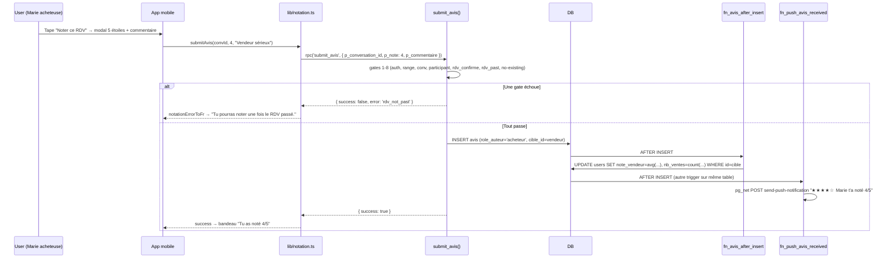

# Module Notation post-RDV — Backend

> Source de vérité backend du module **Notation post-RDV** (CDC v4.0 §confiance, F06).
> Couvre : table `avis`, side-effect sur `users.note_*` et `users.nb_*`, RPCs `submit_avis` + slice `get_user_public_profile`, triggers de recalc + push, RLS, et les écrans / lib mobiles qui consomment.
>
> **Migrations concernées** : 37 (core), 38 (drop auto-3/5 + after-delete trigger + recalc one-shot), 42 (symétrie INSERT recalc-from-scratch), 51 (slice public profile), 67 (push avis_received), 70 (FK fix delete account — dormant en pratique vu mig 24 cascade), **86 (durcit submit_avis : exige rencontre mutuelle confirmée — 3 nouvelles gates)**, 78 (admin KPIs avg/count).
> **Tier RGPD** : 🟡 P1 — l'avis est une donnée publique signée (auteur + cible + note + commentaire facultatif), pas de PII sensible mais identifie un user.

---

## 1. Vue d'ensemble

Niqo est une marketplace C2C où la confiance n'est pas garantie par défaut (pas d'escrow en v4.0). La **notation post-RDV** est l'un des 4 piliers du système de confiance (cf. CDC §confiance) : après un RDV physique confirmé des deux côtés et passé, chaque participant peut noter l'autre 1-5 étoiles + un commentaire optionnel (200 chars max).

**Invariants produit non-négociables :**

| Invariant | Enforcement |
|---|---|
| 1 avis max par auteur par conversation | UNIQUE `(conversation_id, auteur_id)` (mig 37) |
| 2 avis max par RDV (acheteur ↔ vendeur) | Conversation 1↔1 + invariant ci-dessus |
| Avis signés (auteur visible) — pas d'anonymat | Pas de masquage côté `get_user_public_profile` ; `auteur_prenom` + `auteur_avatar_url` exposés |
| Avis figés — non modifiables, non supprimables par l'auteur | Aucune policy UPDATE/DELETE sur `avis` (deny-by-default RLS) |
| Avis posable uniquement après RDV confirmé, passé, ET rencontre mutuelle confirmée (mig 86) | Gates dans la RPC `submit_avis` (mig 37 origines + mig 86 ajouts anti-fraude) |
| Compteurs et moyennes auto-mises à jour | Triggers `tg_avis_after_insert` (mig 37+42) et `tg_avis_after_delete` (mig 38), recalc-from-scratch les deux |
| Auteur ≠ cible | CHECK `avis_pas_soi_meme` (mig 37) |
| Pas de note auto si l'user ne note pas | Cron `avis-auto-j7` DROPPED en mig 38 — décision UX "plus simple, plus honnête" |

**Browse-first** : la lecture des avis est publique (RLS `using (true)`) — un visiteur anonyme voit le profil vendeur avec note + recent_avis sans avoir besoin de s'authentifier.

**Modèle économique** : la note alimente le statut implicite "Vendeur Fiable" (`nb_ventes ≥ 5 && note_vendeur ≥ 4.0`, calculé en code dans `TrustedAvatar` côté mobile — cf. `docs/architecture/v4-deltas.md`).

---

## 2. Tables consommées

### 2.1 `public.avis` (mig 37 + FK fix mig 70)

| Colonne | Type | Source mig | Usage |
|---|---|---|---|
| `id` | `uuid` PK default `uuid_generate_v4()` | 37 | identifiant interne |
| `conversation_id` | `uuid` NOT NULL FK→conversations CASCADE | 37 | rattachement RDV — cascade cohérente quand la conv est purgée |
| `auteur_id` | `uuid` **nullable** FK→users SET NULL | 37 + 70 | NULL si compte supprimé (mig 70 — anonymisation post-deletion). UI affiche "Utilisateur supprimé". |
| `cible_id` | `uuid` NOT NULL FK→users CASCADE | 37 + 70 | si la cible disparaît, l'avis disparaît avec (mig 70) |
| `note` | `smallint` NOT NULL CHECK (1-5) | 37 | étoiles |
| `commentaire` | `text` nullable CHECK (1-200 chars) | 37 | optionnel ; pas de filtre mots interdits MVP (cf. mig 37 décision §4) |
| `role_auteur` | `text` NOT NULL CHECK (`acheteur` \| `vendeur`) | 37 | détermine quel champ recalculer côté cible |
| `is_auto` | `boolean` NOT NULL default false | 37 | héritage pré-mig 38. Aucune row NEW devrait être à `true` post-mig 38 (cron supprimé). Conservé en schéma pour rétrocompat. |
| `created_at` | `timestamptz` NOT NULL default now() | 37 | tri profil (DESC) |

**Constraints** :
- `avis_unique_par_conv_auteur` UNIQUE (`conversation_id`, `auteur_id`) → 1 avis max par auteur par conv
- `avis_pas_soi_meme` CHECK (`auteur_id != cible_id`) → on ne se note pas soi-même
  - ⚠ Avec auteur_id NULL post-deletion, le CHECK passe en UNKNOWN (Postgres ignore NULL) → comportement OK : l'avis anonymisé reste valide

**Indexes** :
- `idx_avis_cible (cible_id, role_auteur, created_at desc)` — query principale "avis reçus par X" (recent_avis + recalc trigger)
- `idx_avis_conv (conversation_id)` — fetchMyAvisOnConv + fetchAvisFromOtherOnConv (mobile)
- `idx_avis_auteur (auteur_id, created_at desc)` — historique d'un auteur (admin futur, KPIs)

### 2.2 Side-effect sur `public.users`

L'INSERT (et le DELETE) sur `avis` met à jour 4 colonnes côté `users` via les triggers :

| Colonne `users` | Source | Usage produit |
|---|---|---|
| `note_vendeur` | `avg(note) WHERE cible_id=user AND role_auteur='acheteur'` | Affichée sur profil vendeur (mobile + landing public `/a/[id]`) |
| `note_acheteur` | `avg(note) WHERE cible_id=user AND role_auteur='vendeur'` | Affichée si l'user a déjà acheté (UX progressive disclosure) |
| `nb_ventes` | `count(*) WHERE cible_id=user AND role_auteur='acheteur'` | Critère "Vendeur Fiable" (≥5) + dashboard vendeur |
| `nb_achats` | `count(*) WHERE cible_id=user AND role_auteur='vendeur'` | Stat profil + KPIs admin |

**Pattern recalc-from-scratch (mig 42 + 38)** : les triggers ne font PAS `nb_ventes = nb_ventes + 1`. Ils refont un `count(*)` + `avg(note)` complet depuis la table `avis`. Plus défensif (auto-correction si désynchro), légèrement plus coûteux mais instantané vu la volumétrie attendue (`idx_avis_cible` couvre la query). Cf. mig 42 header pour la justification (incident "Jean nb_ventes=7 fantôme" pré-mig 38).

---

## 3. RLS

### 3.1 `public.avis`

Mig 37 ligne 70 :
```sql
alter table public.avis enable row level security;
```

| Action | Policy | Effet |
|---|---|---|
| SELECT | `avis_select_public` `using (true)` | Public — anon + authenticated voient tous les avis |
| INSERT | **aucune policy** | Bloqué pour PostgREST. Seul `submit_avis` SECURITY DEFINER insère. |
| UPDATE | **aucune policy** | Bloqué — avis figés. |
| DELETE | **aucune policy** | Bloqué côté client. Possible via cascade `cible_id ON DELETE CASCADE` (mig 70) ou via SQL admin. |

**Pourquoi SELECT public ?** L'avis fait partie du profil public d'un vendeur — un acheteur potentiel doit pouvoir le lire sans compte (browse-first). RGPD : l'auteur a opté en cliquant "publier" → consentement implicite, et le contenu est explicitement signé.

---

## 4. RPCs

### 4.1 `public.submit_avis(p_conversation_id, p_note, p_commentaire)` (mig 37)

```sql
returns jsonb { success: bool, error?: string }
language plpgsql
security definer
set search_path = public
grant execute to authenticated
```

**Gates** (dans l'ordre du code, version actuelle = mig 86 qui a re-créé la RPC. ⚠ La version mig 37 originale n'avait que 8 gates ; mig 86 en a ajouté 3 pour anti-fraude vendeur) :

| # | Check | Code retour | Mig |
|---|---|---|---|
| 1 | `auth.uid() is not null` | `not_authenticated` | 37 |
| 2 | `p_note between 1 and 5` | `note_invalid` | 37 |
| 3 | `char_length(trimmed) <= 200` (après `nullif(trim,'')`) | `commentaire_too_long` | 37 |
| 4 | Conversation existe (lookup `for update` — verrou anti-race) | `conversation_not_found` | 37 |
| 5 | Caller est `acheteur_id` ou `vendeur_id` de la conv | `not_participant` | 37 |
| 6 | `conv.rdv_confirme_at is not null` | `rdv_not_confirmed` | 37 |
| 7 | `conv.rdv_date < now()` | `rdv_not_past` | 37 |
| 8 | `v_rencontre_self is not null` (l'auteur a confirmé "on s'est vu") | `meeting_not_confirmed_self` | **86** |
| 9 | `v_rencontre_self != false` (pas de "on ne s'est pas vu" auto-déclaré) | `meeting_declined_self` | **86** |
| 10 | `v_rencontre_other != false` (l'autre n'a pas dit explicitement "non") | `meeting_disputed` | **86** |
| 11 | Aucun avis existant `(conversation_id, auteur_id)` | `avis_already_submitted` | 37 |

Si tout passe → INSERT avec `role_auteur` (déterminé serveur-side : acheteur si `auth.uid() = conv.acheteur_id`, sinon vendeur), `cible_id` (l'autre côté), `is_auto=false`. Le trigger `fn_avis_after_insert` (mig 37+42) prend le relais.

**Pourquoi mig 86 a durci** : sans rencontre mutuelle, un vendeur pouvait s'auto-noter en proposant un RDV bidon que l'acheteur confirmait par politesse, puis attendre la date passée, puis `submit_avis`. Mig 86 force une étape explicite "on s'est vu" côté chaque participant après le RDV (RPC `confirm_rencontre`, cf. `docs/backend/rdv.md` §rencontre). Sans cette confirmation = pas de notation.

⚠ **Implication pour le mapping FR côté lib mobile** : `lib/notation.ts:NOTATION_ERRORS_FR` ne contient pas les 3 nouveaux codes mig 86 (`meeting_not_confirmed_self`, `meeting_declined_self`, `meeting_disputed`). En l'état, l'UI affiche le DEFAULT_FR ("Une erreur est survenue. Réessaie dans un instant.") au lieu d'un message explicite. Cf. §11 audit finding.

**Verrou** `for update` sur la conversation : protège contre 2 RPC concurrentes du même auteur (clic double sur "Publier"). Le second sera bloqué jusqu'au commit du premier, puis la check d'unicité (gate #8) le rejettera proprement avec `avis_already_submitted`.

### 4.2 `public.get_user_public_profile(p_user_id)` — slice notation (mig 37 §7 + slice mig 51)

Cette RPC pré-existe à mig 37 (mig 16 origine). Mig 37 a étendu la jsonb de retour pour inclure les champs notation. Mig 51 a ajouté `is_verified`. Couverture complète dans `docs/backend/auth.md` §RPC.

Champs notation exposés :
```json
{
  "note_vendeur": 4.50,        // moyenne note (NULL si nb_ventes=0)
  "nb_ventes":    12,
  "note_acheteur": 4.75,
  "nb_achats":    3,
  "recent_avis": [             // top 10 avis reçus, plus récents en premier
    {
      "id": "...",
      "note": 5,
      "commentaire": "Vendeur sérieux, bon prix",
      "role_auteur": "acheteur",
      "is_auto": false,
      "created_at": "2026-04-12T10:30:00Z",
      "auteur_id": "...",
      "auteur_prenom": "Marie",
      "auteur_avatar_url": "https://..."
    }
  ]
}
```

⚠ **Subtilité `recent_avis` post-mig 70** : la query fait `join public.users ua on ua.id = a.auteur_id` (INNER JOIN). Un avis avec `auteur_id IS NULL` (auteur supprimé) **n'apparaît pas** dans recent_avis. Cf. §10 Écart code vs commentaire mig 70.

**Grants** : `authenticated, anon` — utilisable browse-first.

---

## 5. Triggers

### 5.1 `tg_avis_after_insert` → `fn_avis_after_insert` (mig 37, body symétrisé mig 42)

```sql
after insert on public.avis for each row
security definer, set search_path = public
```

**Effet** :
- Si `NEW.role_auteur = 'acheteur'` → cible = vendeur → recalc `note_vendeur` + `nb_ventes` côté `users.id = NEW.cible_id`
- Sinon → cible = acheteur → recalc `note_acheteur` + `nb_achats`

**Recalc** (depuis mig 42) : `select round(avg(note)::numeric, 2)` + `select count(*)::int` from `avis` filtrée. `coalesce(..., 0)` pour le cas dégénéré (single avis tout juste inséré ne devrait jamais déclencher coalesce ici, mais safety).

### 5.2 `tg_avis_after_delete` → `fn_avis_after_delete` (mig 38)

Symétrique à insert : recalc depuis la table après le DELETE. Couvre les cas :
- Cascade `cible_id ON DELETE CASCADE` (mig 70) — supp d'un user → tous ses avis reçus disparaissent
- DELETE manuel admin via SQL Editor / service_role (modération anti-fraude)

Pas de DELETE possible via PostgREST (pas de policy).

### 5.3 `trg_push_avis_received` → `fn_push_avis_received` (mig 67)

```sql
after insert on public.avis for each row
security definer
```

**Effet** : envoie une push notification à `NEW.cible_id` via `pg_net` → Edge Function `send-push-notification` (cf. `docs/backend/auth.md` §push pour le pattern complet, ou la prochaine doc backend push.md à venir).

Format : `"<étoiles>" <prenom_auteur> t'a noté <note>/5` (ex : `"★★★★☆ Marie t'a noté 4/5"`). Cf. mig 67 ligne 102-105.

**FP rule** : ce trigger est dans le scope du module Push, pas Notation strictement. Documenté ici parce qu'il est attaché à la table `avis` ; les détails du transport push vivent dans le module Push.

---

## 6. Cron jobs

**Aucun cron actif sur ce module.**

Mig 37 avait créé `avis-auto-j7` (note auto 3/5 quotidien à 04:00 UTC pour tout RDV passé depuis ≥7j sans avis). Mig 38 l'a explicitement supprimé (`cron.unschedule` + `drop function fn_avis_auto_j7`). Décision UX : "plus simple, plus honnête — si l'user n'a pas noté en 7j, pas de note posée".

⚠ **Écart CDC v4.0** — la spec figée en avril 2026 mentionne encore "auto 3/5 après 7j" dans :
- Système de confiance §4 piliers (Notation post-RDV)
- F06 status dans CLAUDE.md historique

Le code est la source de vérité (mig 38). Cf. §10.

---

## 7. Storage

**Aucun bucket sur ce module.** Les avis sont 100% structurés en DB (pas de pièce jointe / preuve photo).

---

## 8. Lib mobile + UI consumers

### 8.1 `lib/notation.ts`

| Export | Signature | Usage |
|---|---|---|
| `submitAvis(convId, note, commentaire)` | wraps RPC `submit_avis` avec timeout 15s | Modal post-RDV (mobile chat screen) |
| `fetchMyAvisOnConv(convId)` | SELECT direct via RLS public, filtré sur `auteur_id = auth.uid()` | Bandeau chat "Tu as noté X" vs "Noter X" |
| `fetchAvisFromOtherOnConv(convId)` | SELECT direct, filtré sur `cible_id = auth.uid()` | Affichage optionnel "Jean t'a noté aussi" |
| `notationErrorToFr(error)` | Mappe les codes RPC en messages FR | Toasts d'erreur UX |

Types : `AvisNote = 1\|2\|3\|4\|5`, `RoleAuteur = 'acheteur' \| 'vendeur'`, `Avis`, `AvisWithAuteur`.

### 8.2 Écrans qui consomment

| Écran | Lib utilisée | Affichage |
|---|---|---|
| `app/messages/[conversationId].tsx` | `submitAvis` + `fetchMyAvisOnConv` | Modal "Note ce RDV" + bandeau "Tu as noté X" post-submit |
| `app/u/[id].tsx` (profil public d'un vendeur) | `get_user_public_profile` (RPC, pas via lib/notation) | `note_vendeur` + recent_avis (top 10) |
| `app/profile/dashboard.tsx` (mon dashboard vendeur) | `get_my_dashboard_stats` (RPC) | `nb_ventes` + `note_vendeur` agrégés |
| `landing/src/app/a/[id]/page.tsx` (annonce publique web) | RPC + render SSR | Score vendeur visible aux visiteurs anon |

### 8.3 Composants

`components/notation/*` — module compact. Composants principaux :
- `NotationStarRow` — affichage 5 étoiles
- `NotationModal` — UI submit avis
- `RecentAvisList` — top 10 sur profil public
- `TrustedAvatar` — wraps Avatar + ring vert si Vendeur Fiable (`nb_ventes ≥ 5 && note_vendeur ≥ 4.0`)

---

## 9. Flow Mermaid — submit_avis



## 10. Écarts CDC v4.0 vs code

| Sujet | CDC v4.0 (figé avril 2026) | Code source de vérité |
|---|---|---|
| Note auto 3/5 après 7j | ✅ mentionnée comme pilier confiance | ❌ supprimée mig 38 — décision UX "plus simple, plus honnête" |
| Avis ancré sur `transactions` | implicite si v3.14 lu | ❌ ancré sur `conversations.id` — table `transactions` n'existe pas en v4.0 |
| Recent_avis affiche aussi auteurs supprimés | implicite mig 70 commentaire "historique préservé" | ❌ INNER JOIN dans `get_user_public_profile` exclut les avis avec `auteur_id IS NULL`. Cf. §11. |
| Filtre mots interdits sur commentaire | non spécifié | ❌ pas implémenté (mig 37 décision "à ajouter si abus"). Pas de blocage MVP. |

À refléter dans `docs/architecture/v4-deltas.md` la prochaine fois qu'il est mis à jour.

---

## 11. Audit cohérence — pistes d'amélioration

Audit fait le 2026-05-10 lors du backfill backend. Aucune régression de sécurité ; les points ci-dessous sont des améliorations possibles, **rien n'est bloquant** pour la prod.

| # | Constat | Sévérité | Action proposée |
|---|---|---|---|
| 1 | `get_user_public_profile.recent_avis` fait un **INNER JOIN** sur `auteur_id`, donc un avis dont l'auteur a supprimé son compte (auteur_id NULL) est exclu de la liste. Le commentaire mig 70 ligne 21 dit "anonymise — historique préservé", mais l'historique ne s'affiche pas. **De plus** : `auteur_id ON DELETE SET NULL` (mig 70) est en pratique **dormant** — quand un user est supprimé via `delete_my_account`, ses conversations cascade-suppriment via `mig 24` (`acheteur_id`/`vendeur_id` ON DELETE CASCADE), ce qui cascade-supprime ses avis via `conversation_id` AVANT que le SET NULL puisse s'appliquer. Vérifié pgTAP test 28-29. | 🟡 cohérence | Mig 106 (optionnelle) : LEFT JOIN dans `get_user_public_profile`. Mais en pratique le SET NULL ne se déclenche jamais → contenu réellement préservé = 0. Soit on assume la suppression complète (statu quo), soit on retire `mig 70` SET NULL et on documente le cascade complet. |
| 1b | `lib/notation.ts:NOTATION_ERRORS_FR` est désynchronisé avec la version actuelle de `submit_avis`. 3 codes mig 86 (`meeting_not_confirmed_self`, `meeting_declined_self`, `meeting_disputed`) absents → UI affiche un message d'erreur générique au lieu d'un message explicite. UX dégradée. | 🟡 UX | Ajouter 3 entrées au mapping. Probablement déjà présent dans `lib/rdv.ts` (mark_annonce_vendue partage les gates) — extraire ou dupliquer pour `lib/notation.ts`. |
| 2 | `is_auto` reste exposé dans `Avis` interface (`lib/notation.ts:26`) et dans `recent_avis` jsonb. Aucune row n'est jamais à `true` post-mig 38 (cron drop). | 🟢 cleanup | Laisser tel quel pour rétrocompat — éventuellement supprimer dans une mig de cleanup post-MVP, ou ne plus surfacer côté UI. |
| 3 | `submit_avis` ne vérifie pas que la cible (`v_cible_id`) est `is_active`. Un user peut noter quelqu'un dont le compte vient d'être suspendu (par admin) entre la fin du RDV et la note. | 🟢 acceptable | Comportement défendable : la note historique reste valide. La suspension n'efface pas le passé. Pas d'action. |
| 4 | Pas de filtre mots interdits sur `commentaire`. Mig 37 décision §4 "à ajouter si abus". | 🟢 acceptable MVP | Si abus détecté en prod, ajouter trigger BEFORE INSERT qui appelle `fn_check_forbidden_words(NEW.commentaire)` (existe déjà via mig 29). 1 ligne en SQL. |

**Verdict** : module solide. La couverture par les triggers recalc-from-scratch (mig 42) corrige toutes les désynchros possibles. Pas de mig 106 nécessaire pour l'instant.

---

## 12. Tests

### 12.1 pgTAP — `tests/sql/notation.test.sql`

Couvre niveau base (RPC, triggers, RLS isolés du gateway). Cibles :

| Catégorie | Assertions |
|---|---|
| `submit_avis` happy path (acheteur note vendeur) | INSERT avis OK + recalc `note_vendeur` + `nb_ventes` |
| `submit_avis` happy path (vendeur note acheteur) | INSERT avis OK + recalc `note_acheteur` + `nb_achats` |
| Gates : `not_authenticated`, `note_invalid`, `commentaire_too_long`, `conversation_not_found`, `not_participant`, `rdv_not_confirmed`, `rdv_not_past`, `avis_already_submitted` | 1 erreur attendue par gate |
| UNIQUE `(conversation_id, auteur_id)` | 2e submit du même auteur → `avis_already_submitted` |
| CHECK `avis_pas_soi_meme` | impossible naturellement via RPC (cible déterminée serveur-side ≠ auth.uid) — testé par INSERT direct service_role qui échoue |
| Trigger after-insert recalc | INSERT 2 avis sur même cible → `note_vendeur` = avg, `nb_ventes` = 2 |
| Trigger after-delete recalc | DELETE 1 avis → recalc descend |
| Cascade `cible_id` | DELETE cible → ses avis reçus supprimés en cascade + trigger recalc s'enchaîne (mais users disparu, donc no-op) |
| FK `auteur_id` SET NULL | DELETE auteur → ses avis émis ont `auteur_id = null` |
| RLS public SELECT | role anon peut SELECT toute la table |
| RLS deny INSERT direct | `set role authenticated` + `insert into avis` → erreur |

Total cible : ~30 assertions.

### 12.2 Vitest intégration — `tests/integration/notation.test.ts`

Couvre stack complet via PostgREST + JWT + RLS gateway :

- 2 users authentifiés (acheteur Alice + vendeur Bob) + annonce + conversation + RDV confirmé + passé
- `submitAvis` côté Alice → succès → re-fetch `users.note_vendeur` côté Bob ⇒ valeur attendue
- Re-`submitAvis` côté Alice → erreur `avis_already_submitted`
- `fetchMyAvisOnConv` côté Alice ⇒ son avis ; côté Bob ⇒ null
- `fetchAvisFromOtherOnConv` côté Bob ⇒ avis d'Alice ; côté Alice ⇒ null
- 3e user Charlie tente `submitAvis` sur cette conv → `not_participant`
- `get_user_public_profile(bobId)` (anon) ⇒ recent_avis non vide

Total cible : 8-10 tests.

---

## 13. Pièges connus & recettes de debug

| Symptôme | Cause | Fix |
|---|---|---|
| `note_vendeur` côté Bob ne bouge pas après que Marie l'a noté | Trigger pas joué — vérifier que l'INSERT est bien dans `public.avis` et pas une autre table | Tail `select * from public.avis order by created_at desc limit 5;` |
| `note_vendeur` est faux (5 étoiles, mais `nb_ventes=0`) | Désynchro pré-mig 38 (seed/test data) | Re-jouer mig 38 §2 (recalc one-shot) |
| `submit_avis` retourne `rdv_not_past` alors que le RDV était hier | Timezone — `rdv_date` stocké en UTC, comparaison `now()` en UTC. Vérifier que côté client le timestamp envoyé inclut le suffix Z. | Logs Postgres `select rdv_date, now() from conversations where id=...` |
| `avis_already_submitted` au premier submit | Re-soumission depuis un retry réseau silencieux | UI doit débouncer + désactiver le bouton après le 1er click |
| Auteur avec `prenom = null` dans `recent_avis` | Compte supprimé (auteur_id NULL post-mig 70) → INNER JOIN exclut → ne devrait pas apparaître. Si ça apparaît, c'est un compte avec un trigger handle_new_user qui n'a pas posé prenom (rare) | Vérifier `select id, prenom from users where id = '<auteur_id>'` |
| Cascade DELETE conv → avis disparaît mais `note_vendeur` mal recalculée | Ne devrait pas arriver — `tg_avis_after_delete` couvre. Si ça arrive, le trigger ne s'est pas joué (event trigger désactivé ?) | `select tgname, tgenabled from pg_trigger where tgrelid = 'public.avis'::regclass;` |
| Push "X t'a noté" non reçue côté Bob | Rate-limit Expo, ou Bob n'a pas de push token | Cf. `docs/backend/push.md` (à venir) |

---

## 14. Pour aller plus loin

- Filtre mots interdits sur `commentaire` si abus détecté → cf. mig 29 `fn_check_forbidden_words`
- Modération admin avec soft-delete (à la place du DELETE direct) → table `avis` à étendre avec `deleted_by_admin_at` + policy SELECT excluant les soft-deleted pour role anon
- Réponse vendeur à un avis (1 réponse max) → table `avis_reponses` ou champ jsonb sur `avis`
- Dispute via signalement (mig 91 fraude post-RDV) déjà couvert dans le module Signalement, n'altère pas l'avis lui-même

Pour l'historique des décisions et les écarts vs CDC, cf. `docs/architecture/v4-deltas.md`.
