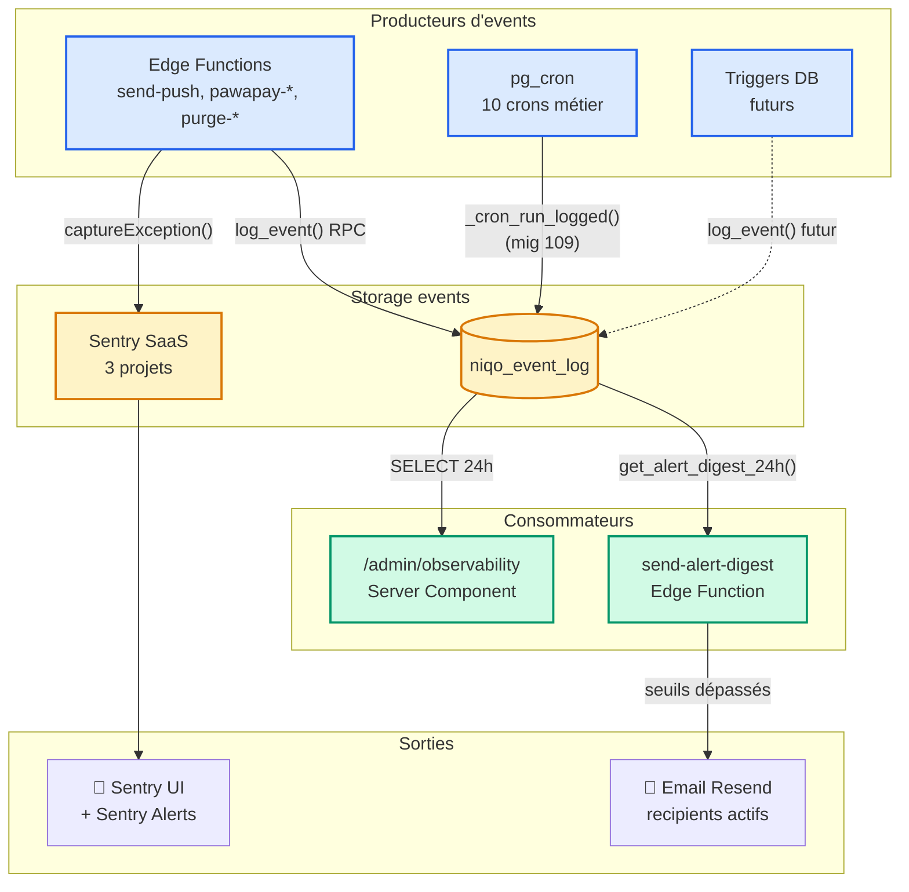

# Module Observability — Backend

> Source de vérité backend du **stack d'observabilité Niqo** : Sentry (errors temps réel) + `niqo_event_log` (compteurs business) + dashboard `/admin/observability` + alertes email quotidiennes via Resend + instrumentation des crons DB.
>
> **Migrations concernées (106-109)** : **106** (table `niqo_event_log` + RPC `log_event` + cron purge 30j), **107** (fix grant `authenticated`), **108** (alert digest — table `niqo_alert_recipients` + RPC `get_alert_digest_24h` + Edge Function `send-alert-digest` + cron 8h UTC), **109** (instrumentation des 10 crons DB existants via `_cron_run_logged`).
>
> **Commits associés** : `5038ffd` (Sentry integration), `53bda31` (fix Sentry Metro mobile), `820a56e` (mig 106+107 + Edge instrumentation + page admin), `84e9d28` (mig 108 alert digest), `06b2053` (mig 109 cron instrumentation).
>
> **Tier RGPD** : 🟡 P1 — les payloads `niqo_event_log` ne doivent jamais contenir de PII (téléphone, email, contenu de message). Les `extra` Sentry suivent la même règle. Conventions strictement appliquées : seulement counts, IDs, codes d'erreur.

---

## 1. Vue d'ensemble

L'observabilité Niqo s'articule autour de **3 piliers complémentaires** :

| Pilier | Outil | Granularité | Rétention |
|---|---|---|---|
| **Erreurs en temps réel** | Sentry (3 projets) | Stack trace + breadcrumbs + release | 90j (free tier) |
| **Compteurs métier** | `niqo_event_log` (Postgres) | Event log structuré, agrégeable | 30j (cron purge) |
| **Push proactif** | Edge Function + Resend | Digest email quotidien si seuils dépassés | — |

**Pourquoi 3 piliers ?**
- Sentry seul : on capture les crashes mais on ne sait pas combien de pushs passent ni si les crons tournent (pas d'event "rien à signaler")
- Event log seul : on a les volumes mais pas le stack trace lisible des crashes
- Sans push proactif : l'admin doit penser à check le dashboard manuellement — pas viable en routine solo

**Visibilité unifiée** côté Next.js admin : `/admin/observability` lit `niqo_event_log` ; Sentry reste un onglet séparé (`niqo-edge` / `niqo-mobile` / `niqo-admin` sur sentry.io).

---

## 2. Architecture



---

## 3. Tables

### `niqo_event_log` (mig 106)

| Colonne | Type | Notes |
|---|---|---|
| `id` | bigint identity PK | |
| `occurred_at` | timestamptz default now() | Indexé desc |
| `module` | text not null | Nom court du producteur (`send-push`, `pawapay-webhook`, `rdv-reminder`, etc.) |
| `event_type` | text not null | Verbe métier : `push.sent`, `webhook.completed`, `cron.run`, etc. |
| `severity` | text not null CHECK | `debug`, `info`, `warning`, `error` |
| `payload` | jsonb not null default '{}' | Counts, IDs, codes — **jamais de PII** |
| `user_id` | uuid FK auth.users ON DELETE SET NULL | Optionnel |

**Indexes** :
- `(module, occurred_at desc)` — query "events d'un module sur N derniers"
- `(event_type, occurred_at desc)` — query "tous les push.sent"
- `(occurred_at)` — range scan pour le cron de purge

**RLS deny-by-default** + policy SELECT pour `authenticated` filtrée par `users.is_admin = true` (mig 106 + grant SELECT mig 107).

### `niqo_alert_recipients` (mig 108)

| Colonne | Type | Notes |
|---|---|---|
| `id` | uuid default gen_random_uuid() PK | |
| `email` | text not null | Index unique sur `lower(email)` |
| `label` | text | Optionnel — nom humain |
| `active` | boolean default true | Index partiel `WHERE active = true` |
| `created_at` | timestamptz default now() | |

**RLS deny-by-default** + policy SELECT admin only. Gestion CRUD via `service_role` (SQL Editor admin pour MVP — pas d'UI dédiée).

---

## 4. RPCs

### `public.log_event(module, event_type, severity, payload, user_id)` → bigint (mig 106)

**Append-only logger** pour `niqo_event_log`. SECURITY DEFINER + `set search_path` + `revoke from authenticated` + `grant to service_role`.

**Validation** :
- `severity` doit être dans `('debug', 'info', 'warning', 'error')` (raise sinon)
- `module` et `event_type` non vides
- Retourne l'id inséré, ou `null` si une exception est catchée

**Catch-all** : un échec interne (FK cassée, contrainte violée) retourne `null` + raise warning. **Un échec de log ne casse JAMAIS le caller métier** — c'est une garantie forte du module.

### `public.get_alert_digest_24h()` → jsonb (mig 108)

Agrège `niqo_event_log` sur les 24 dernières heures en un seul `jsonb` :

```json
{
  "window_hours": 24,
  "total": 142,
  "totals_by_severity": { "info": 138, "warning": 2, "error": 2 },
  "by_module": [
    { "module": "send-push", "total": 89, "error_count": 0, "warning_count": 0, "info_count": 89 },
    { "module": "rdv-reminder", "total": 24, ... }
  ],
  "top_errors": [
    { "event_type": "push.expo_api_error", "module": "send-push", "cnt": 2 }
  ],
  "generated_at": "2026-05-11T08:00:00Z"
}
```

SECURITY DEFINER, service_role only. Réutilisable depuis SQL Editor pour debug : `select public.get_alert_digest_24h();`.

### `public._cron_run_logged(cron_name, fn_name)` → void (mig 109)

**Wrapper générique** pour les crons pg_cron. Execute `public.<fn_name>()` via `EXECUTE format('select public.%I()', p_fn_name)` avec **whitelist regex `^[a-zA-Z_][a-zA-Z0-9_]*$`** anti-injection.

Logue automatiquement :
- `cron.run` (info) avec `{ fn, duration_ms }` en cas de succès
- `cron.error` (error) avec `{ fn, sqlstate, message, duration_ms }` en cas d'exception, puis **re-raise** pour que `cron.job_run_details` voie aussi l'échec.

### Wrappers dédiés (mig 109)

Pour les crons à SQL inline (impossible de paramétrer via `_cron_run_logged`) :
- `_cron_purge_suspended_users()` — DELETE `auth.users` is_active=false >30j (mig 04)
- `_cron_expire_annonces()` — UPDATE `annonces` SET statut='expiree' WHERE expires_at < now() (mig 16)

### Helpers privés

- `_invoke_alert_digest()` (mig 108) — appelle l'Edge Function `send-alert-digest` via `pg_net` avec `Bearer NIQO_INTERNAL_KEY` lu depuis `vault.decrypted_secrets`. Catch-all (un échec n'arrête pas le cron).

---

## 5. Edge Functions

### `send-alert-digest` (mig 108)

**Auth** : `Authorization: Bearer ${NIQO_INTERNAL_KEY}` (constant-time compare, même pattern que `send-push-notification`). Le caller légitime est `pg_net` invoqué par le cron `niqo-alert-digest`.

**Flow** :
1. Récupère `get_alert_digest_24h()` via RPC
2. Évalue les seuils (ordre de priorité) :
   - `errors > 0` → email avec `reason: "errors"`
   - `warnings ≥ 5` → email avec `reason: "warnings"`
   - `total == 0` → email avec `reason: "silence"` (signal cron mort)
   - Else if `ALERT_FORCE_DAILY=true` → email avec `reason: "force_daily"`
   - Sinon → skip + log `alert.skipped` dans `niqo_event_log`
3. Récupère `niqo_alert_recipients WHERE active = true`
4. POST `https://api.resend.com/emails` pour chaque recipient (HTML + text + tag `alert-digest`)
5. Log `alert.sent` ou `alert.skipped` dans `niqo_event_log`

**Email HTML responsive** : header coloré selon severity (rouge `#E24B4A` / amber `#F59E0B` / gris `#6B7280` / noir `#1A1A1A`) + tableau par module avec counts severity + top 10 erreurs + lien vers le dashboard.

**Secrets Supabase Edge Functions** :
- `NIQO_INTERNAL_KEY` — déjà set pour `send-push-notification`
- `RESEND_API_KEY` — **à set séparément de Vercel** (deux runtimes)
- `ALERT_EMAIL_FROM` — optionnel, default `Niqo <bonjour@niqo.africa>`
- `ALERT_FORCE_DAILY` — optionnel, `true` pour digest quotidien systématique

### Edge Functions instrumentées (820a56e)

4 Edge Functions appellent `logEvent` côté succès + échecs (via `_shared/event_log.ts`) :

| Function | Events émis |
|---|---|
| `send-push-notification` | `push.sent`, `push.no_tokens`, `push.db_error`, `push.expo_api_error`, `push.fetch_failed` |
| `pawapay-webhook` | `webhook.completed`, `webhook.failed`, `webhook.rejected` (fraude), `webhook.db_error` |
| `pawapay-init-deposit` | `deposit.mock_completed`, `deposit.pending`, `deposit.rejected`, `deposit.fetch_failed` |
| `purge-annonces-photos` | `purge.completed`, `purge.error` |

Le helper `_shared/event_log.ts` est **fire-and-forget + best-effort** : un échec de log côté Postgres n'interrompt pas la fonction caller.

---

## 6. Cron jobs

12 crons actifs au total. Tous instrumentés sauf 2 (par design).

| Cron | Schedule | Commande | Mig | Instrumenté ? |
|---|---|---|---|---|
| `niqo-purge-suspended-users` | `0 3 * * *` | `_cron_run_logged('niqo-purge-suspended-users', '_cron_purge_suspended_users')` | 04 + 109 | ✅ |
| `expire-annonces` | `0 2 * * *` | `_cron_run_logged('expire-annonces', '_cron_expire_annonces')` | 16 + 109 | ✅ |
| `purge-expired-annonces` | `0 3 * * *` | `_cron_run_logged('purge-expired-annonces', 'fn_purge_expired_annonces')` | 16 + 109 | ✅ |
| `avis-auto-j7` | `0 4 * * *` | `_cron_run_logged('avis-auto-j7', 'fn_avis_auto_j7')` | 37 + 109 | ✅ |
| `purge-expired-kyc-verifications` | `0 3 * * *` | `_cron_run_logged('purge-expired-kyc-verifications', 'purge_expired_kyc_verifications')` | 54 + 109 | ✅ |
| `purge-expired-boosts` | `*/15 * * * *` | `_cron_run_logged('purge-expired-boosts', 'purge_expired_boosts')` | 60 + 62 + 109 | ✅ |
| `purge-stale-push-tokens` | `0 3 * * *` | `_cron_run_logged('purge-stale-push-tokens', 'purge_stale_push_tokens')` | 68 + 109 | ✅ |
| `rencontre-reminder` | `0 10 * * *` | `_cron_run_logged('rencontre-reminder', 'fn_push_rencontre_reminder')` | 87 + 109 | ✅ |
| `mark-vendue-reminder` | `0 10 * * *` | `_cron_run_logged('mark-vendue-reminder', 'fn_push_mark_vendue_reminder')` | 90 + 109 | ✅ |
| `rdv-reminder` | `0 * * * *` | `_cron_run_logged('rdv-reminder', 'fn_push_rdv_reminder')` | 97 + 109 | ✅ |
| `purge-niqo-event-log` | `5 4 * * *` | `delete from niqo_event_log where occurred_at < now() - interval '30 days'` | 106 | ❌ par design (log de soi récursif inutile) |
| `niqo-alert-digest` | `0 8 * * *` | `select public._invoke_alert_digest()` | 108 | ❌ par design (log côté Edge Function send-alert-digest) |

**Horaire** : 8h UTC = 9h Abidjan (UTC+0) = 9h Brazzaville (UTC+1) — l'admin reçoit le digest à l'ouverture de sa journée.

---

## 7. Conventions

### Nommage `event_type`

Format : **`<domaine>.<verbe>`** (kebab-case domaine, snake_case verbe).

| Pattern | Usage |
|---|---|
| `<domaine>.sent`, `<domaine>.completed`, `<domaine>.run` | Happy path (info) |
| `<domaine>.rejected` | Signal métier suspect (warning) |
| `<domaine>.error`, `<domaine>.db_error`, `<domaine>.fetch_failed` | Échec technique (error) |
| `cron.run`, `cron.error` | Universel pour les crons via `_cron_run_logged` |

### Choix de `severity`

| Niveau | Quand |
|---|---|
| `debug` | Verbeux, jamais en prod (réservé futur) |
| `info` | Flux normal — pas d'action requise |
| `warning` | Signal métier suspect (fraude potentielle, dérive, dépréciation imminente). Déclenche email digest si volume ≥ 5/24h. |
| `error` | Échec technique. Déclenche email digest dès la 1ère occurrence. |

### Payload — ce qu'on stocke et ne stocke pas

✅ Counts, IDs (paiement_id, user_id), codes d'erreur (sqlstate, http_status), durations
❌ Téléphone, email, contenu message, body fetch complet (peut contenir tokens / PII)

Pour les détails sensibles d'un crash, **Sentry est le canal correct** (encrypted at-rest, RGPD-compliant, retention 90j puis purge).

---

## 8. Sentry — setup

### Projets (sentry.io org `niqo`)

| Projet | DSN env var | Init côté |
|---|---|---|
| `niqo-edge` | `SENTRY_DSN` (Supabase Edge Function secret) | `_shared/sentry.ts` (custom envelope API) |
| `niqo-mobile` | `EXPO_PUBLIC_SENTRY_DSN` (mobile `.env.local` + EAS secret) | `lib/sentry.ts` |
| `niqo-admin` | `NEXT_PUBLIC_SENTRY_DSN` (Vercel env var) | `instrumentation.ts` + `instrumentation-client.ts` + `sentry.{server,edge}.config.ts` |

### Activation

- **Edge** : SENTRY_DSN + `NIQO_ENV=production` (off en local par défaut)
- **Mobile** : EXPO_PUBLIC_SENTRY_DSN + `!__DEV__` (off en Expo Go / dev build par design produit)
- **Next.js admin** : NEXT_PUBLIC_SENTRY_DSN + `NODE_ENV=production`

### Config commune

- `tracesSampleRate: 0` — errors only en MVP (économise le quota perf events 10k/mois free tier)
- `sendDefaultPii: false` — pas de PII auto-capturée
- Mobile : `beforeSend` strippe les query strings des URLs (anti-token leak)

### Reste à faire avant launch

- ⏳ **Sentry release tracking** — injecter `SENTRY_RELEASE` au build EAS + Vercel (sans ça, on ne peut pas dire "ce crash vient du build 1.0.2")
- ⏳ **Source maps mobile** — valider que `eas build` upload bien les sourcemaps via `SENTRY_AUTH_TOKEN` (provoque un crash sur build EAS preview, vérifier que la stack est lisible)
- ⏳ **Sentry Alert Rules** — configurer côté UI Sentry "Si >10 new issues en 1h → email" (10 min par projet)

---

## 9. Dashboard `/admin/observability`

**Route** : `landing/src/app/admin/(admin-protected)/observability/page.tsx`. Server Component, `dynamic = "force-dynamic"`, gate via le layout `(admin-protected)` qui check `users.is_admin = true`.

**Composants** :
- `_components/PeriodFilter.tsx` (client) — 3 chips 24h / 7j / 30j, URL `?window=24h|7d|30d`
- `_components/EventsTimeline.tsx` (client) — Recharts BarChart stacked (info gris / warning amber / error rouge)
- Tiles par module (server) — total + breakdown severity + top 4 event_types + last seen
- Tables erreurs (≤20) + warnings (≤10) récents

**Helper** : `landing/src/lib/admin/observability.ts` — fonction `fetchObservability(supabase, windowHours)` qui fait 1 fetch raw (limit 5000) + agrège en mémoire. À factoriser en RPC si volume > 10k events/jour.

---

## 10. RLS / Grants — résumé

| Table | anon | authenticated | admin | service_role |
|---|---|---|---|---|
| `niqo_event_log` | ❌ | SELECT (mais policy filtre is_admin=true → 0 rows) | SELECT all | ALL (bypass RLS) |
| `niqo_alert_recipients` | ❌ | SELECT (policy is_admin=true) | SELECT all | ALL |

**Aucun INSERT/UPDATE/DELETE possible depuis PostgREST** — toutes les écritures passent par les RPCs SECURITY DEFINER ou par `service_role` (SQL Editor / Edge Functions).

---

## 11. Opérations courantes

### Ajouter un email destinataire de l'alerte
```sql
insert into public.niqo_alert_recipients (email, label)
values ('partner@example.com', 'Partenaire X');
```

### Désactiver temporairement un recipient
```sql
update public.niqo_alert_recipients set active = false
where email = 'partner@example.com';
```

### Forcer un envoi immédiat (test)
```sql
-- Optionnel : set ALERT_FORCE_DAILY=true côté Supabase Edge secrets, sinon
-- l'email ne partira que si un seuil est dépassé
select public._invoke_alert_digest();
```

### Vérifier qu'un cron a tourné
```sql
select occurred_at, module, event_type, payload
from public.niqo_event_log
where module = 'rdv-reminder' and event_type = 'cron.run'
order by id desc limit 5;
```

### Vérifier la santé globale 24h
```sql
select * from public.get_alert_digest_24h();
```

### Purger manuellement
```sql
-- Réservé debug — le cron purge-niqo-event-log tourne à 4:05 UTC daily
delete from public.niqo_event_log where occurred_at < now() - interval '30 days';
```

---

## 12. Étendre — checklist

Pour ajouter un nouveau producteur d'events (futur Edge Function, futur cron, futur trigger DB) :

1. **Choisir un `module` court** (kebab-case, ≤ 30 chars) — préfixer par le domaine (`payments-…`, `auth-…`).
2. **Choisir les `event_type`** selon les conventions §7 (`<domaine>.<verbe>`).
3. **Côté Edge Function** : importer `logEvent` depuis `_shared/event_log.ts`, appeler après chaque résultat (succès et échec).
4. **Côté trigger DB** : `perform public.log_event(...)` dans la fonction de trigger (SECURITY DEFINER hérité). Catch-all garantit pas de regression.
5. **Côté cron** : si call une RPC existante, utiliser `_cron_run_logged(name, fn)` (mig 109 pattern). Si SQL inline, créer un wrapper `_cron_<name>()` dans une nouvelle mig.
6. **Ajouter un libellé humain** dans `landing/src/lib/admin/observability.ts` → `MODULE_LABELS` (sinon le module s'affiche en code brut dans le dashboard).
7. **Ajouter une icône** dans `landing/src/app/admin/(admin-protected)/observability/page.tsx` → `MODULE_ICONS` (fallback Activity sinon).

Pas besoin de modifier la table, la RPC, le dashboard ou le digest — tout l'agrégation est dynamique par `module`.

---

## 13. Liens

- **Sentry org** : https://sentry.io/organizations/niqo/
- **Resend dashboard** (deliverability) : https://resend.com/emails
- **Pre-prod checklist** : `docs/pre-production-checklist.md` §observabilité
- **Migrations** : `docs/migrations/INDEX.md` (entrées 106-109)
