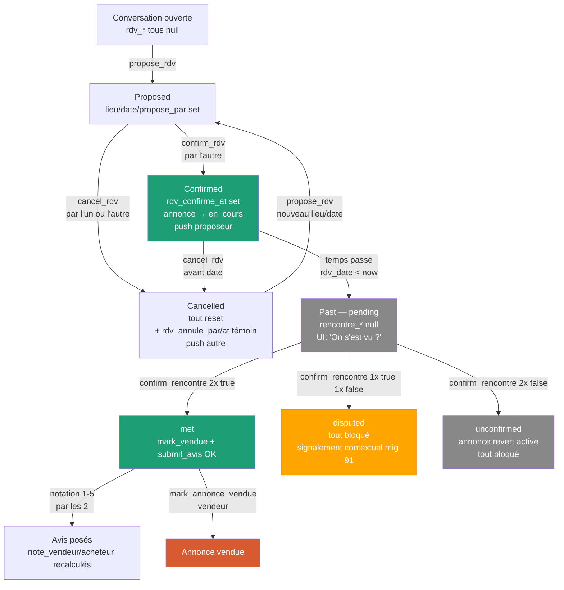
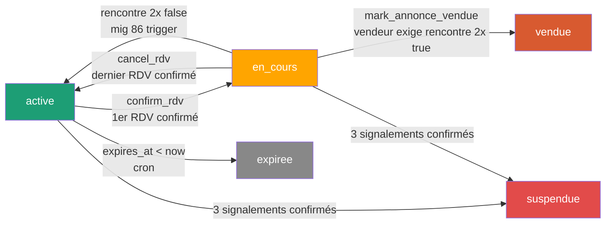
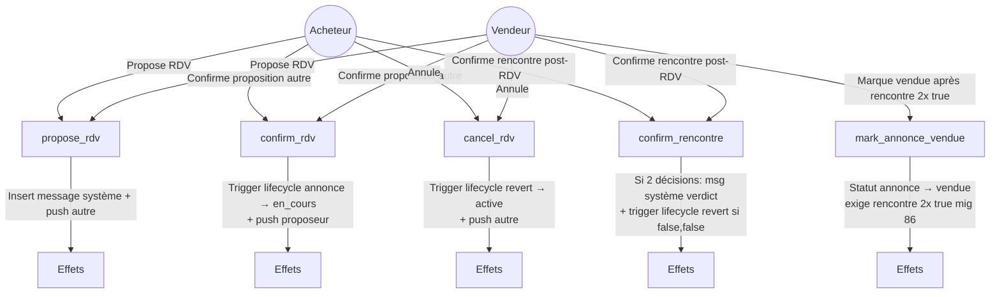

# Module RDV — Backend

> Source de vérité backend du module **F05 — Confirmation de rendez-vous physique** + **confirmation mutuelle post-RDV** (anti-fraude vendeur).
> Couvre : colonnes `rdv_*` + `rencontre_*` sur `conversations`, RPCs `propose/confirm/cancel/confirm_rencontre`, triggers lifecycle annonce (active ↔ en_cours), trigger `mark_annonce_vendue` (gating mutual confirm), push notif, Realtime, FK fixes pour droit à l'oubli.
>
> **Migrations concernées (35-102)** : 35 (RPCs + colonnes + Realtime), 36 (simpli messages système), 39 (lifecycle annonce + FK annonce_id SET NULL + `mark_annonce_vendue`), 41 (RLS visibilité annonce post-RDV), 66 (push proposed/refonte confirmed/annule), 67 (push critical events — RDV inclus), 71 (FK `rdv_propose_par` / `rdv_annule_par` → SET NULL), **86 (confirmation mutuelle post-RDV — anti-fraude `mark_vendue` + `submit_avis`)**, **87 (cron de relance push J+1/J+3/J+7 pour la partie silencieuse + reset rencontre_* dans propose/cancel)**, **88 (mark_vendue voix acheteur seule)**, **89 (mark_vendue auto-confirm rencontre vendeur + msg système)**, **90 (cron relance push mark_vendue oublié + counter sur annonces)**, **91 (signalement contextualisé post-RDV : enum `cible_signalement` += `rdv_post`, enum `motif_signalement_rdv`, RPC `create_signalement_post_rdv`, extension trigger `fn_signalement_check_threshold` avec auto-pause annonce sur fraude)**, **92 (photos post-RDV anti-fraude : table `rencontre_photos` + bucket Storage privé + RPC `add_rencontre_photo` + RLS auteur-only anti-revanche)**, **93 (RPC `get_pending_user_actions` pour bannière Home — agrège actions pendantes : disputed/rencontre/mark_vendue/avis)**, **95 (`admin_revert_annonce_to_active` pour signalement non-fraude)**, **96 (`conversations.admin_signalement_decided_at` + UX bandeau gris résolu côté chat + filtre Home banner)**, **97 (rappels push pre-RDV J-1 + H-2, cron horaire + counter)**, **98 (`get_my_rdv_signalement_status` — verdict côté user signaleur, anti-leak)**, **100 (`propose_rdv` raise `IMMO_NO_RDV` si annonce immo)**, **101 (`mark_annonce_vendue` bypass guard rencontre + auto-confirm pour annonces immo)**, **102 (`add_rencontre_photo` raise `signalement_decided` après admin tranché)**.
>
> **Tier RGPD** : 🔴 P0 — touche à la mise en relation et au lifecycle commercial. Bug = perte de confiance plateforme.

---

## 1. Vue d'ensemble

Niqo n'intermédie plus l'argent (v4.0). Le RDV physique est le moment-clé du parcours : c'est là que l'acheteur et le vendeur se rencontrent, échangent, paient en direct (cash / Mobile Money entre eux). Sans RDV confirmé, pas de notation possible (F06), pas de transition de statut sur l'annonce, pas de signal de confiance pour la communauté.

**Modèle de confirmation** : *Proposer → Confirmer*.
- Une partie propose (lieu + date)
- L'autre partie confirme (le proposeur ne peut pas auto-confirmer)
- Les deux peuvent annuler à tout moment, avant ou après confirmation

**Single source of truth** : 7 colonnes `rdv_*` sur la table `conversations`. Pas de table dédiée `rdv` — un RDV est une propriété d'une conversation, pas une entité séparée. Si la conversation a `rdv_confirme_at IS NOT NULL`, il y a un RDV actif (dans le futur ou passé).

**Side effects** : la confirmation déclenche 2 triggers :
1. **Lifecycle annonce** (mig 39) : annonce passe `active → en_cours` → la fiche reste visible aux participants mais disparaît des listes publiques (RLS `annonces_read_active` filtre). L'acheteur garde la visibilité via `annonces_buyer_select_via_conv` (mig 41).
2. **Push notif** (mig 66) : l'autre participant reçoit un push "RDV confirmé !"

**Annulation** = revert : la conversation reset toutes les colonnes RDV (sauf `rdv_annule_par` / `rdv_annule_at` posés en témoin). Le trigger lifecycle remet l'annonce en `active` s'il n'y a plus aucun autre RDV confirmé sur cette annonce.

**Anti-fraude post-RDV (mig 86)** : la simple confirmation du RDV ne suffit plus à débloquer `mark_vendue` ni `submit_avis`. Après le passage de `rdv_date`, **chaque partie doit explicitement confirmer la rencontre** via `confirm_rencontre(true|false)`. Sans ça, un vendeur pourrait gonfler ses chiffres sans avoir réellement vu l'acheteur. Cf. section 7bis.

---

## 2. Tables consommées

### 2.1 `conversations` — colonnes RDV (mig 35) + rencontre (mig 86)

Toutes nullables, persistées sur la table existante (mig 22) :

| Colonne | Type | Source | Sémantique |
|---|---|---|---|
| `rdv_lieu` | `text` (1-100 chars) | propose_rdv | Lieu en libre — "Marché de Cocody, devant la pharmacie". Check `between 1 and 100`. |
| `rdv_date` | `timestamptz` | propose_rdv | Date+heure RDV (timezone serveur UTC). Doit être `> now() + 30 min` côté RPC. |
| `rdv_propose_par` | `uuid` FK → users SET NULL | propose_rdv | UID du proposeur. SET NULL au delete account (mig 71) → audit anonymisé. |
| `rdv_propose_at` | `timestamptz` | propose_rdv | Timestamp serveur de la proposition. |
| `rdv_confirme_at` | `timestamptz` | confirm_rdv | NULL = en attente, set = confirmé. **Colonne pivot** pour les triggers lifecycle annonce + push. |
| `rdv_annule_par` | `uuid` FK → users SET NULL | cancel_rdv | UID de l'annuleur. SET NULL au delete account (mig 71). |
| `rdv_annule_at` | `timestamptz` | cancel_rdv | Timestamp serveur. **Pas reset** par propose_rdv après — sert de témoin "il y a eu une annulation". |
| `rencontre_acheteur` | `boolean` | confirm_rencontre (mig 86) | NULL=pas répondu, TRUE=on s'est vu, FALSE=on ne s'est pas vu |
| `rencontre_vendeur` | `boolean` | confirm_rencontre (mig 86) | idem côté vendeur |
| `rencontre_decided_at` | `timestamptz` | confirm_rencontre (mig 86) | Set quand les DEUX parties ont répondu (état terminal figé). Colonne pivot du trigger `tg_annonce_statut_on_rencontre_change`. |

**Contrainte** : `conversations_rdv_lieu_max` (`char_length between 1 and 100` ou null).

**Indexes** :
- `idx_conversations_rdv_confirme on (rdv_confirme_at desc) where rdv_confirme_at is not null` — utilisé par F06 (notation), dashboard vendeur (`get_my_dashboard_stats`), KPIs admin.
- `idx_conversations_rdv_pending_decision on (rdv_date) where rdv_confirme_at is not null and rencontre_decided_at is null` (mig 86) — sert aux requêtes "RDV passés en attente de décision rencontre" (futur dashboard + cron de relance push).

**FK fixes (mig 71)** : `rdv_propose_par` et `rdv_annule_par` étaient en `NO ACTION` par défaut → bloquaient `delete_my_account`. Passés à `ON DELETE SET NULL`.

### 2.2 `annonces` — statut piloté par les triggers lifecycle

Le module RDV pilote les transitions :

```
active ──confirm_rdv──→ en_cours ──cancel_rdv (dernier)──→ active
                            │                ▲
                            │                │ rencontre (false,false) — mig 86
                            ├────────────────┘
                            │
                            └──mark_annonce_vendue──→ vendue (exige rencontre 2x true)
```

Statuts hors RDV (`expiree`, `suspendue`) ne sont jamais touchés par ce module (les triggers n'agissent que `active ↔ en_cours`).

**Mig 86** : si les 2 parties confirment "on ne s'est pas vu" (`rencontre_*=false,false`), le trigger `tg_annonce_statut_on_rencontre_change` revert l'annonce `en_cours → active` (le RDV était fictif, l'annonce redevient achetable). En `disputed` (true/false) ou `met` (true/true), l'annonce reste `en_cours` jusqu'à `mark_annonce_vendue` ou expiration.

### 2.3 `messages` — insertions système par les RPCs

Chaque RPC RDV insère un message `type = 'systeme'` dans la conversation (trace humaine + déclencheur Realtime côté chat).

Le trigger `fn_messages_content_filter` (mig 29) **bypass** explicitement `type = 'systeme'` (mig 35), sinon "RDV au marché central" pourrait matcher un mot interdit.

**Trou potentiel** : la RLS `messages_insert` (mig 22) ne contraint pas `type` — un client malveillant pourrait `insert` un faux message système via REST. Géré par convention pour l'instant (les apps officielles passent toujours par les RPCs). À durcir Phase 2 si besoin (`with check (type = 'texte' or auth.uid() = NULL)` ou similaire).

---

## 3. RPCs (toutes `SECURITY DEFINER`, granted to `authenticated`)

Toutes retournent `jsonb` au format `{ success: true | false, error?: code, message?: text }`. Les codes d'erreur sont snake_case et mappés FR par `lib/rdv.ts` (`rdvErrorToFr`).

### 3.1 `propose_rdv(p_conversation_id uuid, p_lieu text, p_date timestamptz)` (mig 35, simpli mig 36)

Ouvre ou ré-ouvre une proposition.

**Validations serveur** (raise jsonb error si fail) :
- `not_authenticated` — `auth.uid() is null`
- `lieu_required` — `p_lieu null/empty`
- `lieu_too_long` — `char_length > 100`
- `date_required` — `p_date null`
- `date_too_soon` — `p_date <= now() + 30 min`
- `conversation_not_found` — id inconnu
- `not_participant` — caller ≠ acheteur ni vendeur (RLS aurait déjà bloqué la SELECT mais double-gate côté RPC)
- `rdv_already_confirmed` — `rdv_confirme_at is not null` (annuler d'abord)

**Effet** : `SELECT ... FOR UPDATE` (anti-race), update `rdv_lieu/date/propose_par/propose_at` + reset `rdv_confirme_at = null` + reset `rdv_annule_par/at = null`. Insert message système : `"<Prénom> a proposé un RDV à <lieu>"` (sans date, cf. mig 36 — la date est rendue côté client en timezone locale).

**Triggers fired** :
- `trg_push_rdv_proposed` (mig 66) → push à l'autre participant
- (lifecycle annonce ne fire pas ici — `rdv_confirme_at` n'est pas updaté)

### 3.2 `confirm_rdv(p_conversation_id uuid)` (mig 35, simpli mig 36)

Confirme la proposition en cours. **Le proposeur ne peut pas s'auto-confirmer**.

**Validations** :
- `not_authenticated`
- `conversation_not_found`
- `not_participant`
- `no_pending_rdv` — `rdv_propose_par/lieu/date null`
- `rdv_already_confirmed` — `rdv_confirme_at is not null`
- `cannot_self_confirm` — `rdv_propose_par = auth.uid()`

**Effet** : `update conversations set rdv_confirme_at = now()`. Insert message système : `"RDV confirmé à <lieu>"`.

**Triggers fired** :
- `tg_annonce_statut_on_rdv_change` → annonce → `en_cours` (si `active`)
- `trg_push_rdv_confirmed` → push au proposeur (mig 66 : seulement le proposeur, pas les 2 — celui qui confirme sait qu'il a confirmé)

### 3.3 `cancel_rdv(p_conversation_id uuid)` (mig 35)

Annulation par n'importe lequel des deux participants, à n'importe quel stade (proposé OU confirmé).

**Validations** :
- `not_authenticated`
- `conversation_not_found`
- `not_participant`
- `no_rdv_to_cancel` — `rdv_propose_par null AND rdv_lieu null`

**Effet** : `update conversations set rdv_lieu = null, rdv_date = null, rdv_propose_par = null, rdv_propose_at = null, rdv_confirme_at = null, rdv_annule_par = auth.uid(), rdv_annule_at = now()`. Insert message système : `"<Prénom> a annulé le RDV"`.

**Triggers fired** :
- `tg_annonce_statut_on_rdv_change` (si on annule un RDV qui était confirmé) → annonce revert à `active` s'il n'y a plus d'autre RDV confirmé sur cette annonce
- `trg_push_rdv_annule` → push à l'autre participant (mig 66)

### 3.4 `mark_annonce_vendue(p_annonce_id uuid)` (mig 39, durci mig 86, assoupli mig 88, auto-confirm mig 89, bypass immo mig 101)

Action manuelle du vendeur quand la transaction est conclue. Garde-fou anti-fraude : exige que **l'acheteur ait confirmé la rencontre** ET que le vendeur ne l'ait pas explicitement niée — sauf en mode immo où aucune rencontre n'est possible (pas de RDV en immo, mig 100).

**Validations** :
- `not_authenticated`
- `annonce_not_found`
- `not_owner` — `vendeur_id ≠ auth.uid()`
- `invalid_state` — annonce pas dans `(active, en_cours)`
- `no_meeting_confirmed` (mig 86 + 88) — pas de conv avec `rdv_confirme_at not null AND rencontre_acheteur=true AND rencontre_vendeur IS DISTINCT FROM false`. **Bypass mig 101** si `annonce.type_offre IS NOT NULL` (annonce immobilière).

**Effet** :
1. `update annonces set statut = 'vendue'`
2. **Mig 89 — auto-confirm rencontre côté vendeur** : sur toutes les conv éligibles où `rencontre_vendeur IS NULL`, set `rencontre_vendeur=true` + `rencontre_decided_at=now()`. Cliquer mark_vendue est une affirmation IMPLICITE "j'ai vu l'acheteur". **Skipped en mode immo** (mig 101) — pas de RDV donc pas de conv en attente.
3. Insertion message système "Annonce marquée vendue — rencontre confirmée" dans chaque conv concernée (trace humaine côté chat). **Skipped en mode immo** (mig 101).
4. Realtime sync : le bandeau chat passe automatiquement de `unilateral_other` à `met` côté vendeur sans qu'il ait à cliquer "Oui".

**Pourquoi auto-poser vend=true** :
- Sans ça, après mark_vendue le bandeau reste en `unilateral_other` (zombie : boutons Oui/Non visibles alors que vente conclue)
- Le vendeur ne pouvait pas noter l'acheteur (`submit_avis` exige self=true)
- Incohérent : le vendeur a vendu mais n'a pas confirmé la rencontre

**Mode immo (mig 101)** :
- En immo, `propose_rdv` raise `IMMO_NO_RDV` (mig 100) → aucune `rdv_confirme_at` posée → guard rencontre échoue toujours sans bypass.
- Le vendeur immo doit pouvoir clore son annonce à tout moment (visite hors plateforme, signature de bail, paiement traçable). Le bypass autorise `mark_vendue` direct, statut DB reste `vendue` (libellé "louée" / "vendue" géré côté client via `annonce.type_offre`).
- Risque de fraude marginal : un vendeur immo malveillant peut "cocher vendue" sans transaction. Mais comme `submit_avis` exige `self=true AND other!=false` (toujours impossible en immo car pas de rencontre), ça ne gonfle ni `nb_ventes` ni `note_vendeur`. Conséquence : juste retrait propre du marché.

**Évolution** :
- **Avant mig 86** : `mark_vendue` dès `rdv_date < now()` → vendeur pouvait gonfler `nb_ventes` sans rencontre réelle.
- **Mig 86 strict** : exige `rencontre_acheteur=true AND rencontre_vendeur=true`. Friction inutile pour le vendeur honnête.
- **Mig 88** : exige `rencontre_acheteur=true AND rencontre_vendeur IS DISTINCT FROM false`. Voix acheteur seule, vendeur n'a plus besoin de confirmer en amont.
- **Mig 89** : en plus, mark_vendue auto-pose `rencontre_vendeur=true` + message système. Un seul tap, état terminal cohérent.
- **Mig 101 (actuel)** : bypass complet du guard rencontre + de l'auto-confirm en mode immo (`type_offre IS NOT NULL`). Débloque le vendeur immo qui sinon ne pouvait jamais marquer son bien vendu/loué.

### 3.5 `confirm_rencontre(p_conversation_id uuid, p_rencontre boolean)` (mig 86)

Permet à un participant de répondre "oui/non" sur la rencontre post-RDV. Cf. section 7bis pour les règles métier complètes.

**Validations** :
- `not_authenticated`
- `rencontre_required` — `p_rencontre is null`
- `conversation_not_found`
- `not_participant`
- `no_confirmed_rdv` — `rdv_confirme_at is null` (pas de RDV à confirmer)
- `rdv_not_past` — `rdv_date >= now()` (RDV pas encore passé)
- `rencontre_already_decided` — les 2 parties ont déjà répondu (`rencontre_decided_at not null`) → décision figée

**Effet** :
1. Update `rencontre_<role courant>` à `p_rencontre`
2. Si l'autre partie a déjà répondu → set `rencontre_decided_at = now()` ET insert message système avec le verdict :
   - "Rencontre confirmée par les deux parties" (true,true)
   - "Aucune rencontre confirmée par les deux parties" (false,false)
   - "Désaccord sur la rencontre — signalement possible" (true/false ou false/true)
3. Si l'autre partie n'a pas encore répondu → silencieux (pas de message système, pas de push) — on n'inonde pas le chat

**Triggers fired** :
- `tg_annonce_statut_on_rencontre_change` (mig 86) — uniquement quand `rencontre_decided_at` passe non-null. Si état `unconfirmed` (false,false) → annonce revert `en_cours → active`. Sinon (`met` ou `disputed`) → no-op.

**Retour** : `{ success: true, decided: boolean, rencontre_acheteur, rencontre_vendeur }`.

### 3.6 `create_signalement_post_rdv(p_conversation_id uuid, p_motif_categorie motif_signalement_rdv, p_description text default null)` (mig 91)

Crée un signalement contextualisé `target_type='rdv_post'` (target_id = conversation_id). Bouche le placeholder Alert "Signaler ce RDV" du bandeau `disputed` introduit en mig 86.

**Validations** :
- `not_authenticated`
- `description_required` — `p_motif_categorie='autre'` ET description vide
- `description_too_long` — `char_length > 1000`
- `conversation_not_found`
- `not_participant`
- `no_confirmed_rdv` — `rdv_confirme_at is null`
- `rdv_not_past` — `rdv_date >= now()`
- `already_reported` — UNIQUE constraint déclenché (1 seul report par conv par signaleur)

**Effet** :
1. Calcule `role_signaleur` (`acheteur` | `vendeur`) depuis l'identité du caller
2. Build `rdv_snapshot` jsonb immuable (titre+prix+statut annonce, prénoms parties, lieu/date RDV, état rencontre au moment T, snapshot_at) — préserve le contexte si annonce/conv supprimée plus tard
3. Mappe l'enum motif vers un label FR pour le champ `motif text` (fallback admin)
4. Insert dans `signalements` : `target_type='rdv_post'`, `target_id=conv_id`, `motif_categorie`, `rdv_snapshot`, `role_signaleur`

**Pas de push à la cible** (anti-vendetta). Le push signaleur "Signalement pris en compte/examiné" est envoyé par le trigger `fn_signalement_check_threshold` (mig 91 §4.7) à la décision admin.

### 3.7 `add_rencontre_photo(p_conversation_id uuid, p_storage_path text)` (mig 92, locked mig 102)

Enregistre une photo post-RDV uploadée par un participant. Le binaire est uploadé directement dans le bucket privé `rencontre-photos` côté client (RLS storage gate la folder `{conv_id}/{uid}/`), puis cette RPC enregistre la métadonnée DB.

**Validations** :
- `not_authenticated`
- `path_required`
- `invalid_path` — le path doit être `{conv_id}/{uid}/...` (défense en profondeur, re-vérification serveur du gating storage RLS)
- `conversation_not_found`
- `not_participant`
- `no_confirmed_rdv` — pas de RDV confirmé
- `rdv_not_past` — RDV pas encore passé
- `signalement_decided` (mig 102) — `admin_signalement_decided_at` non-null. Cohérence UX avec le bandeau gris mig 96 ("RDV examiné par notre équipe") : une fois l'affaire close côté admin, plus de nouvelles preuves possibles. Côté UI : `RencontrePhotosBlock` reçoit `locked={!!convInfo.admin_signalement_decided_at}` et masque le bouton "+ Ajouter".
- `quota_exceeded` — déjà 5 photos pour ce caller dans cette conv

**Effet** : insert ligne `rencontre_photos (conversation_id, auteur_id, role_auteur, storage_path)`. Pas de push, pas de message système (la photo est une preuve perso pour signalement, pas un événement chat).

**Retour** : `{ success: true, count_after: int }` (utile UI pour afficher "3/5 photos").

### 3.8 `get_pending_user_actions()` (mig 93)

Agrégateur lecture seule pour la bannière Home actions. Retourne max **5 lignes** triées par priorité asc puis `rdv_date desc nulls last` puis `created_at desc`. Ne raise jamais — empty result si caller anonyme ou rien à afficher.

**Types d'actions retournés** (col `type` text) :

| `type` | `priority` | Quand |
|---|---|---|
| `disputed` | 1 | Conv où `rencontre_acheteur != rencontre_vendeur` (les 2 ont répondu en désaccord) |
| `rencontre` | 2 | RDV passé, **moi je n'ai pas encore répondu** (ma colonne null) |
| `mark_vendue` | 3 | Je suis vendeur, ≥1 conv en `met` sur cette annonce, statut `en_cours` (dédup `distinct on annonce_id`) |
| `avis` | 4 | Conv `met`, fenêtre 7j post-`rencontre_decided_at`, je n'ai pas encore noté l'autre |

**Colonnes retournées** : `type`, `priority`, `conversation_id`, `annonce_id`, `annonce_titre`, `other_user_id`, `other_prenom` (cast `::text` pour matcher `varchar(60)`), `rdv_date`, `created_at`.

**Implémentation** : single CTE `my_convs` (toutes les conv où je suis participant + jointure `annonces`) puis UNION ALL des 4 sélecteurs typés + `LIMIT 5`. Pas d'effet de bord. Idempotente.

**Pas de filter `users.is_active`** côté caller : si l'user est suspendu, il n'a de toute façon pas d'app fonctionnelle pour appeler la RPC.

---

## 4. Triggers

### 4.1 `tg_annonce_statut_on_rdv_change` → `fn_annonce_statut_on_rdv_change()` (mig 39)

`AFTER UPDATE OF rdv_confirme_at ON conversations FOR EACH ROW`

**Logique** :
1. Skip si `rdv_confirme_at` n'a pas changé d'état null↔non-null
2. Skip si `annonce_id IS NULL` (annonce déjà purgée)
3. Compte les RDV confirmés sur cette annonce (toutes conversations)
4. Si ≥1 confirmé ET annonce `active` → `en_cours`
5. Si 0 confirmé ET annonce `en_cours` → `active`

**Ne touche jamais** : `vendue`, `expiree`, `suspendue`. Une annonce vendue reste vendue même si une conv annule son RDV après coup.

### 4.2 `trg_push_rdv_proposed` → `fn_push_rdv_proposed()` (mig 66)

`AFTER UPDATE OF rdv_propose_at ON conversations FOR EACH ROW`

Notifie l'**autre** participant : `"<Proposeur> te propose un RDV — Le DD/MM à HHhMM à <lieu> — Confirme depuis le chat"`. Format date/heure en timezone Africa/Abidjan (UTC+0). Payload `{ conversation_id }` pour le deeplink.

### 4.3 `trg_push_rdv_confirmed` → `fn_push_rdv_confirmed()` (mig 65 puis refondu mig 66)

`AFTER UPDATE ON conversations`

Notifie le **proposeur** uniquement (l'autre, qui a confirmé, sait déjà). Fallback notif aux 2 si `rdv_propose_par null` (cas exotique post delete account).

### 4.4 `trg_push_rdv_annule` → `fn_push_rdv_annule()` (mig 66)

`AFTER UPDATE OF rdv_annule_at ON conversations FOR EACH ROW`

Notifie l'**autre** participant (celui qui n'a PAS annulé) : `"<Annuleur> a annulé le RDV — Vous pouvez en proposer un nouveau depuis le chat."`

### 4.5 Patch `fn_messages_content_filter` (mig 35 patch sur mig 29)

Bypass `type = 'systeme'` avant le check des mots interdits. Sinon les RPCs RDV (qui insèrent des messages système avec lieu en libre) seraient bloquées par le filter sur `lieu = "marché bombe artisanal"` ou similaire.

### 4.6 `tg_annonce_statut_on_rencontre_change` → `fn_annonce_statut_on_rencontre_change()` (mig 86)

`AFTER UPDATE OF rencontre_decided_at ON conversations FOR EACH ROW`

**Logique** :
1. Skip si `OLD.rencontre_decided_at` était déjà set (la décision est figée — on garde le bénéfice de l'idempotence)
2. Skip si `NEW.rencontre_decided_at` est null (pas encore terminal)
3. Skip si `annonce_id IS NULL` (annonce purgée)
4. **Cas `unconfirmed`** (`rencontre_acheteur=false AND rencontre_vendeur=false`) → `en_cours → active` (l'annonce redevient achetable, le RDV était fictif)
5. Cas `met` ou `disputed` → no-op (l'annonce reste `en_cours`, vendeur fera `mark_vendue` ou cron expirera)

**Pourquoi pas revert sur `disputed`** : le désaccord est un signal de fraude potentielle, pas une preuve. L'annonce reste gelée en `en_cours` jusqu'à signalement contextualisé (mig 91) ou expiration naturelle. Si on revert à `active`, on permet à un fraudeur d'effacer le signal en relançant le cycle.

### 4.7 Extension `fn_signalement_check_threshold` (mig 91, sur trigger mig 25)

`AFTER UPDATE OF statut ON signalements FOR EACH ROW` — la function est `CREATE OR REPLACE`, le trigger lui-même est inchangé depuis mig 25.

**Diff vs mig 25** :
1. **Push signaleur sur toute décision** (`traite` ou `rejete`) : `_notify_push` au signaleur — *"Signalement pris en compte / examiné"*. Léger changement comportement vs mig 25 (avant : silence). Bénéfique : feedback de modération.
2. **Résolution `v_target_user_id` pour `target_type='rdv_post'`** : la cible = l'**autre partie** de la conv (pas le signaleur). Lookup via `role_signaleur` sans re-fetch.
3. **Comptage 30j étendu** : ajoute la branche `target_type='rdv_post'` dans le compte des signalements `traite` (utilisé pour l'auto-suspend ≥3 — délégué à `tg_check_score_abus` mig 28).
4. **Auto-pause annonce sur fraude validée** : si `motif_categorie ∈ ('tentative_fraude', 'complot_fraude')` ET statut → `traite`, l'annonce du `rdv_snapshot.annonce_id` passe `→ suspendue` (sauf si déjà `suspendue`/`expiree`). C'est l'un des rares cas où une décision admin sur signalement modifie l'annonce et pas seulement l'user.

**Inchangé depuis mig 25** : `score_abus++`, `nb_signalements++`, fenêtre 30j, fire uniquement quand `OLD.statut != NEW.statut`.

---

## 5. RLS

### 5.1 Héritage `conversations` (mig 22) — inchangé

- `conversations_select_participants` : SELECT si `auth.uid() ∈ {acheteur_id, vendeur_id}`
- `conversations_insert_buyer` : INSERT si `auth.uid() = acheteur_id`
- `conversations_update_participants` : UPDATE si participant *(durci en mig 74 — voir caveat ci-dessous)*

**Caveat mig 74 hardening** : la policy UPDATE a été révoquée pour éviter qu'un participant ne write directement les colonnes `rdv_*` via REST (bypass des validations RPC). Toutes les transitions RDV passent désormais **obligatoirement** par les RPCs `SECURITY DEFINER`.

### 5.2 Nouvelle policy `annonces_buyer_select_via_conv` (mig 41)

Autorise un user à SELECT une annonce s'il a une conversation comme acheteur dessus :

```sql
exists (
  select 1 from public.conversations c
  where c.annonce_id = annonces.id
    and c.acheteur_id = auth.uid()
)
```

**Pourquoi** : la RLS publique sur `annonces` (mig 15) filtre `WHERE statut = 'active'`. Quand le RDV passe l'annonce en `en_cours` (mig 39), l'acheteur perd la visibilité → joins via REST renvoient null → l'UI affiche "Annonce supprimée". Cette policy lui rend l'accès via le chemin conversation.

Combinée OR avec : `annonces_read_active` (statut=active), `annonces_owner_select_own` (vendeur). 3 chemins SELECT, OR-és.

---

## 6. Realtime

`alter publication supabase_realtime add table public.conversations` (mig 35) → les 2 parties voient les colonnes `rdv_*` se mettre à jour live.

Les messages système sont déjà publiés par la mig 22 (`messages` est dans la publication). Le chat affiche ainsi 2 signaux convergents :
- la bulle système ("RDV confirmé à...")
- le bandeau d'état RDV en haut (calculé depuis les colonnes `rdv_*` synchronisées)

Si l'un arrive avant l'autre (race), l'UI reste cohérente car `getRdvState()` est dérivé des colonnes, pas des messages.

---

## 7. Code mobile qui consomme

### `lib/rdv.ts`

| Export | Rôle |
|---|---|
| `RdvFields` | Type des 7 colonnes (toutes nullables) |
| `RdvState` | `"none" \| "proposed" \| "confirmed" \| "past"` |
| `getRdvState(conv)` | Pure helper — dérive l'état depuis les colonnes (re-eval à chaque render → transition `confirmed → past` au passage de la date) |
| `proposeRdv(convId, lieu, date)` | Wrapper RPC, retourne `{ success, error?, message? }` |
| `confirmRdv(convId)` | idem |
| `cancelRdv(convId)` | idem |
| `rdvErrorToFr(error)` | Mapping snake_case → FR (12 codes mappés + fallback timeout/network) |

### `app/messages/[conversationId].tsx`

- Fetch initial des colonnes RDV via SELECT direct (`rdv_lieu, rdv_date, rdv_propose_par, ...`)
- Subscribe Realtime sur `conversations` (filter `id = convId`)
- Bandeau contextuel haut du chat selon `rdvState` :
  - `none` → bouton "Proposer un RDV"
  - `proposed` → si je suis proposeur : "En attente de confirmation" + Annuler ; sinon : "L'autre te propose ..." + Confirmer / Annuler
  - `confirmed` → "RDV confirmé pour ..." + Annuler
  - `past` → "RDV passé" + bouton Noter (F06)
- Handlers `handleConfirm` / `handleCancel` appellent les wrappers + `Alert.alert(rdvErrorToFr(r.error))` en cas d'erreur

---

## 7bis. Confirmation mutuelle post-RDV (mig 86)

### Pourquoi
Avant mig 86, `mark_annonce_vendue` et `submit_avis` ne gating-aient que sur `rdv_confirme_at not null AND rdv_date < now()`. Conséquence : un vendeur pouvait gonfler ses chiffres (`nb_ventes`, `note_vendeur`, `is_trusted`) sans avoir réellement rencontré l'acheteur — il suffisait de proposer un RDV bidon, l'acheteur confirme par politesse, le vendeur attend la date, mark_vendue → faux KPI plateforme.

Mig 86 force une **confirmation mutuelle explicite** post-RDV : chaque partie répond "on s'est vu ?" via `confirm_rencontre(true|false)`.

### Modèle — 3 colonnes, 5 états dérivés

Stockage : `rencontre_acheteur boolean`, `rencontre_vendeur boolean`, `rencontre_decided_at timestamptz` (figé quand les 2 ont répondu).

| `rencontre_acheteur` | `rencontre_vendeur` | État dérivé | UX bandeau RDV passé |
|---|---|---|---|
| `null` | `null` | **pending** | "On s'est vu ?" (Oui / Non) côté chaque partie |
| `true` | `null` (ou `null`/`true`) | **unilateral** | "Tu as confirmé. En attente de l'autre." |
| `false` | `null` (ou `null`/`false`) | **unilateral_decline** | "Tu as dit non. En attente de l'autre." |
| `true` | `true` | **met** | "Rencontre confirmée ✓" + boutons Marquer vendue (vendeur) + Noter |
| `true` | `false` (ou inverse) | **disputed** | "Désaccord — signaler ?" (lien signalement contextuel mig 91) |
| `false` | `false` | **unconfirmed** | "Aucune rencontre — annonce de retour en vente" |

Les états `unilateral*` sont temporaires : ils basculent dès que l'autre répond (→ `met`/`disputed`/`unconfirmed`).

### Matrice de décision

| Action | pending | unilateral(true) | unilateral(false) | met | disputed | unconfirmed |
|---|---|---|---|---|---|---|
| `confirm_rencontre(true)` | ✅ | (déjà fait) | (peut basculer si caller≠self) | ❌ `rencontre_already_decided` | ❌ idem | ❌ idem |
| `mark_annonce_vendue` (mig 88) | ❌ | ✅ si **acheteur=true** (vendeur silence OK) | ❌ | ✅ | ❌ | ❌ |
| `submit_avis` (côté ayant dit `true`) | ❌ `meeting_not_confirmed_self` | ❌ `meeting_not_confirmed_self` (l'autre côté) ou ❌ `meeting_disputed` (si other=false) | n/a | ✅ | ❌ `meeting_disputed` | ❌ `meeting_disputed` |
| `submit_avis` (côté ayant dit `false`) | n/a | n/a | ❌ `meeting_declined_self` | n/a | ❌ `meeting_declined_self` | ❌ `meeting_declined_self` |
| Lifecycle annonce | reste `en_cours` | reste `en_cours` | reste `en_cours` | reste `en_cours` (vendeur fera mark_vendue) | reste `en_cours` (gelée) | revert `active` (trigger mig 86) |

**Mig 88 — Voix acheteur seule** : `mark_annonce_vendue` n'exige plus que les 2 confirment. La règle est `rencontre_acheteur=true AND rencontre_vendeur IS DISTINCT FROM false`. Justification : la voix du vendeur n'apporte aucune garantie anti-fraude (un fraudeur dirait toujours "oui"). Seule la voix de l'acheteur protège. Si le vendeur dit explicitement "non" (cas no-show acheteur), `mark_vendue` reste bloqué — utile pour signalement futur (mig 87 PR2). Côté UI, le bouton "Marquer vendue" apparaît côté vendeur dès que l'acheteur a dit `true`, même en `unilateral_other`.

### Auto-décision après 7j
**Pas implémentée en mig 86.** Décision manuelle uniquement. Si une partie ne répond jamais, l'annonce reste en `en_cours` jusqu'à expiration naturelle (60j → `expiree`).

Possibilité Phase 2 (cron) : si rdv_date dépassé de 7j ET une seule partie a répondu → présumer `met` (silence = accord, pattern F06 originel). Décidé contre en mai 2026 : on préfère bloquer que de risquer un faux positif anti-fraude (si vendeur ment et acheteur ne revient jamais sur l'app).

### Cron de relance push (mig 87)
À défaut d'auto-décision, on incite la partie silencieuse à répondre via 3 push espacés. Cron quotidien `rencontre-reminder` à 10h Africa/Abidjan (UTC+0) qui appelle `fn_push_rencontre_reminder()` :

| Trigger | Conditions | Effet |
|---|---|---|
| **J+1** | `sent=0` AND `rdv_date < now()-1d` | Push aux silencieux + `sent=1` |
| **J+3** | `sent=1` AND `rdv_date < now()-3d` | Push aux silencieux + `sent=2` |
| **J+7** | `sent=2` AND `rdv_date < now()-7d` | Push aux silencieux + `sent=3` |
| après J+7 | `sent=3` | Plus de push (silence radio, anti-spam) |

Counter `conversations.rencontre_reminders_sent` (smallint 0-3) sert de garde anti-doublon : si le cron rate un jour, on rattrape sans dupliquer. Reset à 0 dans `propose_rdv` et `cancel_rdv` (un nouveau cycle commence).

Message personnalisé : *"Tu as rencontré [Other] ?"* + corps *"Réponds dans le chat pour clore le RDV"*. Si les 2 sont silencieux : message neutre *"Vous êtes-vous rencontrés ?"* envoyé aux 2.

Filtré sur `users.is_active = true` côté acheteur ET vendeur (pas de push à un compte ban/suspendu).

### Cron de relance mark_vendue oublié (mig 90)
Symétrique au cron rencontre-reminder, côté vendeur cette fois. Si le vendeur a confirmé la rencontre (état `met`) mais oublie de cliquer "Marquer vendue", l'annonce reste `en_cours` indéfiniment. Le cron quotidien `mark-vendue-reminder` (10h UTC, même horaire que rencontre-reminder) appelle `fn_push_mark_vendue_reminder()` :

| Trigger | Conditions | Effet |
|---|---|---|
| **1ère relance** | `mark_vendue_reminders_sent=0` AND ≥1 conv en `met` | Push vendeur + counter=1, last_at=now() |
| **2e/3e relance** | `sent<3` AND `last_at < now()-7j` | Push + sent++ + last_at=now() |
| après 3 pushs | `sent=3` | Silence radio (anti-spam), annonce expire à 60j |

Counter `annonces.mark_vendue_reminders_sent` (smallint 0-3) sur la **table annonces** (pas conversations, car le push est par annonce, pas par conv). Trigger `tg_reset_mark_vendue_reminders` BEFORE UPDATE OF statut remet à 0 quand l'annonce repasse à `active` (cancel_rdv) — permet un nouveau cycle de relance si nouveau RDV se confirme plus tard.

Message : *"Marque ton annonce comme vendue"* + corps *"Tu as conclu la vente avec [PrénomAcheteur] ? Pense à marquer « [TitreAnnonce] » comme vendue."* + deeplink `/announce/{id}`.

Filtré sur `users.is_active = true` côté vendeur. Multi-conv `met` sur la même annonce → mention le premier acheteur (rencontre_decided_at asc).

### Backfill
La mig 86 backfill les conv existantes avec `rdv_confirme_at not null AND rdv_date < now()` à `rencontre_*=true,true` (présume rencontre, sans risque en pré-MVP). Idempotent.

La mig 90 ne nécessite pas de backfill : les counter `mark_vendue_reminders_sent`/`mark_vendue_reminder_last_at` partent à 0/null par défaut sur les annonces existantes.

### Bandeau `disputed` — signalement contextualisé (mig 91)

Le bandeau chat `disputed` (true/false ou false/true sur `rencontre_*`) propose désormais un vrai signalement (pas un placeholder Alert). Modal bottom-sheet `RdvReportSheet` (`components/chat/RdvReportSheet.tsx`) avec 7 motifs typés (`MOTIFS_RDV` dans `lib/signalements.ts`) :

| Motif | Cas typique |
|---|---|
| `no_show` | L'autre n'est pas venu |
| `produit_different` | Produit ne correspond pas à l'annonce |
| `produit_defectueux` | Cassé / non fonctionnel |
| `tentative_fraude` | Fausse monnaie, vol, escroquerie → **auto-pause annonce si traite** |
| `comportement_dangereux` | Violent, menaçant, harcèlement physique |
| `complot_fraude` | Coordination malveillante (multi-comptes) → **auto-pause annonce si traite** |
| `autre` | Description obligatoire |

**Snapshot** : la RPC fige titre+prix+statut annonce, prénoms parties, lieu/date RDV, état rencontre, snapshot_at. Stocké dans `signalements.rdv_snapshot` jsonb. Préservé même si annonce/conv supprimée (cf. §3.6).

**Anti-doublon** : 1 seul `rdv_post` par conv par signaleur (UNIQUE constraint signalements). Code retour `already_reported` côté UI.

**Côté admin web** (`landing/src/app/admin/(admin-protected)/signalements/[id]/page.tsx`) : page dédiée pour `target_type='rdv_post'` qui :
- Re-fetch fresh state conv + parties + photos rencontre (signed URLs 1h)
- Affiche `RdvPostTargetCard` avec motif typé, annonce, RDV, état rencontre des 2 côtés, photos grid 3 cols + badge role_auteur
- Bullet "Annonce auto-suspendue (motif fraude)" si motif ∈ fraude
- Skip `TargetActionButton` (pas d'action directe sur la cible — l'action est sur l'user `score_abus++` + l'annonce auto-pause)

---

## 7ter. Photos post-RDV (mig 92) — preuves anti-fraude

### Pourquoi
Mig 91 permet de signaler. Mais l'admin n'a que la description textuelle pour juger. Pour les motifs critiques (`produit_different`, `produit_defectueux`, `tentative_fraude`), une preuve photo est très utile (montrer la fausse monnaie, le produit défectueux, la facture).

### Composants
| Composant | Détail |
|---|---|
| Table `rencontre_photos` | `id, conversation_id, auteur_id, role_auteur, storage_path, created_at`. FK `on delete cascade` sur conv et auteur (droit à l'oubli). |
| Bucket Storage `rencontre-photos` | Privé (`public=false` forcé). MIME `image/jpeg` + `image/webp`, max 5 MB côté serveur (3 MB côté client). |
| Path pattern | `{conversation_id}/{auteur_id}/{photo_id}.jpg` — la 2e folder est l'UID auteur, gating storage RLS. |
| RPC `add_rencontre_photo` | Cf. §3.7 — gates participant + RDV passé + path validation + quota max 5 par auteur par conv. |
| RLS table | `rencontre_photos_select_own` (auteur SELECT own) + `rencontre_photos_select_admin`. **Pas de policy SELECT pour l'autre partie** — anti-revanche critique. |
| RLS storage.objects | Mêmes policies miroir : INSERT owner-folder + participant conv, SELECT owner-folder OU admin, DELETE admin only. |

### Anti-revanche
**Critique** : si le vendeur pouvait voir les photos uploadées par l'acheteur, il pourrait :
- Identifier les preuves contre lui et préparer une parade
- Faire pression sur l'acheteur ("retire ton signalement, je sais ce que tu as photographié")

→ La RLS `rencontre_photos_select_own` filtre sur `auteur_id = auth.uid()`. L'autre partie reçoit un empty array sur SELECT. L'admin (via `is_admin = true`) voit tout pour modération.

### Capture côté client
`lib/rencontre.ts` :
- `captureAndUploadRencontrePhoto(convId)` → `expo-image-picker.launchCameraAsync({ mediaTypes: ['images'], quality: 0.7 })` — **camera only, pas d'import galerie** (anti-spoof : preuves fraîches, pas de screenshots récupérés ailleurs)
- Upload binaire via `supabase.storage.from('rencontre-photos').upload(path, blob)` puis `add_rencontre_photo` RPC pour la métadonnée
- `fetchMyRencontrePhotos(convId)` → liste mes photos
- `getRencontrePhotoSignedUrl(path)` → URL signée 1h pour rendu

UI : `components/chat/RencontrePhotosBlock.tsx` — ScrollView horizontal de thumbnails 64×64 + bouton "+ Ajouter" + lightbox plein écran. Affiché dans `app/messages/[conversationId].tsx` pour tout `rencontreState !== "unconfirmed"` (pas de photos sur `unconfirmed` qui revert l'annonce à active).

### Edge cases
- **Compte supprimé** : photos cascade delete via FK `auteur_id`. Storage objects pas auto-purgés (à étudier en cron Phase 2).
- **Conv supprimée** : photos cascade delete (FK `conversation_id`).
- **Quota dépassé côté upload mais OK DB** : impossible — la RPC est appelée APRÈS l'upload binaire. Le client doit gérer le rollback si RPC retourne `quota_exceeded` (delete storage object). À noter Phase 2.

---

## 7quater. Bannière Home actions pendantes (mig 93)

### Pourquoi
Push notifications + bandeaux chat couvrent le moment opportun. Mais un user qui désactive les notifs OU revient sur l'app après plusieurs jours peut oublier des actions. Sans surface centralisée, ces actions restent invisibles → annonces zombies en `en_cours`, avis non posés, conflits non remontés.

### RPC
Cf. §3.8 — `get_pending_user_actions()` retourne max 5 actions triées par priorité.

### Code mobile
`lib/pendingActions.ts` :
- Types `PendingAction` (matche les colonnes RPC) + `PendingActionType`
- `fetchPendingActions()` → wrapper Supabase RPC
- `actionTitleFr(action)` / `actionSubtitleFr(action)` — formatage FR par type (ex: rencontre → "Tu as rencontré [Other] ?")
- `actionDeeplink(action)` → `/messages/{conv_id}` pour disputed/rencontre/avis, `/announce/{annonce_id}` pour mark_vendue

`components/home/HomeActionsBanner.tsx` :
- ScrollView horizontal de cards 260px
- Couleur par type : `warning` (disputed) / `coral` (rencontre) / `success` (mark_vendue) / `black` (avis)
- `useFocusEffect` refetch — la bannière refresh quand l'user revient sur Home (après notation, après mark_vendue, etc.)
- Insertion dans `app/home.tsx` via `ListHeaderComponent` (avant la grille d'annonces)

### Limite design
- **5 max** : si l'user a >5 actions, les moins prioritaires ne sont pas affichées. Acceptable MVP — au-delà, l'user devrait aller dans Messages/Profile dédiés.
- **Pas de pagination** : volontaire (anti-overload UI).
- **Pas de bouton "ignorer"** : ne pas créer un graveyard d'actions ignorées. L'action sort de la liste dès qu'elle est résolue (avis posé, mark_vendue cliqué, rencontre confirmée).

---

## 8. Diagramme — Flow RDV



---

## 9. Diagramme — Lifecycle annonce piloté par RDV



---

## 10. Diagramme — Cas d'utilisation RDV



---

## 11. Mapping use case → backend

| Use case UI | RPC | Trigger(s) fired | Output |
|---|---|---|---|
| Proposer RDV (1er) | `propose_rdv` | `trg_push_rdv_proposed` | Bandeau "proposed" + push autre |
| Re-proposer RDV (après annulation) | `propose_rdv` | `trg_push_rdv_proposed` | Bandeau "proposed" + push autre |
| Confirmer la proposition | `confirm_rdv` | `tg_annonce_statut_on_rdv_change` (→en_cours) + `trg_push_rdv_confirmed` | Bandeau "confirmed" + push proposeur + annonce passe en_cours |
| Annuler avant confirmation | `cancel_rdv` | `trg_push_rdv_annule` | Bandeau revient "none" + push autre |
| Annuler après confirmation | `cancel_rdv` | `tg_annonce_statut_on_rdv_change` (→active si dernier) + `trg_push_rdv_annule` | Bandeau "none" + push autre + annonce revert active |
| RDV date passe (UI) | (rien — pure dérivation `getRdvState`) | — | Bandeau "past — pending" + boutons "On s'est vu / Pas vu" |
| Confirmer rencontre (mig 86) | `confirm_rencontre(true\|false)` | `tg_annonce_statut_on_rencontre_change` (revert active si 2x false) | Bandeau bascule selon état dérivé (`unilateral`, `met`, `disputed`, `unconfirmed`) |
| Marquer vendue | `mark_annonce_vendue` | (rien — update direct annonces) | Annonce → vendue. Exige rencontre 2x true (mig 86) sinon `no_meeting_confirmed`. |

---

## 12. Edge cases & gotchas

| Cas | Comportement attendu |
|---|---|
| 2 propositions RDV simultanées (race) | `SELECT ... FOR UPDATE` dans `propose_rdv` sérialise. Le second overwrite le premier (pas de lock, juste séquencement) |
| Self-confirm tentée | RPC `confirm_rdv` raise `cannot_self_confirm`. Côté UI le bouton Confirmer n'est pas affiché si je suis proposeur, mais double-gate serveur. |
| Annonce purgée pendant un RDV confirmé | `conversations.annonce_id` passe à `null` (FK SET NULL mig 39). Trigger lifecycle skip (annonce_id null). La conv reste consultable + historique avis préservé. UI affiche "Annonce supprimée" mais le RDV reste utilisable. |
| Compte proposeur supprimé | `rdv_propose_par` → null (FK SET NULL mig 71). Le RDV reste valide. Trigger push fallback aux 2 participants si null (cf. `fn_push_rdv_confirmed`). |
| Annonce passée en `en_cours` mais conv supprimée à la main | Edge case improbable (pas d'UI de delete conv). Le trigger lifecycle ne fire pas sur DELETE. L'annonce resterait `en_cours` orpheline → corriger via `mark_annonce_vendue` ou attendre le cron expiration (60j). À noter Phase 2 si ça devient courant. |
| Cancel d'un RDV passé déjà noté | RPC accepte (pas de check `rdv_date < now()`). Reset les champs RDV mais les avis F06 restent (table avis distincte). UI peut être confuse — Phase 2 : bloquer cancel après RDV passé + avis posé. |
| Re-proposition immédiate après cancel | Autorisé. Génère 2 messages système + 2 push (annule puis nouvelle proposition). Pas de rate limit. Acceptable MVP. |
| Push trigger appelé sans token push | `_notify_push` skip silencieusement (cf. mig 64+). Le trigger ne raise pas. |
| Message système contenant un mot interdit (lieu malicieux) | Bypass via `fn_messages_content_filter` patch mig 35 (type='systeme' skip). Le lieu en libre n'est PAS filtré côté propose_rdv → un user peut techniquement injecter un mot interdit dans le lieu. À noter si modération devient critique. |
| Insert direct message type='systeme' via REST | RLS `messages_insert` (mig 22) ne contraint pas `type` → théoriquement possible. Convention que les apps officielles passent par les RPCs. À durcir si besoin. |

---

## 13. Tests

- **Tests pgTAP RDV** : `tests/sql/rdv.test.sql` — **31 assertions**. Couvre les 4 RPCs (propose/confirm/cancel/mark_vendue) en happy + erreurs, le trigger lifecycle (active ↔ en_cours), la policy `annonces_buyer_select_via_conv`. Inclut (mig 86) : mark_vendue exige confirm_rencontre 2x true en happy path, raise `no_meeting_confirmed` sinon.
- **Tests pgTAP rencontre v2** : `tests/sql/rencontre.test.sql` — **70 assertions** (plan(70)). 13 blocs couvrant migs 86 → 93 :
  - Bloc 1-9 (mig 86) — `confirm_rencontre` happy + 6 erreurs, gating mark_vendue (`no_meeting_confirmed` en pending/disputed/unconfirmed), gating `submit_avis` (`meeting_disputed`/`meeting_declined_self`/`meeting_not_confirmed_self`), trigger lifecycle revert annonce sur `unconfirmed`, reste `en_cours` sur `disputed`
  - Bloc 10 (mig 90) — counter `mark_vendue_reminders_sent`, reset trigger sur statut → active, helper `fn_push_mark_vendue_reminder` no-op si pas de conv `met`
  - Bloc 11 (mig 91) — `create_signalement_post_rdv` happy, validations (`description_required` autre, `not_participant`, `no_confirmed_rdv`, `rdv_not_past`, `already_reported`), snapshot jsonb non null, trigger auto-pause annonce sur fraude validée
  - Bloc 12 (mig 92) — `add_rencontre_photo` happy, validations (`invalid_path`, `quota_exceeded` à 5, `rdv_not_past`), RLS isolation auteur SELECT own (l'autre partie ne voit pas)
  - Bloc 13 (mig 93) — `get_pending_user_actions` rencontre puis bascule mark_vendue après confirm_rencontre, anonymous caller retourne empty, ordre par priorité
- **Tests pgTAP rencontre v2 (suite)** : 11 assertions supplémentaires couvrant migs 97 + 98 :
  - Bloc 16 (mig 97) — counter rdv_reminders_sent default 0, fn_push_rdv_reminder no-op si RDV >24h, J-1 incrémente sent 0→1, H-2 incrémente sent 1→2, no-op si RDV passé, trigger reset counter quand rdv_date change
  - Bloc 17 (mig 98) — get_my_rdv_signalement_status sans signalement (false), avec en_attente, avec traite, anti-leak côté autre partie (false), anti-leak côté non-participant (false)
- **Tests intégration Vitest** : `tests/integration/rdv.test.ts` — **13 tests**. Flow end-to-end avec 2 sessions (acheteur + vendeur), validation cross-user via PostgREST (RLS + RPCs). Inclut (migs 86-93) : mark_vendue exige confirm_rencontre, succès après 2 confirms, signalement post-RDV happy + anti-doublon, photo upload + RLS isolation + invalid_path, pending actions rencontre→mark_vendue.
- **Tests manuels v2 — 2 devices** : `docs/features/rdv-trust-v2-test-plan.md` — plan complet ~2h sur 2 iPhones (Marie acheteuse / Jean vendeur), 8 blocs ~15 min chacun couvrant tout le scope migs 86-93 (proposer/confirmer/annuler RDV, confirmer rencontre, mark_vendue auto-confirm, cron rappel push, signalement post-RDV, photos preuves, bannière Home actions).
- **Tests manuels historiques** : `docs/features/rendez-vous-tests.md` — flows multi-device base (proposer/confirmer/annuler), antérieur au scope v2.
