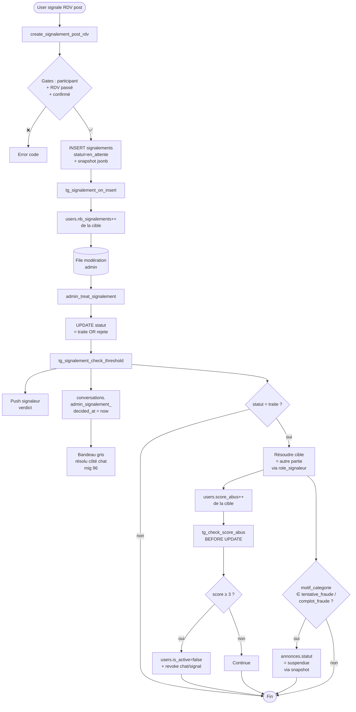

# Module Signalements — Backend

> Source de vérité backend du module **Signalements** (CDC v4.0 §2.6 Pilier 3, F08 + extensions post-RDV mig 91 / closure mig 96 / verdict mig 98).
> Couvre : table `public.signalements` (**11 colonnes**), 2 enums + 1 enum étendu post-RDV, **2 RLS policies** (signaleur SELECT/INSERT) + 1 admin SELECT, **3 triggers** (insert compteurs + update threshold + check_score_abus), 2 RPCs publiques (`submit_report`, `create_signalement_post_rdv`) + 4 RPCs admin (`admin_treat_signalement`, `admin_suspend_annonce`, `admin_suspend_user`, `admin_soft_delete_message`, `admin_revert_annonce_to_active`) + 1 RPC consultation (`get_my_rdv_signalement_status`), 1 view (`v_signalements_queue_stats`), 0 cron direct.
>
> **Migrations concernées** : **25 (CREATE TABLE signalements + 2 enums + RLS signaleur + RPC `submit_report` + trigger `tg_signalement_check_threshold` + colonnes users.`nb_signalements`/`score_abus`)**, **26 (trigger `tg_signalement_on_insert` — incrémente `nb_signalements` à la création + auto-suspend annonce si ≥ 3 en_attente)**, **27 (auto-fill `submit_report.description` avec résumé cible)**, **28 (trigger `tg_check_score_abus` BEFORE UPDATE users → auto-set `is_active=false` si score_abus ≥ 3)**, **52 (helper `is_current_user_admin`)**, **56 (RLS admin SELECT + RPC `admin_treat_signalement` + view `v_signalements_queue_stats`)**, **57 (RPCs admin cascade `admin_suspend_annonce` / `admin_suspend_user` / `admin_soft_delete_message`)**, **65 (helper `_notify_push` consommé par fn check_threshold mig 91)**, **74 (RLS hardening `signalements_insert_own` + `is_my_account_active()`)**, **91 (extension `cible_signalement` avec `'rdv_post'` + enum `motif_signalement_rdv` + colonnes `motif_categorie`/`rdv_snapshot`/`role_signaleur` + RPC `create_signalement_post_rdv` + extension `fn_signalement_check_threshold` post-RDV avec push signaleur + auto-pause annonce sur fraude)**, **94 (REVOKE EXECUTE bulk : `fn_signalement_check_threshold` + `fn_signalement_on_insert` + `fn_check_score_abus` revoked des roles app — security_invoker=on sur view + RPCs publiques revoke from public/anon, grant to authenticated)**, **95 (RPC `admin_revert_annonce_to_active` — revert `en_cours → active` après signalement non-fraude validé)**, **96 (colonne `conversations.admin_signalement_decided_at` posée par fn check_threshold + filtre `get_pending_user_actions` + backfill)**, **98 (RPC `get_my_rdv_signalement_status` — verdict perso visible côté signaleur)**, **102 (lock `add_rencontre_photo` après `admin_signalement_decided_at` — consommateur, pas une mig signalement à proprement parler)**, **103 (audit `_log_admin_action` patch sur les 4 RPCs admin signalements/cascade)**.
>
> **Tier RGPD** : 🟡 **P1** — la table contient un text libre (`description`) qui peut référencer 2 users + 1 cible (annonce, message, ou conv RDV). Aucune PII chiffrée. Cascade FK : `signaleur_id` → `users(id) ON DELETE CASCADE` (mig 25 ligne 43) → user supprimé efface tous ses signalements. Cibles non cascade (par design : conserver l'historique de modération même si la cible est purgée). `rdv_snapshot` jsonb est un témoin **immuable** : il préserve titre annonce + prénoms parties même si annonce/conv plus tard supprimée. Conformité ARTCI 2024-30 / ANRTIC 2023-15 / loi 2021-058 RW (audit RGPD `docs/references/rgpd-audit.md` entrée Signalements).
>
> **Périmètre** : ce doc couvre la table `signalements`, ses triggers, ses RPCs publiques et admin (sauf `admin_validate_verification` qui relève de **KYC** — voir `kyc.md`). Les **back-office pages admin web** (`/admin/signalements/*`) sont du Next.js — non couvertes par les tests pgTAP/Vitest (mock E2E). Les **target_type** `'message'` / `'annonce'` / `'utilisateur'` consomment respectivement les tables Conversations / Annonces / Auth — voir leurs docs respectives pour les FK upstream.

---

## 1. Vue d'ensemble

Niqo est une marketplace C2C où la confiance est un livrable produit. Le signalement est **le filet de sécurité communautaire** : tout user authentifié peut alerter Niqo sur une annonce frauduleuse, un message harceleur, un utilisateur récurrent, ou un RDV post-confirmation qui a mal tourné. L'admin (Dom solo MVP) traite la file et applique sanctions.

**Le cycle de vie d'un signalement** :

```
User clique "Signaler"        admin reviews          sanctions
       │                          │                       │
       ▼                          ▼                       ▼
┌─────────────┐  insert    ┌──────────────┐  update   ┌─────────────────┐
│ submit_report│ ────────► │  en_attente   │ ────────► │  traite | rejete │
└─────────────┘            └──────────────┘            └─────────────────┘
       │                          │                       │
       │ tg_signalement_on_insert │                       │ tg_signalement_check_threshold
       │ - nb_signalements++      │                       │ - push signaleur (mig 91)
       │ - si ≥3 pending sur ann  │                       │ - score_abus++ (si traite)
       │   → annonce suspendue    │                       │ - tg_check_score_abus (mig 28)
       │                          │                       │   → si score ≥ 3 → is_active=false
       │                          │                       │ - si rdv_post + fraude → annonce suspendue
       │                          │                       │ - si rdv_post → conv.admin_signalement_decided_at
       ▼                          ▼                       ▼
```

**4 target_type supportés** (enum `cible_signalement`) :

| target_type | `target_id` pointe sur | Use-case | Mig |
|---|---|---|---|
| `annonce` | `annonces.id` | Arnaque annonce, prix anormal, photo volée | 25 |
| `utilisateur` | `users.id` | Profil pollué, multi-comptes | 25 |
| `message` | `messages.id` | Harcèlement, contenu illégal | 25 |
| `rdv_post` | `conversations.id` | Post-RDV : no_show, produit_different, fraude in-person | 91 |

**Invariants produit non-négociables :**

| Invariant | Enforcement |
|---|---|
| Un user ne peut signaler la même cible qu'une fois | `signalements_unique_per_user UNIQUE (target_type, target_id, signaleur_id)` (mig 25) |
| Pas d'auto-signalement (`target_type='utilisateur'`) | `submit_report` retourne `{success:false, error:'cannot_report_self'}` (mig 25) |
| Description max 1000 chars | CHECK `signalements.description ≤ 1000` (mig 25) + recheck dans `create_signalement_post_rdv` |
| Description obligatoire pour `motif='autre'` (rdv_post) | `create_signalement_post_rdv` retourne `{error:'description_required'}` si vide ET motif='autre' (mig 91) |
| Pour `rdv_post` : caller doit être participant + RDV passé + confirmé | `create_signalement_post_rdv` gates : `not_participant`/`no_confirmed_rdv`/`rdv_not_past` (mig 91) |
| **Auto-suspend annonce** à 3 signalements `en_attente` du même type | `tg_signalement_on_insert` (mig 26) — passe `annonces.statut='suspendue'` si target_type='annonce' |
| **Auto-suspend user** à 3 signalements `traite` en 30j | `tg_signalement_check_threshold` (mig 25→91) — incrémente score_abus puis check window 30j |
| **Auto-suspend user** dès `score_abus ≥ 3` (BEFORE UPDATE) | `tg_check_score_abus` (mig 28) — guard belt-and-suspenders au cas où score serait set hors trigger threshold |
| **Auto-pause annonce sur fraude rdv_post validée** | `tg_signalement_check_threshold` (mig 91) — si `motif_categorie ∈ (tentative_fraude, complot_fraude)` AND `statut→traite` → annonce du snapshot passe `suspendue` |
| **Push signaleur** sur décision (toutes décisions) | `_notify_push` dans `tg_signalement_check_threshold` (mig 91) — "Signalement pris en compte" (traite) ou "Signalement examiné" (rejete) |
| Marqueur conv résolu après décision rdv_post | `tg_signalement_check_threshold` set `conversations.admin_signalement_decided_at = now()` si target_type='rdv_post' AND statut∈(traite,rejete) (mig 96, cumulatif coalesce) |
| Snapshot rdv immuable | `signalements.rdv_snapshot jsonb` posé à la création (mig 91), JAMAIS update — préserve contexte post-purge annonce |
| Anti-leak verdict | `get_my_rdv_signalement_status` filtre `signaleur_id = auth.uid()` (mig 98) — l'autre partie ne voit pas le verdict adverse |
| Anti-suspend self admin | `admin_suspend_user` raise `CANNOT_SUSPEND_SELF` (mig 57) |
| User suspendu (`is_active=false`) ne peut plus signaler | `signalements_insert_own` exige `is_my_account_active()` (mig 74) |
| Audit log sur 5 RPCs admin | `_log_admin_action` posté en fin de RPC (mig 103) — actions `signalement_traite/rejete`, `annonce_suspended/reverted_active`, `user_suspended`, `message_soft_deleted` |

---

## 2. Tables consommées

### 2.1 `public.signalements` (mig 25 + extensions 91)

**Total 11 colonnes.**

| Colonne | Type | Default | NOT NULL | FK / CHECK | Mig | Sémantique |
|---|---|---|---|---|---|---|
| `id` | uuid | `uuid_generate_v4()` | ✅ | PK | 25 | |
| `target_type` | enum `cible_signalement` | — | ✅ | `('annonce','utilisateur','message','rdv_post')` | 25→91 | Type de cible (mig 91 ajoute `rdv_post`) |
| `target_id` | uuid | — | ✅ | logique : selon target_type | 25 | Pas de FK (cible peut être supprimée, on garde l'historique de modération) |
| `signaleur_id` | uuid | — | ✅ | → users(id) **ON DELETE CASCADE** (mig 25) | 25 | User efface tous ses signalements à la suppression |
| `motif` | text | — | ✅ | CHECK `char_length BETWEEN 1 AND 100` | 25 | Label court — pour rdv_post : auto-rempli depuis enum motif_signalement_rdv (mig 91) |
| `description` | text | NULL | ✗ | CHECK `description IS NULL OR char_length ≤ 1000` | 25 | Détail libre. Mig 27 : auto-rempli depuis cible si vide (titre annonce, prénom user, contenu msg). |
| `statut` | enum `statut_signalement` | `'en_attente'` | ✅ | `('en_attente','traite','rejete')` | 25 | Workflow modération |
| `created_at` | timestamptz | `now()` | ✅ | — | 25 | |
| `updated_at` | timestamptz | `now()` | ✅ | trigger `set_updated_at` | 25 | Refletté à chaque update statut |
| **`motif_categorie`** | enum `motif_signalement_rdv` | NULL | ✗ | 7 valeurs (cf. §2.3) | **91** | NULL sauf si target_type='rdv_post' |
| **`rdv_snapshot`** | jsonb | NULL | ✗ | — | **91** | Snapshot immuable conv+annonce+parties au moment du report. Anti-purge. |
| **`role_signaleur`** | text | NULL | ✗ | CHECK `role_signaleur IN ('acheteur','vendeur')` | **91** | Permet au trigger threshold de résoudre la cible (= l'autre partie) sans re-fetch conv |

**Constraints :**
- `signalements_unique_per_user UNIQUE (target_type, target_id, signaleur_id)` — anti-doublon (mig 25, post-`drop constraint if exists`)
- CHECK `motif` char_length 1-100 (mig 25)
- CHECK `description` ≤ 1000 chars (mig 25)
- CHECK `role_signaleur` IN (`acheteur`, `vendeur`) OR NULL (mig 91)

**Indexes :**
- `idx_signalements_target (target_type, target_id, statut) WHERE statut='en_attente'` — sert au compteur auto-suspend annonce et aux "autres signalements pending" admin (mig 25)
- `idx_signalements_signaleur (signaleur_id)` — "mes signalements" (mig 25)
- `idx_signalements_pending_by_type (target_type, created_at DESC) WHERE statut='en_attente'` — file modération admin tous types confondus (mig 91)

**Realtime :** ❌ pas dans `supabase_realtime` (admin manuel via dashboard, pas de push real-time aux signaleurs autres que la notif `_notify_push` posté par le trigger threshold).

### 2.2 Colonnes `users` consommées (mig 25, 28)

| Colonne | Type | Source d'increment | Effet | Mig |
|---|---|---|---|---|
| `nb_signalements` | int default 0 | `tg_signalement_on_insert` à la création | Compteur reçus (validés OU non) | 25 + 26 |
| `score_abus` | int default 0 | `tg_signalement_check_threshold` quand statut→traite | Compteur signalements validés. Trigger `tg_check_score_abus` (mig 28) BEFORE UPDATE → `is_active=false` si score_abus ≥ 3 | 25 + 28 |
| `is_active` | bool default true | `tg_signalement_check_threshold` (window 30j ≥3) + `tg_check_score_abus` (≥3 quel que soit la window) + `admin_suspend_user` (manuel) | Source : `auth.is_active` consommé par RLS auth, cf. `auth.md` | 25, 28, 57 |

### 2.3 Enums

**`cible_signalement` (mig 25, ALTER mig 91)** :
```
'annonce' | 'utilisateur' | 'message' | 'rdv_post'
```

**`statut_signalement` (mig 25)** :
```
'en_attente' | 'traite' | 'rejete'
```

**`motif_signalement_rdv` (mig 91)** :
| Valeur | Label fr produit | Use-case |
|---|---|---|
| `no_show` | Absent au rendez-vous | L'autre n'est pas venu |
| `produit_different` | Produit ne correspond pas à l'annonce | Mauvais modèle, fausse description |
| `produit_defectueux` | Produit défectueux | Cassé, ne marche pas |
| `tentative_fraude` | Tentative de fraude | Fausse monnaie, faux billet, vol → **auto-pause annonce** |
| `comportement_dangereux` | Comportement dangereux | Violent, menaces, harcèlement |
| `complot_fraude` | Complot / coordination malveillante | Multi-comptes suspects → **auto-pause annonce** |
| `autre` | Autre (description obligatoire) | Tout le reste — description requise (gate mig 91) |

Le label fr est dupliqué côté front (mig 91 ligne 358 : "pas de table de référence côté DB pour rester souple"). Front : `lib/signalements.ts` mapping enum → label.

---

## 3. RLS — qui voit/écrit quoi

### 3.1 SELECT — 2 policies

| Policy | Mig | Qui | Quoi |
|---|---|---|---|
| `signalements_select_own` | 25 | signaleur (`auth.uid() = signaleur_id`) | Ses propres signalements (file "Mes signalements" côté mobile — pas implémenté côté UI actuellement, mais policy nécessaire pour `get_my_rdv_signalement_status`) |
| `signalements_admin_select` | 56 | admin (`is_current_user_admin()`) | Tous — file de modération `/admin/signalements` |

→ Un user lambda ne voit **pas** les signalements posés par d'autres sur ses propres annonces/messages (anti-pollution UX — voir mig 25 ligne 86 : "Pas de update/delete pour les users — seul l'admin modifie le statut").

### 3.2 INSERT — 1 policy

| Policy | Mig | Gate |
|---|---|---|
| `signalements_insert_own` | 25→74 | `auth.uid() = signaleur_id AND is_my_account_active()` |

→ Mig 74 ajoute le check `is_my_account_active()` : un user suspendu (`is_active=false`) ne peut plus créer de signalements (anti-poursuite vendetta post-ban).

### 3.3 UPDATE / DELETE — aucune policy

Par design (mig 25 ligne 86) : le user ne peut PAS modifier son signalement après création (pas de retraction). Seul l'admin via la RPC `admin_treat_signalement` (mig 56) mute `statut`. La RPC est SECURITY DEFINER → bypass RLS.

### 3.4 RLS upstream consommées (mig 56)

Pour que l'admin puisse consulter le contenu de la cible dans la page détail signalement, mig 56 ajoute 4 policies admin SELECT cross-table :

| Table | Policy | Effet |
|---|---|---|
| `annonces` | `annonces_admin_select` | Admin lit annonces tous statuts (suspendue, expirée, vendue) — sinon RLS owner-only mig 15 |
| `messages` | `messages_admin_select` | Admin lit messages toute conv (non-participant inclus) |
| `conversations` | `conversations_admin_select` | Admin lit conv contexte (pour afficher annonce concernée + autre partie) |

→ Ces policies cross-table sont **dans le scope Signalements** (mig 56) bien qu'elles touchent d'autres tables : c'est le besoin admin signalements qui les motive. Voir `conversations.md` §3 pour le détail conv/messages.

---

## 4. RPCs publiques

### 4.1 `submit_report(p_target_type, p_target_id, p_motif, p_description?)` (mig 25, 27)

**Signature** : `(cible_signalement, uuid, text, text default null) → jsonb`
**Auth** : authenticated (GRANT explicit mig 25 + REVOKE public/anon mig 94)
**SECURITY DEFINER** + `search_path=public` (mig 25)
**Idempotent** : non (UNIQUE constraint bloque le 2e call)

**Gates** :
1. JWT présent (sinon `{success:false, error:'not_authenticated'}`)
2. Pas d'auto-signalement si `target_type='utilisateur'` AND `target_id=auth.uid()` (`cannot_report_self`)
3. Cible existe : check `annonces.id` / `users.id` / `messages.id` (sinon `target_not_found`)
4. Pas de doublon — UNIQUE constraint capté en try/catch (`already_reported`)

**Effet secondaire** : auto-fill `description` si vide (mig 27) — résumé typé selon target_type (`[Annonce] titre — desc[200]`, `[User] prenom N. — ville, pays`, `[Message] contenu[500]`).

**Returns** : `{success: true}` ou `{success: false, error: 'code'}`.

### 4.2 `create_signalement_post_rdv(p_conversation_id, p_motif_categorie, p_description?)` (mig 91)

**Signature** : `(uuid, motif_signalement_rdv, text default null) → jsonb`
**Auth** : authenticated
**SECURITY DEFINER** + `search_path=public`

**Gates** :
1. JWT (`not_authenticated`)
2. `p_motif_categorie = 'autre'` + description vide → `description_required` (mig 91)
3. `description > 1000` chars → `description_too_long`
4. Conv existe (`conversation_not_found`)
5. Caller ∈ {acheteur, vendeur} (`not_participant`)
6. RDV confirmé (`rdv_confirme_at IS NOT NULL` sinon `no_confirmed_rdv`)
7. RDV passé (`rdv_date < now()` sinon `rdv_not_past`)
8. Pas de doublon UNIQUE → `already_reported`

**Effet secondaire** :
- Snapshot jsonb posé à l'INSERT (titre, prix, statut annonce + prénoms parties + lieu/date/confirme/rencontre_* — voir mig 91 ligne 172).
- `motif` text auto-mappé depuis enum (`v_motif_label` mig 91 ligne 197).
- `role_signaleur` calculé selon `acheteur_id`/`vendeur_id` de la conv.

**Returns** : `{success: true}` ou `{success: false, error: 'code'}`.

### 4.3 `get_my_rdv_signalement_status(p_conversation_id)` (mig 98)

**Signature** : `(uuid) → jsonb`
**Auth** : authenticated
**SECURITY DEFINER** + `search_path=public`

**Lecture seule** — anti-leak strict :
1. JWT absent → `{has_signalement: false}` (pas de raise, pattern client friendly)
2. Caller doit être participant de la conv (sinon `{has_signalement: false}` — anti-snoop)
3. Filtre WHERE `signaleur_id = auth.uid()` — l'autre partie ne voit jamais le verdict adverse (mig 98 §design)

**Returns** :
- `{has_signalement: false}` si rien à montrer
- `{has_signalement: true, signalement_id, statut, motif, motif_categorie, created_at, updated_at}` sinon

Consommé par `lib/rdv.ts` côté mobile pour afficher la 2e ligne verdict perso dans le bandeau gris mig 96.

---

## 5. RPCs admin (modération)

Toutes SECURITY DEFINER + REVOKE public/anon + GRANT authenticated + gate `is_current_user_admin()` (helper mig 52) ou `is_admin=true` direct. Toutes logguent dans `audit_log_admin` via `_log_admin_action` (mig 103) après succès.

### 5.1 `admin_treat_signalement(p_signalement_id, p_action)` (mig 56, patché mig 103)

**Action** : `'traite'` (validé) ou `'rejete'` (faux positif).

**Raises** :
- `AUTH_REQUIRED` P0001
- `ADMIN_REQUIRED` P0002
- `INVALID_ACTION` P0003 (action ∉ {traite, rejete})
- `SIGNALEMENT_NOT_PENDING` P0004 (race ou re-traitement — protège contre double déclenchement trigger)

**Effet** : UPDATE `statut` → déclenche `tg_signalement_check_threshold` (cascade complexe — voir §6.2).
**Audit** : `signalement_traite` ou `signalement_rejete`, target_type=`signalement`.

### 5.2 `admin_suspend_annonce(p_annonce_id)` (mig 57, patché mig 103)

**Effet** : `annonces.statut → 'suspendue'`. Idempotent (no-op si déjà suspendue → return sans audit log).
**Raises** : `AUTH_REQUIRED` / `ADMIN_REQUIRED` / `ANNONCE_NOT_FOUND` P0003.
**Audit** : `annonce_suspended`, target_type=`annonce`.

### 5.3 `admin_suspend_user(p_user_id)` (mig 57, patché mig 103)

**Effet** : `users.is_active → false` + `updated_at = now()`. Idempotent.
**Raises** : `AUTH_REQUIRED` / `ADMIN_REQUIRED` / **`CANNOT_SUSPEND_SELF` P0004** (anti-self-ban) / `USER_NOT_FOUND` P0003.
**Audit** : `user_suspended`, target_type=`user`.
**Side-effect upstream** : trigger `tg_check_score_abus` (mig 28) ne fire pas (la guard "is_active=true" du trigger empêche le re-update — voir mig 57 §commentaire ligne 21).

### 5.4 `admin_soft_delete_message(p_message_id)` (mig 57, patché mig 103)

**Effet** : `messages.is_deleted → true`. Idempotent. **Soft** : contenu préservé pour audit / RGPD. Front filtre côté query (`is_deleted = false` dans `fetchMessages`).
**Raises** : `AUTH_REQUIRED` / `ADMIN_REQUIRED` / `MESSAGE_NOT_FOUND` P0003.
**Audit** : `message_soft_deleted`, target_type=`message`.

### 5.5 `admin_revert_annonce_to_active(p_annonce_id)` (mig 95, patché mig 103)

**Pattern jsonb** (différent des 4 RPCs ci-dessus qui raise) — par cohérence avec les RPCs publiques jsonb-pattern (mig 95 §design choice).

**Use-case** : un signalement rdv_post non-fraude est validé. `rencontre_acheteur ≠ rencontre_vendeur` ⇒ annonce reste `en_cours` 60j (gel). Admin décide au cas par cas si le vendeur est de bonne foi → revert manuel.

**Gates** :
- `auth.uid()` (sinon `{error: 'AUTH_REQUIRED'}`)
- `users.is_admin = true` (sinon `ADMIN_REQUIRED`)
- Annonce existe (`ANNONCE_NOT_FOUND`)
- `statut = 'en_cours'` uniquement (`INVALID_STATE` + `current_statut` dans la réponse pour debug)

**Effet** :
- `annonces.statut → 'active'`, `updated_at = now()`
- Push notif vendeur "Annonce remise en vente" (best-effort `_notify_push` mig 65, ne fail pas la tx)
- Audit `annonce_reverted_active` + metadata `{previous_statut: 'en_cours'}` (mig 103 §10)

**Returns** : `{success: true}` ou `{success: false, error, current_statut?}`.

---

## 6. Triggers

### 6.1 `tg_signalement_on_insert` (mig 26 — AFTER INSERT)

Function : `fn_signalement_on_insert` (mig 26 ligne 27, SECURITY DEFINER, REVOKE EXECUTE mig 94).

```pseudo
AFTER INSERT ON signalements FOR EACH ROW:
  1. Résoudre v_target_user_id :
     - utilisateur → NEW.target_id
     - annonce     → annonces.vendeur_id
     - message     → messages.expediteur_id
     - rdv_post    → (PAS GÉRÉ par mig 26 — voir §findings ⚠ D2)
  2. Si v_target_user_id pas null : users.nb_signalements++
  3. Si target_type='annonce' :
     compter signalements en_attente sur cette annonce
     si ≥ 3 : annonces.statut → 'suspendue' (si annonce était 'active')
```

**Effet observable** :
- `nb_signalements` (counter "reçus") incrémenté à la création
- **Auto-pause annonce** à 3 signalements `en_attente` du même type → annonces.statut=suspendue (mig 26 §1 — applique le seuil CDC v4.0 §2.7)

### 6.2 `tg_signalement_check_threshold` (mig 25 — AFTER UPDATE)

Function : `fn_signalement_check_threshold` (mig 25→91→96, SECURITY DEFINER, REVOKE EXECUTE mig 94).

```pseudo
AFTER UPDATE ON signalements FOR EACH ROW:
  -- Fire seulement quand statut change
  if NEW.statut = OLD.statut: return
  
  -- (mig 91) Push signaleur sur traite OR rejete
  if NEW.statut in ('traite','rejete'):
    _notify_push(NEW.signaleur_id, "Signalement pris en compte"|"Signalement examiné", ...)
  
  -- (mig 96) Marqueur résolu sur conv pour rdv_post
  if NEW.target_type='rdv_post' AND NEW.statut in ('traite','rejete'):
    update conversations 
      set admin_signalement_decided_at = coalesce(admin_signalement_decided_at, now())
      where id = NEW.target_id
  
  -- Sanction (seulement si traite)
  if NEW.statut != 'traite' OR OLD.statut = 'traite': return
  
  -- Résoudre v_target_user_id selon target_type (4 branches incl. rdv_post mig 91)
  v_target_user_id := case target_type
    when 'utilisateur' → NEW.target_id
    when 'annonce'     → annonces.vendeur_id
    when 'message'     → messages.expediteur_id
    when 'rdv_post'    → case role_signaleur 
                          when 'acheteur' → vendeur_id 
                          else acheteur_id
                        end from conversations
  end
  
  -- Sanction user ciblé
  users.score_abus++ + nb_signalements++
  -- ↓ déclenche tg_check_score_abus (mig 28) qui set is_active=false si ≥3
  
  -- Compter window 30j (ttes branches target_type, rdv_post via role_signaleur)
  if count_30d >= 3 AND user.is_active: 
    users.is_active = false  (belt-and-suspenders, idempotent vs mig 28)
  
  -- (mig 91) Auto-pause annonce sur fraude rdv_post
  if target_type='rdv_post' AND motif_categorie in (tentative_fraude, complot_fraude):
    annonces.statut → 'suspendue' (depuis rdv_snapshot->>'annonce_id')
```

**Diagramme post-RDV signalement → décision admin → effets en cascade** :



**Idempotence** : le coalesce sur `admin_signalement_decided_at` (mig 96 ligne 103) garantit que si un 2e signalement post-RDV sur la même conv est traité plus tard, on n'écrase pas la première date.

### 6.3 `tg_check_score_abus` (mig 28 — BEFORE UPDATE users.score_abus)

Function : `fn_check_score_abus` (mig 28, REVOKE EXECUTE mig 94).

```pseudo
BEFORE UPDATE OF score_abus ON users FOR EACH ROW:
  if NEW.score_abus >= 3 AND NEW.is_active = true:
    NEW.is_active := false
```

**Belt-and-suspenders** : garantit l'auto-suspend même si `score_abus` est modifié manuellement (admin via dashboard). En pratique seul `fn_signalement_check_threshold` modifie cette colonne, mais le trigger guard évite tout drift.

### 6.4 `tg_signalements_updated_at` (mig 25 — BEFORE UPDATE)

Function : `set_updated_at` (helper standard mig 02).

→ Pose `updated_at = now()` à chaque update — sert au compteur window 30j (`signalements.updated_at > now() - 30 days` dans `fn_signalement_check_threshold`).

---

## 7. View

### `public.v_signalements_queue_stats` (mig 56)

Compteurs file modération : `{en_attente, traite, rejete, total}`. `security_invoker=on` (mig 94 §1) → RLS de l'appelant s'applique → effectivement admin-only via `signalements_admin_select`.

Consommé par `landing/src/app/admin/(admin-protected)/signalements/page.tsx` (count badge sidebar) + `AlertBand.tsx` (alerte si pending > 24h).

---

## 8. Crons & Storage

**Aucun.** Le module n'a pas de cron direct (la modération est manuelle admin). Pas de Storage (les photos rencontre uploadées via `add_rencontre_photo` mig 92/102 sont attachées à la conv, pas au signalement — voir `rdv.md` §photos).

Note : si une future feature "auto-clore signalements stale > 90j" est ajoutée, ce serait à crontab via pg_cron — pas implémenté MVP.

---

## 9. Integrations

### 9.1 Audit log admin (mig 103)

5 RPCs admin patchées pour logger leur action après succès :
- `admin_treat_signalement` → action `signalement_traite` ou `signalement_rejete`
- `admin_suspend_annonce` → `annonce_suspended`
- `admin_suspend_user` → `user_suspended`
- `admin_soft_delete_message` → `message_soft_deleted`
- `admin_revert_annonce_to_active` → `annonce_reverted_active` + metadata `{previous_statut}`

→ Visible côté admin web `/admin/audit` (Next.js page, mig 103). Voir `audit.test.sql` + ce qui est à venir `docs/backend/audit.md`.

### 9.2 Push notifications (mig 65, 91)

- **Push signaleur** sur décision (`tg_signalement_check_threshold` mig 91) : "Signalement pris en compte" (traite) ou "Signalement examiné" (rejete) — URL deep link `/profile`.
- **Pas de push à la cible** par design (mig 91 §choix) — anti-vendetta — sauf si auto-suspendue (géré par `fn_push_user_suspended` côté users — voir `auth.md`).
- **Push vendeur** "Annonce remise en vente" sur `admin_revert_annonce_to_active` (mig 95).

### 9.3 Get pending user actions (mig 96)

`get_pending_user_actions` (mig 93 → mig 96 update) filtre la card priority 1 "disputed" pour exclure les conv où :
1. `admin_signalement_decided_at IS NOT NULL` (admin a tranché), OU
2. le user a déjà signalé (`signalements.signaleur_id = auth.uid()` existe sur cette conv)

→ Bouche la card zombie sur la bannière Home après modération. Voir `rdv.md` §rencontre + bandeau Home.

### 9.4 RDV photos lock (mig 102)

`add_rencontre_photo` raise `signalement_decided` si `conversations.admin_signalement_decided_at IS NOT NULL`. Pas une mig signalements pure mais un consommateur du marqueur mig 96. Voir `rdv.md` §photos.

---

## 10. Realtime

❌ La table `signalements` n'est **pas** dans `supabase_realtime`.

Justification : l'admin consulte la file via les pages Next.js admin web (Server Components, fetch-at-render). Aucun client mobile n'écoute cette table — les users sont notifiés via `_notify_push` (mig 91) et `get_my_rdv_signalement_status` (mig 98) au render du chat. Realtime serait inutile et fuiterait l'activité admin.

---

## 11. Drift & findings (audit cohérence backfill — 2026-05-12)

### 🟡 D1 — `fn_signalement_on_insert` ne couvre pas `target_type='rdv_post'`

`fn_signalement_on_insert` (mig 26) résout `v_target_user_id` pour `annonce/utilisateur/message` mais **pas** pour `rdv_post`. En pratique : un signalement post-RDV qui est créé n'incrémente PAS `nb_signalements` de la cible (l'autre partie). Seul `score_abus` est incrémenté plus tard quand l'admin trait via `fn_signalement_check_threshold` (mig 91).

**Impact réel** : faible. `nb_signalements` est un compteur "reçus" (validés ou non), pas un seuil de sanction. Le vrai seuil est `score_abus` (qui n'est incrémenté qu'au `traite`). Mais incohérence sémantique : un user post-RDV signalé 5 fois en attente affichera `nb_signalements=0` dans son profil admin.

**Recommandation** : patcher `fn_signalement_on_insert` (mig 26) pour ajouter la branche `rdv_post` (résoudre via `role_signaleur` + conversations comme dans mig 91). Pas bloquant MVP — à corriger Phase 2.

### 🟡 D2 — Pas d'auto-pause annonce à 3 signalements `rdv_post` en_attente

`fn_signalement_on_insert` mig 26 §1 fait l'auto-pause uniquement pour `target_type='annonce'`. Pour `rdv_post`, l'annonce sous-jacente n'est pas auto-suspendue tant que l'admin n'a pas validé (ET seulement si motif_categorie ∈ fraude — mig 91).

**Impact** : par design (mig 91 §choix). Évite l'auto-suspend abusif sur n'importe quel motif post-RDV (no_show n'est pas un signal d'arnaque vendeur). Pas un bug.

### 🟢 D3 — `admin_treat_signalement` raise au lieu de retourner jsonb (incohérence pattern)

Les 4 RPCs admin (mig 56, 57) raise sur erreur. La 5e (`admin_revert_annonce_to_active` mig 95) retourne jsonb. Cohérence à choisir : tout-raise ou tout-jsonb.

**Impact** : cosmétique. Le front Next.js admin web wrap les deux patterns. Pas bloquant.

### 🟢 D4 — `motif` text vs `motif_categorie` enum redondance pour rdv_post

Pour `rdv_post`, `motif` est auto-rempli depuis l'enum (mig 91 ligne 197). Donc 2 sources de vérité pour le même concept. Pas un drift mais une dette de modélisation : on aurait pu garder `motif` NULL pour rdv_post et ne consommer que `motif_categorie`.

**Impact** : `motif` reste affiché tel quel dans `/admin/signalements`. Le label est cohérent (auto-set par la RPC). Pas bloquant.

### 🟢 D5 — Pas d'audit log sur les triggers (auto-pause, auto-suspend)

`tg_signalement_on_insert` peut suspendre une annonce (3 signalements en_attente). `tg_check_score_abus` peut suspendre un user. Aucun de ces auto-effets n'est loggé dans `audit_log_admin` (mig 103) — admin_id serait NULL puisque c'est trigger-side.

**Impact** : le log existe via signalements.statut + users.score_abus (on peut reconstituer "pourquoi"). Mais pas de trace dédiée. Acceptable MVP.

---

## 12. Tests

### pgTAP — `tests/sql/signalements.test.sql`

Couverture (45 assertions, sections A-M) :
- **A. RLS SELECT** — anon=0, signaleur voit ses signalements, admin voit tout, tiers ne voit pas
- **B. RLS INSERT** — auth.uid=signaleur_id requis, anti-self report, `is_my_account_active()` gate (mig 74)
- **C. UNIQUE constraint** — anti-doublon `(target_type, target_id, signaleur_id)`
- **D. submit_report** — gates `not_authenticated`/`cannot_report_self`/`target_not_found`/`already_reported` + happy path + auto-fill description (mig 27)
- **E. `tg_signalement_on_insert`** — nb_signalements++ sur target user (3 branches) + auto-suspend annonce à 3 signalements en_attente
- **F. `tg_signalement_check_threshold`** — score_abus++ uniquement sur traite, push best-effort, marqueur admin_signalement_decided_at pour rdv_post
- **G. `tg_check_score_abus`** — auto-set is_active=false à score≥3 (belt-and-suspenders mig 28)
- **H. `create_signalement_post_rdv`** — gates `not_participant`/`no_confirmed_rdv`/`rdv_not_past`/`description_required` (motif=autre) + happy path + snapshot non-null
- **I. `admin_treat_signalement`** — non-admin → ADMIN_REQUIRED, invalid action, already-treated → SIGNALEMENT_NOT_PENDING
- **J. Auto-pause annonce sur fraude rdv_post traite** — tentative_fraude → annonces.statut=suspendue depuis snapshot
- **K. `admin_revert_annonce_to_active`** — gates ADMIN_REQUIRED/INVALID_STATE + revert en_cours → active
- **L. `get_my_rdv_signalement_status`** — anti-leak (autre partie = has_signalement:false), participant + filtre signaleur_id
- **M. Audit log** — `signalement_traite/rejete` + `annonce_reverted_active` posés dans audit_log_admin

### Vitest — `tests/integration/signalements.test.ts`

End-to-end via PostgREST (gate JWT + RLS) :
- submit_report happy (annonce / utilisateur / message) + anti-self + anti-doublon
- create_signalement_post_rdv full setup conv + RDV passé
- mark statut=traite via service_role (simule admin Dashboard) → vérif score_abus++ + auto-suspend si score≥3
- admin RPCs (admin_treat / admin_suspend_annonce / admin_suspend_user / admin_soft_delete_message / admin_revert_annonce_to_active) gates + happy
- `get_my_rdv_signalement_status` anti-leak (Alice signale Bob, Bob query → has_signalement:false)

---

## 13. Références

- **CDC v4.0** §2.6 Pilier 3 (signalements communautaires) + §2.7 (auto-suspend 3 signalements)
- **Migrations** : 25, 26, 27, 28, 52, 56, 57, 65, 74, 91, 94, 95, 96, 98, 102 (consommateur), 103 (audit patch)
- **Modules adjacents** : `auth.md` (users.is_active + score_abus + cascade), `conversations.md` (FK message + admin_soft_delete_message), `annonces.md` (FK annonce + admin_suspend + admin_revert), `rdv.md` (conversations.rdv_* + admin_signalement_decided_at + photos lock mig 102), `kyc.md` (audit_log_admin pattern), `admin_kpis.md` (signalements_pending_24h_plus alerte mig 116)
- **RGPD** : entrée "Signalements" dans `docs/references/rgpd-audit.md`
