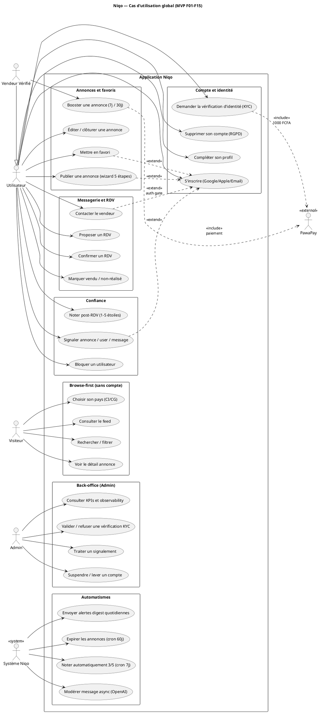
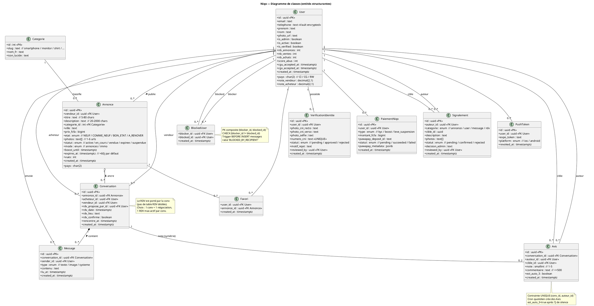
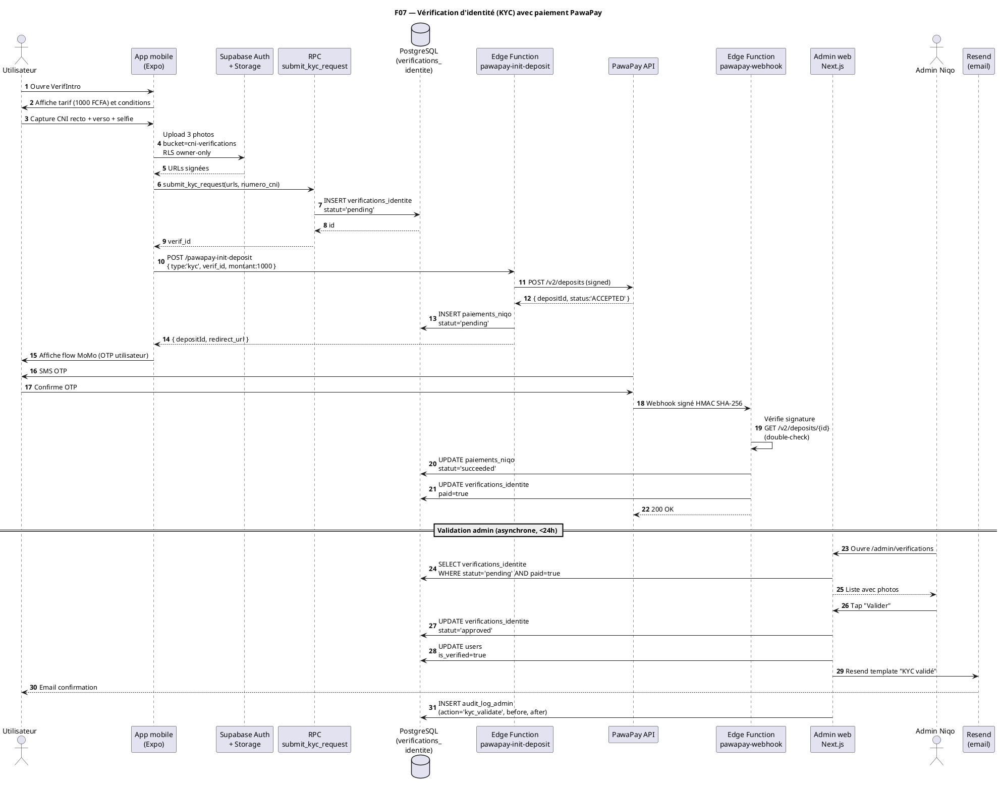
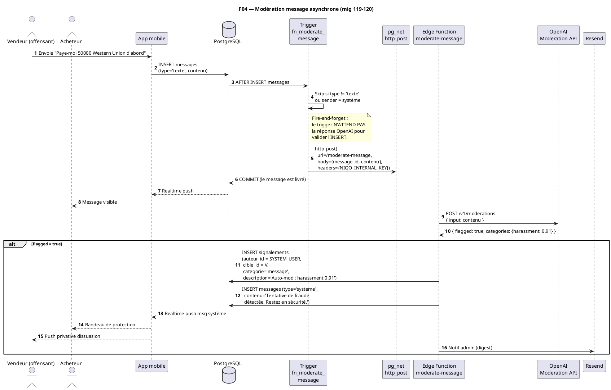
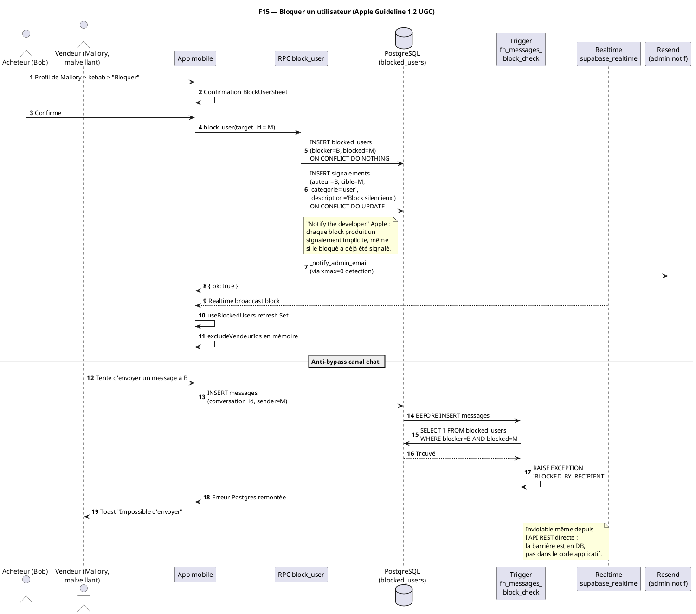
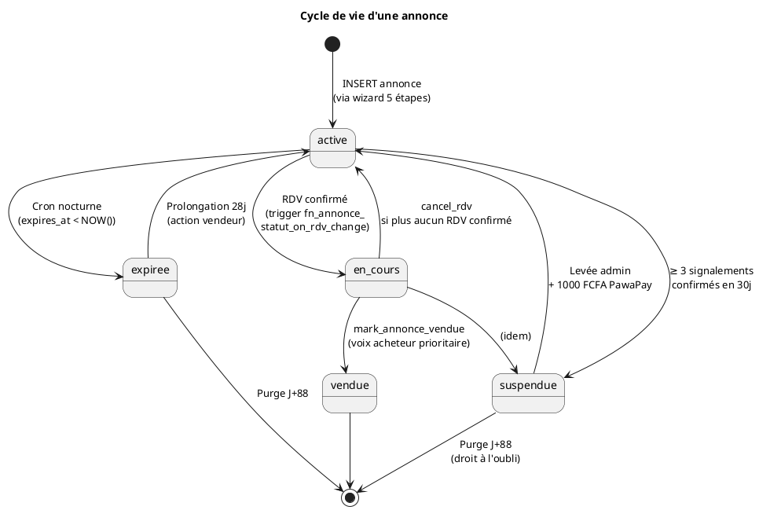
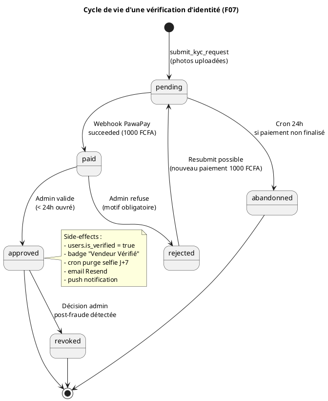
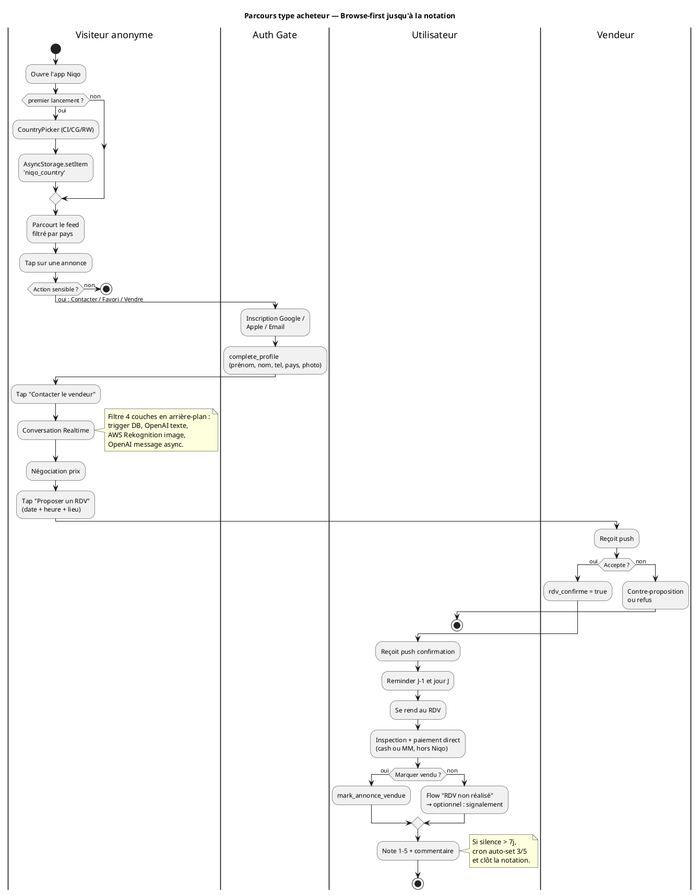
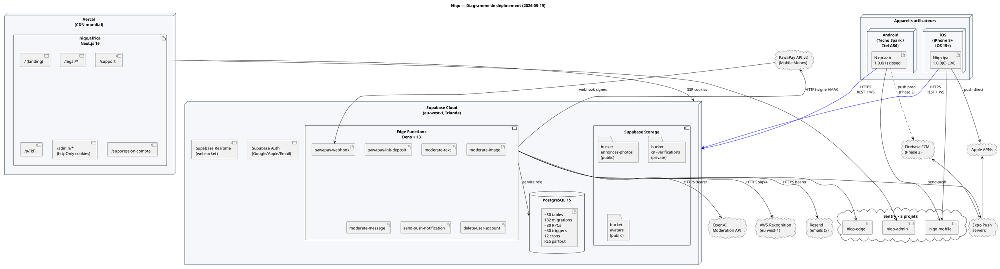

# Méthodologie d'analyse UML — Projet Niqo

> Document produit pour le dossier de certification RNCP **Concepteur Développeur d'Applications** (TP-CDA — code 31678).
> Il décrit la **démarche** suivie pour modéliser le système Niqo en UML, **justifie** les choix de diagrammes, et fournit les **modèles concrets** au format PlantUML. À lire avec le **Cahier des Charges v5.0** ([docs/CAHIER_DES_CHARGES.md](CAHIER_DES_CHARGES.md)) et le **rétro-planning** (CDC §9 « Gestion de projet et planning »).

---

## Sommaire

1. [Contexte et objectifs de la modélisation](#1-contexte-et-objectifs-de-la-modélisation)
2. [Pourquoi UML pour Niqo](#2-pourquoi-uml-pour-niqo)
3. [Démarche d'analyse adoptée](#3-démarche-danalyse-adoptée)
4. [Outils, conventions et versioning](#4-outils-conventions-et-versioning)
5. [Diagramme 1 — Cas d'utilisation](#5-diagramme-1--cas-dutilisation-use-case)
6. [Diagramme 2 — Classes (modèle de données)](#6-diagramme-2--classes-modèle-de-données)
7. [Diagramme 3 — Séquence (trois scénarios critiques)](#7-diagramme-3--séquence-trois-scénarios-critiques)
8. [Diagramme 4 — État-transition](#8-diagramme-4--état-transition)
9. [Diagramme 5 — Activité](#9-diagramme-5--activité)
10. [Diagramme 6 — Déploiement](#10-diagramme-6--déploiement)
11. [Mapping vers les blocs RNCP CDA](#11-mapping-vers-les-blocs-rncp-cda)
12. [Limites, traçabilité et évolutions](#12-limites-traçabilité-et-évolutions)

---

## 1. Contexte et objectifs de la modélisation

**Niqo** est une plateforme C2C (consumer-to-consumer) mobile pour l'Afrique francophone, **LIVE sur l'App Store iOS depuis le 2026-05-17** dans 147 pays. Le système comprend :

- une **application mobile** React Native + Expo (iOS + Android),
- un **back-office administrateur** Next.js 16 hébergé sur Vercel,
- un **backend Supabase** (PostgreSQL + Auth + Storage + Realtime + Edge Functions),
- des **services tiers** (PawaPay Mobile Money, OpenAI Moderation, AWS Rekognition, Resend, Sentry, Expo Push).

L'objectif de la modélisation UML est triple :

1. **Cadrer le périmètre fonctionnel** avant chaque feature (15 features F01→F15) en s'appuyant sur des **cas d'utilisation** explicites avec acteurs et préconditions.
2. **Concevoir un modèle de données cohérent** (~50 tables, 132 migrations incrémentales) en distinguant les concepts métier (Annonce, Conversation, Avis…) de leur implémentation SQL.
3. **Documenter les flux critiques** (inscription, KYC, modération, paiement boost) pour la soutenance et la maintenance future — un développeur qui rejoint le projet doit pouvoir comprendre une feature en lisant son diagramme de séquence avant de plonger dans le code.

Cette démarche s'inscrit dans le **référentiel RNCP CDA 31678**, dont la modélisation est une compétence explicite des **Blocs RNCP1 et RNCP2** (cf. §11).

---

## 2. Pourquoi UML pour Niqo

### 2.1 Forces du formalisme UML appliquées au projet

| Besoin Niqo | Réponse UML | Diagramme retenu |
|---|---|---|
| Définir qui fait quoi (Visiteur vs Utilisateur vs Admin) | Représentation graphique des acteurs et de leurs droits | **Use Case** |
| Modéliser des entités métier interconnectées (Annonce ↔ Conversation ↔ Avis) avant de figer le SQL | Notation orientée objet exprimant cardinalités, héritage, agrégation | **Classes** |
| Spécifier des flux multi-acteurs et multi-systèmes (acheteur ↔ vendeur ↔ DB ↔ PawaPay ↔ Edge Function) | Lignes de vie + messages temporels | **Séquence** |
| Documenter les statuts d'une annonce (active → en_cours → vendue / expirée / suspendue) | Machine à états finis | **État-transition** |
| Décrire le parcours acheteur browse-first | Workflow conditionnel avec branches | **Activité** |
| Cartographier l'infrastructure (3 surfaces + Supabase + tiers) | Représentation des nœuds physiques et artefacts déployés | **Déploiement** |

### 2.2 Pourquoi pas une approche purement textuelle

Un cahier des charges textuel décrit **quoi** faire ; UML décrit **comment** les éléments interagissent. Pour Niqo, j'ai constaté pendant le développement que :

- la **table `conversations`** porte à la fois la conversation, l'ancrage à une annonce, **et** le RDV (colonnes `rdv_propose_par_id`, `rdv_date`, `rdv_lieu`, `rdv_confirme`). Sans diagramme de classes, ce couplage est invisible et conduit à des duplications de logique métier en Edge Function ;
- la **modération de message** combine 1 trigger DB + 1 appel HTTP asynchrone (`pg_net`) + 1 Edge Function + 1 API OpenAI + 1 insertion automatique de signalement par un user système. Sans diagramme de séquence, **personne** ne peut auditer la chaîne complète en moins de 15 minutes.

UML me sert donc autant pour **concevoir** que pour **transmettre** la connaissance technique (au jury, à un futur dev, à un auditeur sécurité).

### 2.3 Vues UML retenues / écartées

Sur les **14 diagrammes UML 2.x** standardisés, j'ai retenu **6 vues** jugées suffisantes au stade MVP. Les écarts :

- **Diagramme d'objet** : utile pour illustrer un cas particulier, redondant ici avec le diagramme de classes commenté.
- **Diagramme de composant** : fusionné avec le diagramme de déploiement (la granularité monolithique du backend Supabase ne justifie pas deux vues distinctes).
- **Diagramme de paquetage** : non pertinent, l'arborescence `app/` + `components/` + `lib/` + `landing/` est auto-documentée par Expo Router (file-based).
- **Diagramme de communication, de temps, de structure composite, de profil** : valeur ajoutée faible pour un MVP, à envisager en Phase 2 si la complexité explose.

---

## 3. Démarche d'analyse adoptée

### 3.1 Approche **top-down + itérative**

```
┌───────────────────────────────────────────────────────────┐
│  Itération N  (1 feature = F01 à F15)                     │
│                                                            │
│  (1) Cas d'utilisation    → on identifie acteurs + scope   │
│        ↓                                                   │
│  (2) Classes              → on raffine le modèle de        │
│                              données (table à créer ?      │
│                              colonne à ajouter ?)          │
│        ↓                                                   │
│  (3) Séquence             → on spécifie les flux back-end  │
│                              et tiers (Edge Functions,     │
│                              triggers, PawaPay, OpenAI…)   │
│        ↓                                                   │
│  (4) État / Activité      → si la feature a un lifecycle   │
│                              non trivial (annonce, KYC,    │
│                              RDV), on le modélise          │
│        ↓                                                   │
│  (5) Déploiement          → mis à jour quand on ajoute     │
│                              un service tiers              │
└───────────────────────────────────────────────────────────┘
```

À chaque itération, **les diagrammes sont versionnés en même temps que le code** (cf. §4.3). Cette discipline évite l'écueil classique de la modélisation UML : produire une jolie spec en début de projet, puis laisser le code diverger.

### 3.2 Lien avec le rétro-planning (CDC §9)

Le planning Niqo (CDC §9.1) découpe le projet en **12 sprints + bonus** sur 6 mois. Voici la cartographie des phases vers les diagrammes UML produits :

| Sprint | Phase produit | Diagrammes UML produits |
|---|---|---|
| **S1-2** | Setup & Admin (société Rwanda, comptes stores, env dev) | Use Case macro (acteurs) + Déploiement v0 |
| **S3-5** | MVP Core (Auth, annonces, recherche, messagerie) | Use Case détaillé F01-F04 + Classes v1 + Séquence (Auth, Création annonce, Chat Realtime) |
| **S6-7** | Confiance (Notation, KYC, Signalements) | État (KYC), Séquence (Validation admin, Auto-suspend score≥3), enrichissement Classes |
| **S8** | Monétisation (Boost, PawaPay, Dashboard) | Séquence (Paiement boost + webhook), Activité (parcours vendeur) |
| **Bonus** | Back-office, Observabilité, Pack légal | Use Case Admin, Déploiement v2 (Sentry + event_log + Resend) |
| **S9-11** | Tests, Déploiement iOS, Block user F15 (urgence post-rejet Apple) | Séquence (Block + signalement implicite + trigger anti-bypass), État (lifecycle annonce v4.0) |
| **S12** | Lancement | Diagrammes consolidés pour soutenance |

### 3.3 Granularité retenue

Chaque diagramme suit une règle de **lisibilité à 1 écran 1080p** (l'humain ne mémorise pas plus de ~7±2 éléments simultanément, loi de Miller). Quand une vue dépasse ce seuil, je la fractionne en sous-diagrammes (ex. : le diagramme de classes global est décliné en 3 vues thématiques — Utilisateurs, Annonces & Conversations, Confiance & Modération).

---

## 4. Outils, conventions et versioning

### 4.1 PlantUML — le choix structurant

**PlantUML** a été retenu (vs Mermaid, Draw.io, StarUML) pour 4 raisons :

1. **Source texte = versionnable Git** : un diff sur un fichier `.puml` se lit, contrairement à un binaire `.drawio`.
2. **Rendu reproductible** : le même `.puml` produit toujours la même image SVG/PNG via la CLI `plantuml` ou l'extension VSCode.
3. **Syntaxe expressive** : supporte les 14 diagrammes UML 2.x là où Mermaid en couvre ~6.
4. **Compatible avec la doc générée** : `pandoc` rend les blocs PlantUML embarqués dans le Markdown pour produire le PDF de soutenance.

### 4.2 Conventions de nommage

| Élément | Convention | Exemple |
|---|---|---|
| Acteur | `PascalCase` | `Acheteur`, `VendeurVerifie`, `Admin` |
| Cas d'utilisation | Verbe à l'infinitif | `Publier une annonce`, `Confirmer un RDV` |
| Classe | `PascalCase` singulier | `Annonce`, `Conversation`, `Avis` |
| Attribut | `snake_case` (= SQL) | `created_at`, `rdv_confirme` |
| Association | Verbe + cardinalité | `User "1" -- "0..*" Annonce : publie` |
| État | `snake_case` (= valeur enum DB) | `active`, `en_cours`, `vendue` |

### 4.3 Versioning

Les fichiers `.puml` vivent dans `docs/uml/` et suivent le **même cycle de revue Git que le code source** :

- une feature qui crée une nouvelle table déclenche obligatoirement une mise à jour de `docs/uml/classes.puml` dans le même commit ;
- les diagrammes de séquence sont versionnés au moment où la feature est livrée (jamais a posteriori) ;
- chaque commit qui touche un `.puml` doit mentionner la feature dans le message (`docs(uml): ajoute séquence F15 block user`).

---

## 5. Diagramme 1 — Cas d'utilisation (Use Case)

### 5.1 Objectif

Identifier **qui** peut faire **quoi** sur la plateforme Niqo, en distinguant les usages anonymes (browse-first) des usages authentifiés et des privilèges admin. Ce diagramme est la **porte d'entrée** de l'analyse — il acte le périmètre du MVP et révèle les besoins d'authentification (auth gate).

### 5.2 Acteurs

| Acteur | Description | Mode d'accès |
|---|---|---|
| **Visiteur** | Utilisateur non authentifié (browse-first) | App mobile sans compte |
| **Utilisateur** | Compte créé, profil complété (`complete_profile`) | App mobile + JWT Supabase |
| **VendeurVerifie** | Sous-type d'Utilisateur ayant validé son KYC (badge) | + droit de publier >3 annonces |
| **Admin** | Membre interne Niqo (`users.is_admin = true`) | Back-office web Next.js + cookies httpOnly |
| **SystemeNiqo** | Acteur technique (crons + triggers + Edge Functions) | Service role key (jamais exposée côté client) |
| **PawaPay** | Acteur externe — webhook signé HMAC SHA-256 | HTTPS depuis pawapay.com |

### 5.3 Modèle PlantUML



### 5.4 Lecture du diagramme

- **Browse-first** : 4 cas d'usage accessibles sans compte (politique produit assumée pour réduire la friction d'acquisition).
- **Relations `<<extend>>`** : matérialisent l'**auth gate** (un visiteur qui tente `Contacter le vendeur` déclenche le scénario d'inscription).
- **Relations `<<include>>`** : tout cas d'usage payant intègre obligatoirement le sous-cas PawaPay.
- **Acteur SystemeNiqo** : rend visibles les **automatismes** (crons + triggers) souvent oubliés des diagrammes use case classiques mais critiques pour la conformité (note auto 3/5, expiration, modération asynchrone).

---

## 6. Diagramme 2 — Classes (modèle de données)

### 6.1 Objectif

Représenter les **entités métier** Niqo et leurs relations avant transposition SQL. Le passage classe → table est documenté dans `docs/migrations/INDEX.md` et `docs/backend/<module>.md`.

### 6.2 Périmètre

Le diagramme global couvre les **12 entités structurantes** sur les ~50 tables réelles (cf. CDC v5.0 §4.1). Les tables techniques (`niqo_event_log`, `audit_log_admin`, `secure_phone`) sont représentées séparément et non détaillées ici.

### 6.3 Modèle PlantUML — Vue principale



### 6.4 Choix de modélisation

- **`Conversation` porte le RDV** (et non une table `RDV` séparée). Justification : un acheteur ne négocie pas en parallèle plusieurs RDV avec le même vendeur sur la même annonce. Cette décision est tracée mig 35 et explicitée dans `docs/backend/rdv.md`.
- **`PaiementNiqo` est générique** (KYC + boost + levée suspension dans la même table). Justification : champs identiques (PawaPay), 3 tables séparées auraient dupliqué la logique webhook.
- **`Avis` symétrique** : un acheteur **et** un vendeur peuvent chacun noter l'autre via la même table, distingués par `(auteur_id, cible_id)`. Permet d'unifier la requête « historique des notes » côté profil public.
- **`BlockedUser` en clé composite** sans `id` artificiel : la paire (blocker, blocked) **est** la clé naturelle, l'unicité est gratuite, le trigger d'anti-bypass devient trivial.

---

## 7. Diagramme 3 — Séquence (trois scénarios critiques)

J'ai retenu **trois scénarios** qui ensemble couvrent les flux les plus complexes du projet et les plus représentatifs pour la soutenance.

### 7.1 Scénario A — Demande de vérification d'identité (F07)



### 7.2 Scénario B — Modération asynchrone d'un message (F04 + couche 4)



### 7.3 Scénario C — Bloquer un utilisateur (F15, ajouté après rejet Apple)



---

## 8. Diagramme 4 — État-transition

### 8.1 Lifecycle d'une annonce (CDC v4.0, mig 39)



### 8.2 Lifecycle d'une vérification KYC



---

## 9. Diagramme 5 — Activité

### 9.1 Parcours acheteur (browse-first → notation post-RDV)



---

## 10. Diagramme 6 — Déploiement

### 10.1 Vue d'ensemble de l'infrastructure



### 10.2 Lecture du diagramme

- **3 surfaces clients** (iOS, Android, Web) + **1 backend Supabase** + **6 services tiers**.
- **iOS LIVE** via APNs direct (pas besoin de FCM côté iOS).
- **Android FCM** à brancher pour la prod (Phase 2 imminente, cf. CDC §9.3).
- **Sentry × 3 projets** : isolation par surface pour faciliter le triage des incidents (Edge Function ≠ Mobile ≠ Admin).
- **Edge Functions** centralisent les appels aux tiers payants (signature HMAC, secrets jamais exposés côté client).

---

## 11. Mapping vers les blocs RNCP CDA

Le titre **Concepteur Développeur d'Applications** (RNCP 31678) couvre 3 blocs de compétences. Voici comment chaque diagramme UML produit alimente la preuve de compétence en soutenance.

| Diagramme | Bloc RNCP1 (Application sécurisée) | Bloc RNCP2 (Multicouche répartie) | Bloc RNCP3 (Déploiement & tests) |
|---|---|---|---|
| **Use Case** | Auth gate, droits visiteur/user/vérifié/admin | Rôles distincts par surface (mobile vs admin web) | — |
| **Classes** | Modélisation `BlockedUser` anti-bypass, audit_log_admin | Conception relationnelle ~50 tables, RLS par classe | — |
| **Séquence KYC** | Chaîne paiement signée HMAC, double-check webhook | Edge Function ↔ DB ↔ PawaPay ↔ Resend | Webhook idempotent testé pgTAP |
| **Séquence Modération** | Modération 4 couches, défense en profondeur | Trigger DB + pg_net + Edge Function + OpenAI | Tests gated `OPENAI_AVAILABLE` |
| **Séquence Block** | Trigger inviolable BEFORE INSERT, anti-bypass | Couche client + couche DB + Realtime sync | Tests pgTAP `tests/sql/moderate_message.test.sql` |
| **État Annonce** | Statuts contrôlés, transitions tracées audit | Triggers DB + cron + RPC admin | Lifecycle testé end-to-end Vitest |
| **État KYC** | RGPD purge selfie J+7, audit log validation | Edge Function + cron + admin web | Tests `tests/sql/kyc.test.sql` |
| **Activité acheteur** | Browse-first + auth gate + safety tips | Mobile ↔ Supabase ↔ tiers | Beta 10 users (en cours) |
| **Déploiement** | RLS partout, Vault téléphone, Sentry 3 projets | 3 surfaces + 1 backend + 6 tiers | EAS Build, Vercel, OTA vs rebuild documenté |

---

## 12. Limites, traçabilité et évolutions

### 12.1 Limites assumées

- **Niveau de détail** : les diagrammes ne représentent pas chaque attribut ou chaque RPC. La source de vérité reste le code (`supabase/migrations/`, `lib/`, `landing/src/`) et la doc backend par module (`docs/backend/*.md`).
- **Pas de diagramme de communication** : redondant avec les diagrammes de séquence pour ce projet.
- **Pas de diagramme de composants** distinct : fusionné avec le déploiement vu la granularité monolithique de Supabase.
- **Diagramme de classes monolithique** : 12 entités sur 50 tables. Une vue exhaustive par domaine sera produite en Phase 2 si la complexité l'exige.

### 12.2 Traçabilité diagrammes ↔ code

| Diagramme | Source de vérité code |
|---|---|
| Use Case | `app/` (Expo Router file-based) + `landing/src/app/admin/` |
| Classes | `supabase/migrations/01_*.sql` à `132_*.sql` + `docs/migrations/INDEX.md` |
| Séquence KYC | `supabase/functions/pawapay-*/index.ts` + `landing/src/app/admin/verifications/` + mig 43-55, 72-73, 75 |
| Séquence Modération | `supabase/functions/moderate-message/index.ts` + mig 119-120 + `docs/backend/moderation.md` |
| Séquence Block | `supabase/functions/` + `lib/blocking.ts` + mig 129-132 + `docs/backend/blocking.md` |
| État Annonce | Trigger `fn_annonce_statut_on_rdv_change` (mig 39) + cron expiration + RPC `mark_annonce_vendue` |
| État KYC | `verifications_identite.statut` + `landing/src/app/admin/verifications/[id]/` |
| Activité acheteur | `app/index.tsx` → `app/search.tsx` → `app/annonce/[id].tsx` → `app/messages/[conversationId].tsx` |
| Déploiement | `eas.json` + `app.json` + `landing/vercel.json` + `supabase/config.toml` + `CLAUDE.md` §Stack |

### 12.3 Évolutions Phase 2

- **Diagramme de composants** pour le Pack Vendeur Pro (M3) si la facturation récurrente justifie une séparation.
- **Diagramme d'état RDV** isolé (proposé → confirmé → réalisé → noté) si on bascule le RDV dans sa propre table.
- **Diagramme de séquence FCM** pour la mise en production Android.
- **Diagramme de communication DSA Trader** quand on ouvrira la distribution UE.

---

## Annexe — Rendu des diagrammes PlantUML

Tous les blocs ` ```plantuml ` ci-dessus sont rendus :

- **dans VSCode** via l'extension *PlantUML* (Jebbs) — `Alt+D` ouvre la preview ;
- **en CLI** via `plantuml -tsvg docs/methodologie-uml.md` (extrait automatiquement les blocs) ;
- **pour le PDF de soutenance** via `pandoc docs/methodologie-uml.md --filter pandoc-plantuml -o soutenance-uml.pdf`.

Les fichiers `.puml` autonomes peuvent être extraits dans `docs/uml/` à la demande pour faciliter le versioning indépendant.

---

> **Document soutenu lors de la session de jury RNCP CDA — 2026.**
> Auteur : Dominique Huang — Date : 2026-05-19 — Version : 1.0
> À lire avec : [docs/CAHIER_DES_CHARGES.md](CAHIER_DES_CHARGES.md), [docs/architecture/v4-deltas.md](architecture/v4-deltas.md), [docs/migrations/INDEX.md](migrations/INDEX.md).
